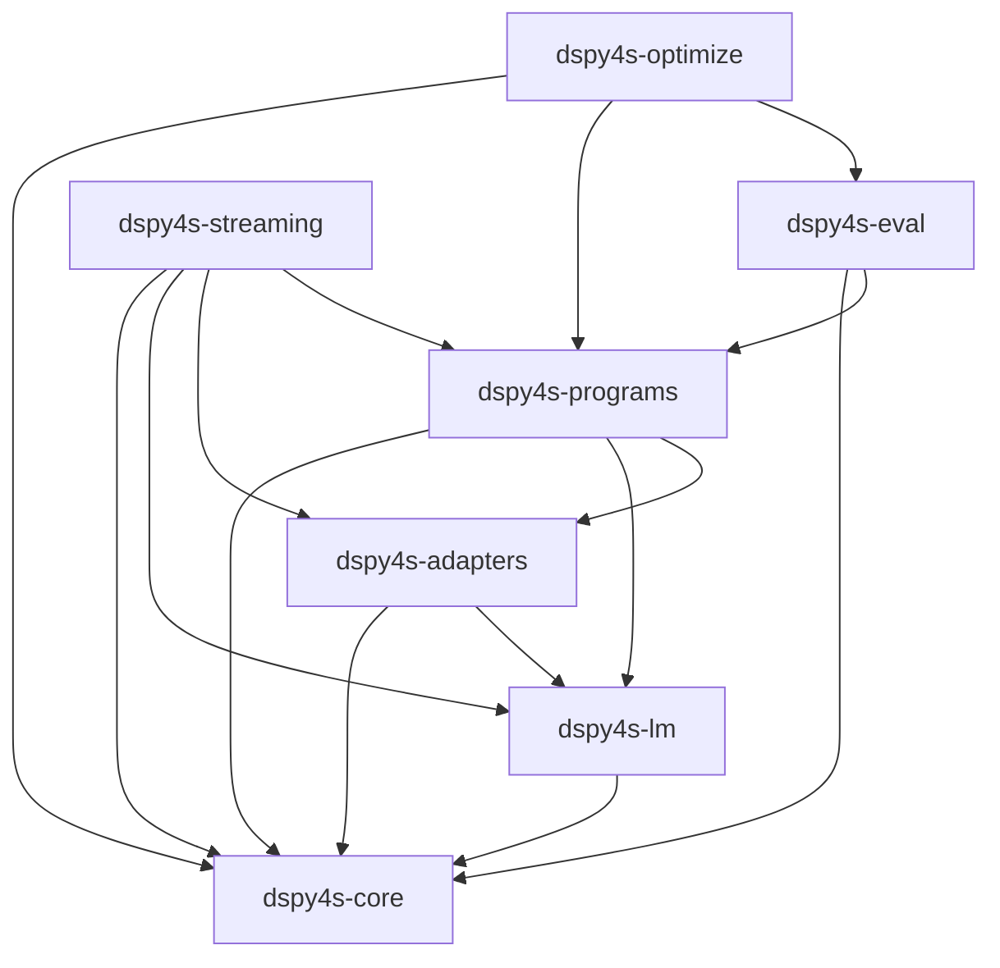

# dspy4s Architecture

## Module Graph

## Runtime Architecture
1. `core`
- Signature model + parser
- Field metadata and output typing contracts
- `Example`/`Prediction`/`Completions`
- Module graph traversal and state persistence contracts
- Shared error ADTs

2. `lm`
- Provider-agnostic LM API
- Request/response normalization (chat + responses modes)
- Retry policy + backoff
- Cache integration
- History and usage accounting

3. `adapters`
- Prompt/message construction from signatures + demos + inputs
- Response parsing to typed outputs
- Native function-calling and custom type integration boundary
- Adapter fallback behavior (Chat -> JSON)

4. `programs`
- `Predict` orchestration
- Higher-level modules (`ChainOfThought`, `ReAct`, etc.)
- Parallel execution APIs
- Trace propagation

5. `eval`
- Parallel evaluation runner
- Score/result aggregation and persistence formats

6. `optimize`
- Few-shot compile flows
- Candidate generation/evaluation loops

7. `streaming`
- Stream listeners (v1: raw token events)
- Status messages and `StatusMessageProvider` customization
- `Streamify.streamify(...)` producer-thread pipeline returning `ClosableIterator[StreamEvent]`
- v2 backlog: per-field `StreamListener` chunk parsing, real provider clients, structured concurrency (see `STREAMING_POSTPONED.md`)

## Canonical Call Flow (`Predict`)
1. Resolve effective settings (`lm`, `adapter`, callbacks, trace).
2. Resolve signature/demos/config/default values.
3. Adapter formats messages.
4. LM executes (cache/retry/history/usage).
5. Adapter parses outputs.
6. `Prediction` is constructed; trace/history updated.

## Semantic Mapping Decisions
1. Replace Python metaclass magic with explicit signature builders and immutable signature values.
2. Use structured effect/context propagation for settings overrides (thread + async safe).
3. Keep runtime mutability constrained to:
- per-call context
- module history/trace
- caches
4. Use typed error ADTs for parse/config/runtime failures instead of dynamic Python exceptions where practical.

## Main Risks and Mitigations
1. Dynamic signature/type parsing parity
- Mitigation: implement DSL parser + exhaustive signature test matrix from Python tests.

2. Context propagation across threads/async boundaries
- Mitigation: define a single context propagation abstraction and reuse it in Parallel/async wrappers.

3. Adapter parse leniency differences
- Mitigation: port reliability tests for malformed outputs and mismatch diagnostics.

4. Tool introspection differences
- Mitigation: explicit Scala tool schema API first; optional reflective derivation second.

5. Python pickle/save compatibility
- Mitigation: define dspy4s-native artifact format; add explicit non-compat note.
