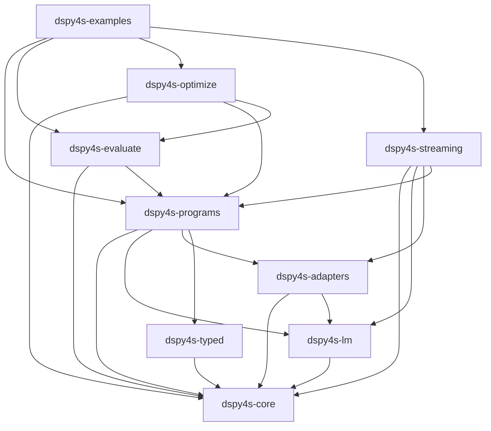

# dspy4s Architecture

A Scala 3 port of the Stanford DSPy framework. The defining design choice
is that **`Signature[I, O]` is the user-facing surface**: inputs and
outputs are statically typed, encoded/decoded by `Shape[A]` typeclass
instances, and adapters / language models still flow through a single
erased runtime contract (`SignatureLayout`).

## Module graph



## Modules

1. **`core`** — pure contracts, no dependencies.
   - `SignatureLayout` and `FieldSpec` (erased runtime contract for adapters)
   - `Example`, `DynamicPrediction`, `Completions`
   - `Module[I, O]` trait, `RuntimeContext`, `Settings`
   - Error ADT (`DspyError`, `ValidationError`, `ParseError`, …)
   - Callbacks + thread-local context machinery
     (`CallbackDispatcher`, `ActivePredictContext`, `ContextPropagation`)
   - DSL parser (`SignatureDsl.parse`)

2. **`typed`** — typed surface over `SignatureLayout`. Depends only on `core`.
   - `Signature[I, O]` — wraps a `SignatureLayout` plus `Shape[I]` / `Shape[O]`
   - `Shape[A]` typeclass with three impls: `KyoProductShape`, `TupleShape`, `MapShape`
   - `FieldCodec[A]` typeclass + `FieldCodec.FlatEnum[E]` helper
   - `Spec` trait + `InputField[+A]` / `OutputField[+A]` opaque types
   - `Prediction[O]` typed wrapper
   - Macros: `Signature.from(method)`, `Signature.fromType[F]`,
     `Signature.of[T <: Spec]`, plus `Signature.derived[I, O]` (inline)
   - Backed by kyo-schema (`Structure` / `Schema`) for product encode/decode

3. **`lm`** — provider-agnostic LM API.
   - `LanguageModel` trait, `LmRequest` / `LmResponse` / `Message` / `ToolCall`
   - `OpenAiClient` (chat + responses modes)
   - Retry policy, cache hooks, usage accounting

4. **`adapters`** — prompt building + output parsing.
   - `ChatAdapter` (the default), `JSONAdapter`, `XMLAdapter`
   - Each owns an `AdapterStreamingState` for incremental field parsing
   - Adapter fallback policy (chat → json)

5. **`programs`** — orchestration.
   - `runtime/PredictEngine` — the shared execute body (private)
   - `runtime/BasePredictProgram` — module-level callback + trace wrapping
   - `DynamicPredict` — erased predict, extends `PredictProgram`
   - `Predict[I, O]` — typed predict, wraps a memoized `DynamicPredict`
   - Composite programs: `ChainOfThought`, `ReAct`, `CodeAct`,
     `ProgramOfThought`, `MultiChainComparison`,
     `Refine`, `BestOfN`, `Parallel`, `Aggregation`
   - `contracts/ProgramContracts.scala` — `PredictProgram`, `ProgramCall`,
     `ProgramRuntime`, `ToolFunction`

6. **`evaluate`** — `Evaluate` runner, score/result aggregation, metrics.

7. **`optimize`** — `BootstrapFewShot` and `BootstrapFewShotWithRandomSearch`.
   Uses the `PredictOps[P]` typeclass to read `layout` + `demos` from a
   program and produce demo-shuffled copies.

8. **`streaming`** — `Streamify`, `StreamingLanguageModelWrapper`,
   `StreamingQueue`, `StatusStreamingCallback`. Per-LM-call routing keyed
   off `ActivePredictContext`.

9. **`examples`** — Python DSPy doc translations (tutorials, deep dives,
   cheatsheet, learn/, production/). Translation rule: string-based
   Python signatures become `Signature.fromType[F]`; class-based ones
   become a `trait T extends Spec`.

## The two stacks

### Dynamic chain (runtime, erased)

```
SignatureLayout ──→ ProgramCall ──→ DynamicPredict ──→ DynamicPrediction
                    (Map[String, Any])                  (Map[String, Any])
```

`SignatureLayout` carries a name, optional instructions, and an ordered
`Vector[FieldSpec]` (each spec has a role, a `TypeRef`, and metadata).
Adapters consume `SignatureLayout` directly; composite programs (e.g.
`ChainOfThought`, `CodeAct`, `MultiChainComparison`) augment a
base layout with extra fields before handing it to a `DynamicPredict`.

The mutation helpers on `SignatureLayout` (`append`, `prepend`, `insert`,
`delete`, `withFields`, `withUpdatedField*`, `updateField`) are
`private[dspy4s]` — only the composite programs use them. User code
goes through the typed surface.

### Typed chain (compile-time)

```
Signature[I, O] ──→ Predict[I, O].run(input: I) ──→ Prediction[O]
                    encode I via Shape[I]            decode Map via Shape[O]
```

`Predict[I, O].run` encodes the input through `signature.inputShape`,
dispatches through a memoized inner `DynamicPredict`, then decodes the
resulting `DynamicPrediction` through `signature.outputShape`. Decode
failures surface as `Left(DspyError)` at this boundary, never via lazy
field access.

## Six ways to make a `Signature`

| Surface | Use case | I/O types |
|---|---|---|
| `Signature.derived[I, O]("name")` | case classes both sides | products |
| `Signature.from(someMethod _)` | method reference | inferred from method |
| `Signature.fromType[F]` | function type only, no impl | inferred from `F` |
| `Signature.of[T <: Spec]` | abstract trait with `InputField` / `OutputField` members | named tuples |
| `Signature.builder("X").input[A]("a").output[B]("b").build` | programmatic, no class needed | returns a `SignatureLayout` |
| `Signature.fromString("q -> a")` | runtime-defined string DSL | `Map[String, Any]` both sides |

The first four are the static-typed surfaces. `fromString` is the
typed wrapper over `SignatureLayout.parse` for cases where the DSL is
discovered at runtime.

## Canonical `Predict` call flow

When `Predict[I, O].run(input)` fires:

1. **Encode** — `signature.inputShape.encode(input)` produces
   `Map[String, Any]`. A defensive check verifies all declared input
   fields are present (catches Map-shape callers missing a field).
2. **Hand off** — wrap in `ProgramCall(inputs, config, traceEnabled)`,
   call the memoized inner `DynamicPredict.run(call)`.
3. **`BasePredictProgram.run` wraps** —
   `CallbackDispatcher.withModule("predict", inputs)` scope; on success,
   conditionally records `TraceEntry` + `HistoryEntry`.
4. **`PredictEngine.execute`** (the shared body):
   1. Push `ActivePredict(name, layout)` onto the thread-local stack.
   2. `runtime.resolveModel` + `runtime.resolveAdapter` (pulled from
      `RuntimeContext.settings`).
   3. `adapter.format(invocation)` inside
      `CallbackDispatcher.withAdapter("format")` → `FormattedPrompt`.
   4. `model.call(request)` inside `CallbackDispatcher.withLm` →
      `LmResponse`.
   5. `adapter.parse(layout, output)` inside
      `CallbackDispatcher.withAdapter("parse")` for each output →
      `Vector[ParsedOutput]`.
   6. Assemble `DynamicPrediction` from completions; attach LM usage
      and tool-call payload.
5. **Decode** — `Prediction.from(raw, signature.outputShape)` returns
   `Either[DspyError, Prediction[O]]`.

`PredictEngine` is `private[dspy4s]`. Composite programs that need the
`PredictProgram` API construct a `DynamicPredict` (which holds an
engine) rather than touching the engine directly.

## Context propagation

Three concerns thread through every call without showing up in user
code:

- **`RuntimeContext`** (`given`) — the only required `using` parameter
  on `.run`. Carries `Settings` (the configured LM, adapter, callbacks,
  cache, …). Built by `RuntimeEnvironment.with(...)` at the entry
  point.
- **`CallbackDispatcher`** — thread-local scopes (`withModule`,
  `withAdapter`, `withLm`) that user-registered callbacks observe.
- **`ActivePredictContext`** — thread-local stack of the currently
  running predict. The streaming wrapper reads this to know which
  signature's fields to label token chunks with.
- **`ContextPropagation`** — copies the above stacks across thread
  boundaries for `arun` (Future) and `Parallel` execution.

## Semantic mapping decisions

1. **Replace Python metaclass magic** with explicit, immutable
   `Signature` / `SignatureLayout` values produced by macros (`from`,
   `fromType`, `of[Spec]`), `derived` (Mirror-based), the
   `SignatureBuilder` DSL, or the string DSL.
2. **Effect / context propagation** is one abstraction
   (`ContextPropagation`) used uniformly by `arun` and `Parallel`.
3. **Runtime mutability** is constrained to per-call context, module
   history/trace, and caches.
4. **Errors** are a structured `DspyError` ADT (parse, validation,
   configuration, runtime, not-found). The typed surface elevates
   adapter-parse failures to the `run` boundary instead of lazy field
   access.

## Extension points

- **New adapter** — implement `Adapter` in `dspy4s.adapters.contracts`;
  register via settings.
- **New LM provider** — implement `LanguageModel`; place under
  `dspy4s.lm.providers`.
- **New composite program** — extend `BasePredictProgram` for the
  callback + trace wrapping, augment a base `SignatureLayout` with
  extra fields via the `private[dspy4s]` mutation helpers, internally
  construct `DynamicPredict`. `CodeAct`, `ProgramOfThought`,
  `MultiChainComparison` are the templates.
- **New optimizer** — use the `PredictOps[P]` typeclass to read
  `layout` / `demos` and produce demo-shuffled program copies.
  `BootstrapFewShot` is the template.
- **New stream listener** — implement `StreamListener[A]`, pass to
  `Streamify.streamify`. The streaming wrapper routes via
  `ActivePredictContext`.

## Main risks and mitigations

1. **Dynamic signature / type parsing parity** with the Python DSL.
   Mitigation: dedicated DSL parser tests; the typed surface
   normalizes through the same `SignatureLayout.create` path so
   adapter behavior is identical.
2. **Context propagation across threads / async boundaries.**
   Mitigation: a single `ContextPropagation` abstraction reused by
   `arun` and `Parallel`.
3. **Adapter parse leniency differences.** Mitigation: ported
   reliability tests for malformed outputs; structured `ParseError`s
   with field-level context.
4. **Tool introspection differences.** Mitigation: explicit Scala
   `ToolFunction` API first; reflective derivation deferred.
5. **Python save / pickle compatibility.** Mitigation: a dspy4s-native
   artifact format (`SignatureLayout.dumpState` / `fromState`);
   explicit non-compat note.

## How this maps to Python DSPy

For comparison with the upstream Python DSPy architecture:

- [`port/PORT_SIMILARITIES.md`](port/PORT_SIMILARITIES.md) — what stayed the same (module decomposition, data spine, composite programs, optimizer pattern, cache/retry/history semantics).
- [`port/PORT_DIFFERENCES.md`](port/PORT_DIFFERENCES.md) — what changed shape and why (signature definition, typed I/O layer, parameter discovery, error handling, save/load, streaming).
- [`port/PORT_MAP.md`](port/PORT_MAP.md) — per-symbol rename + behavioral-delta ledger.
- [`port/PORT_LANGUAGE_NOTES.md`](port/PORT_LANGUAGE_NOTES.md) — Python→Scala idiom mechanics with code samples.

## Where to look in the source

- `core/contracts/SignatureLayout.scala` — the layout case class +
  factories (`parse`, `create`, `fromState`). Mutation helpers are
  `private[dspy4s]`.
- `core/contracts/Data.scala` — `Example`, `DynamicPrediction`,
  `Completions`.
- `core/runtime/ActivePredictContext.scala` — thread-local stack.
- `typed/Signature.scala` — typed wrapper + six factory entry points.
- `typed/Shape.scala` — three shape implementations + kyo-schema
  derivation.
- `typed/Spec.scala` — `InputField[+A]` / `OutputField[+A]` opaque
  types and the `Spec` trait.
- `programs/runtime/PredictEngine.scala` — the shared execute body.
- `programs/runtime/BasePredictProgram.scala` — module-level wrapping
  (callbacks + trace).
- `programs/Predict.scala` and `programs/DynamicPredict.scala` — the
  typed and erased facades.
