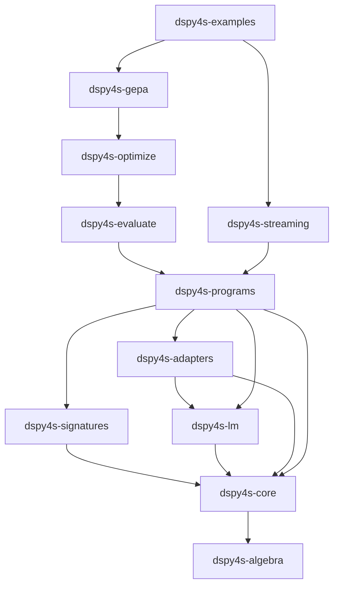

# dspy4s architecture

dspy4s uses typed passive program syntax and separate interpreters.

## Main data flow

```text
Scala input I
  -> Shape[I].encode
  -> DynamicValue.Record
  -> PredictionBackend
  -> RawPrediction
  -> Shape[O].decode
  -> Prediction[O]
```

`DynamicValue.Record` is the common wire and dataset format. The core program graph remains typed as
`ProgramWithEnv[I, O, R]`.

## Program boundary

- `Program.Node[I, O]` describes work.
- `ProgramWithEnv[I, O, R]` stores syntax and an immutable `ParameterStore`.
- `R` states required services. Composition combines requirements with intersection types.
- `ProgramRunner` interprets syntax in ZIO.
- `ProgramEvent` is the explicit execution journal.
- `RecordProgramWithEnv` adds `Shape[I]` for record datasets.

Programs contain no language model, adapter, runner, callback registry, or mutable parameters.

## Effects

The program layer defines small effect capabilities:

- `PredictionBackend`
- `CodeExecutionBackend`
- `ToolBackend`
- `ReplExecutionBackend`

`LivePredictionBackend` adapts the existing blocking LM and adapter contracts. It receives the low-level runtime context
as a constructor value. Global low-level configuration does not enter the program syntax or interpreter.

## Parameters and optimization

Every prediction node has a private declaration key. `ParameterStore` elaborates these keys into public
`ParameterId` values and maps them to `OptimizableParameters`.

- `Program.predict(signature)` creates an anonymous declaration. It receives a deterministic ordinal ID from program
  declaration order. Reusing the same program value shares its slot. Two separate declarations remain independent.
- `Program.namespace("email").declare("classify", signature)` creates a stable semantic declaration and returns a
  first-class `PredictionDef`. It can address the slot without repeated string lookup.

Anonymous state can load into the same program shape. Use a named declaration when identity must not depend on
declaration order or another operation must target one prediction directly. Complete state loading still requires the
same set of parameter IDs.

Evaluation and optimization operate on `RecordProgramWithEnv`:

- `Evaluate` runs examples with bounded ZIO parallelism.
- `Metric` receives a prediction and explicit program events.
- Optimizers return new program values.
- `ProgramPersistence` stores only parameter state. Keys are structural ordinals or explicit semantic names.
- GEPA groups reflection evidence by event `ParameterId`.

## Module graph


```mermaid
graph TD
  algebra[dspy4s-algebra]
  core[dspy4s-core]
  signatures[dspy4s-signatures]
  lm[dspy4s-lm]
  adapters[dspy4s-adapters]
  programs[dspy4s-programs]
  evaluate[dspy4s-evaluate]
  optimize[dspy4s-optimize]
  gepa[dspy4s-gepa]
  streaming[dspy4s-streaming]
  examples[dspy4s-examples]

  core --> algebra
  signatures --> core
  lm --> core
  adapters --> core
  adapters --> lm
  programs --> core
  programs --> signatures
  programs --> lm
  programs --> adapters
  evaluate --> programs
  optimize --> evaluate
  gepa --> optimize
  streaming --> programs
  examples --> gepa
  examples --> streaming
```

The `algebra` module contains reusable categories, functors, and existential optics. Program parameters no longer need
structural optics because the program owns a separate stable parameter store.

## Stack safety

The runner uses an explicit continuation stack for deep structural execution. `DeepProgramSuite` verifies 20,000
sequential nodes, 20,000 loop transitions, 20,000 `collectAll` members, and graph interpretation.
