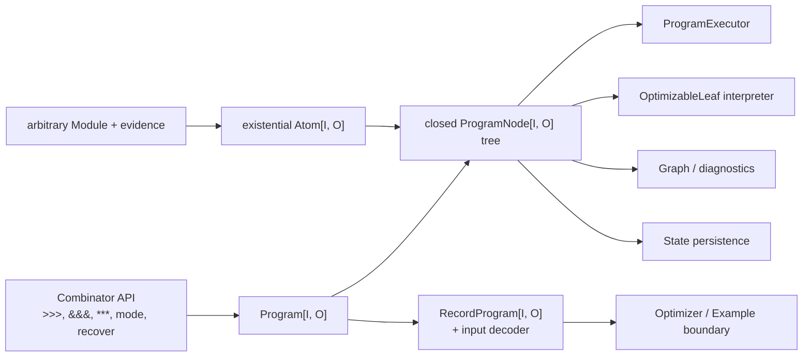

# Proposal: separate program syntax from interpretation

**Status:** design proposal; not adopted and not an implementation plan  
**Date:** 2026-07-22  
**Related:** [Program composition algebra](algebra-2-program-composition.md),
[algebra overview](algebra.md), [composite primitives](composite-primitives.md)

## Summary

The structural program classes in `Compose.scala`, `Transform.scala`, `Mode.scala`, and `Recovery.scala` form a typed,
reified program tree. They are not a conventional passive AST because each node is also a `Module` and implements its
own execution in `forward`. Other interpretations of the same structure—most notably predictor inspection and
replacement—are implemented separately through per-node `OptimizableTraversal` instances.

This proposal separates those responsibilities:

1. A closed, typed `ProgramNode[I, O]` describes the framework's structural language.
2. An existential `Atom[I, O]` keeps the leaf ecosystem open by packaging an arbitrary existing `Module` together with
   the evidence needed to inspect and rebuild it.
3. A public `Program[I, O]` owns a node and is the stable compositional type returned by every combinator.
4. Independent interpreters execute, inspect/reparameterize, render, and analyze the tree.
5. A separate `RecordProgram[I, O]` adds dynamic-record decoding only where optimizers and `Example`-based evaluation
   need it.

This is similar to ZIO's syntax-plus-runtime split in one important respect: program construction becomes separate from
program execution. It is intentionally much smaller than an effect runtime. Existing LM calls, tools, callbacks, agent
loops, and module lifecycles initially remain implemented by open leaf modules.

The recommended architecture is therefore a **closed structural language over open executable atoms**, not a closed
AST containing every DSPy feature.

## Why consider this now?

The current design is a reasonable executable Composite pattern. It becomes less attractive as the number of consumers
of program structure grows.

| Concern | Current home |
|---|---|
| Execution | `forward` on every structural case class |
| Lifecycle transparency | Inheritance from `TransparentModule` |
| OptimizableLeaf traversal and replacement | A `OptimizableTraversal` instance for every node |
| Record-boundary decoding | The existential package in `algebra.Program` |
| Optimizer state persistence | A traversal through `OptimizableTraversal` |
| Laws | Tests observing execution, lifecycle, and parameter traversal |
| Potential graphing, normalization, or full persistence | No common interpreter boundary yet |

Adding a combinator currently means defining its representation, execution, and optimizer traversal in different
places. Binary nodes also repeat state-vector slicing, reconstruction, and structural naming. `PairOptimizableTraversal` and
`UnaryOptimizableTraversal` reduce that duplication but do not remove the architectural coupling.

A central syntax makes new *interpretations* additive. The cost is the other side of the expression problem: adding a
new core instruction requires changing each interpreter. The open `Atom` boundary is what keeps ordinary third-party
modules extensible despite that choice.

## Goals

- Give all structural combinations one stable graded type, `Program[I, O, N]`, instead of exposing increasingly large
  nested implementation types such as `AndThen[I, X, O, A, B]`.
- Define execution semantics in one interpreter, including `ProgramCall` control propagation and `Prediction.raw`
  behavior.
- Derive one lawful `OptimizableTraversal.WithArity[Program[I, O, N], N]` implementation from the tree
  instead of one instance per structural node.
- Preserve arbitrary user and framework `Module`s as executable, optimizer-addressable leaves.
- Keep learnable children structurally visible. In particular, do not introduce a closure-based
  `flatMap: O => Program[?, ?]` that can hide input-dependent predictors.
- Preserve the established category, ordered fanout/split, mode, recovery, and predictor laws.
- Make a future effect-substrate change local to the execution interpreter rather than to every structural node.
- Create honest seams for graphing and state persistence without claiming that arbitrary Scala closures or runtime
  resources are serializable.

## Non-goals

- Reimplement ZIO, add fibers, or choose a new effect system as part of this change.
- Turn every agentic module (`ReAct`, `CodeAct`, `RLM`, `ProgramOfThought`) into a core AST instruction immediately.
- Serialize arbitrary modules, tools, interpreters, language-model clients, or functions captured by `Lift`.
- Change the current lawful `Prediction.raw` accumulator while moving representation. In particular, `p >>> id`
  preserves `p`'s envelope because the identity node contributes the accumulator identity.
- Add dynamic program selection through monadic `flatMap`. The optimizer must know the complete learnable structure
  before execution.
- Normalize trees merely because two expressions have the same typed output. Effects, failure order, lifecycle,
  predictor display paths, and the final prediction envelope are all observations that can invalidate a rewrite.

## Proposed architecture



### 1. `ProgramNode`: the closed structural language

The following is illustrative Scala-shaped pseudocode, not an implementation commitment:

```scala
sealed trait ProgramNode[I, O]

object ProgramNode:
  final case class Leaf[I, O](atom: Atom[I, O]) extends ProgramNode[I, O]
  final case class Id[I]() extends ProgramNode[I, I]
  final case class Lift[I, O](f: I => O) extends ProgramNode[I, O]
  final case class LiftEither[I, O](f: I => Either[DspyError, O]) extends ProgramNode[I, O]

  final case class AndThen[I, X, O](
      first: ProgramNode[I, X],
      second: ProgramNode[X, O]
  ) extends ProgramNode[I, O]

  final case class Fanout[I, A, B](
      first: ProgramNode[I, A],
      second: ProgramNode[I, B]
  ) extends ProgramNode[I, (A, B)]

  final case class Split[I, J, A, B](
      first: ProgramNode[I, A],
      second: ProgramNode[J, B]
  ) extends ProgramNode[(I, J), (A, B)]

  final case class MapOutput[I, A, B](inner: ProgramNode[I, A], f: A => B)
      extends ProgramNode[I, B]
  final case class ContramapInput[J, I, O](inner: ProgramNode[I, O], f: J => I)
      extends ProgramNode[J, O]
  final case class Mode[I, O](inner: ProgramNode[I, O], mode: dspy4s.programs.compose.Mode)
      extends ProgramNode[I, O]
  final case class Recover[I, O](
      primary: ProgramNode[I, O],
      fallback: ProgramNode[I, O],
      policy: RecoveryPolicy
  ) extends ProgramNode[I, O]

  final case class Copy[I]() extends ProgramNode[I, (I, I)]
  final case class Discard[I]() extends ProgramNode[I, Unit]
  final case class Swap[I, J]() extends ProgramNode[(I, J), (J, I)]
```

`Dimap` can either remain an explicit node for exact diagnostic compatibility or be derived from `ContramapInput` and
`MapOutput`. The first migration should keep it explicit if exception component names or graph shape are observable.

Likewise, `Fanout` should remain a first-class node even though its value semantics can be expressed as
`copy >>> split`. The fused node has a useful graph shape and currently gives predictors different display paths from
the expanded expression. AST normalization must not erase those distinctions accidentally.

### 2. `Atom`: open leaves with packaged evidence

The structural language is closed, but its leaves are not. An atom existentially packages the concrete representation
that the current combinators carry as type parameters:

```scala
sealed trait Atom[I, O]:
  type Repr <: Module[I, O]
  val value: Repr
  val optimizableParameters: OptimizableTraversal[Repr]
```

`Atom.of(module)` requires `OptimizableTraversal[module.type-or-concrete-type]`. A genuinely parameter-free custom module must
continue to opt in explicitly with `OptimizableTraversal.empty`; missing evidence must remain a compile error. This retains the
current protection against silently hiding learnable subtrees.

The execution interpreter invokes `atom.value.apply(call)`. The existing module therefore retains responsibility for
its own observed lifecycle, callbacks, trace encoding, LM runtime, tools, and internal algorithm. The predictor
interpreter invokes the packaged evidence and can rebuild the same hidden `Repr` after replacement.

This boundary supports two extension modes:

- A third-party feature can remain an opaque atom. It is fully executable and optimizable, but graphing sees only its
  declared atom metadata.
- A broadly reusable structural operation can be promoted into `ProgramNode`, after which every interpreter handles it
  explicitly.

This is the intended expression-problem tradeoff, made visible rather than accidental.

### 3. `Program`: the stable compositional value

`Program[I, O]` wraps a `ProgramNode[I, O]` and exposes the public algebra:

```scala
final class Program[I, O] private[programs] (private[programs] val root: ProgramNode[I, O])

extension [I, O](p: Program[I, O])
  infix def >>>[B](q: Program[O, B]): Program[I, B]
  infix def &&&[B](q: Program[I, B]): Program[I, (O, B)]
  def mapOutput[B](f: O => B): Program[I, B]
  def contramapInput[J](f: J => I): Program[J, O]
  def mode(m: Mode): Program[I, O]
```

Every combinator returns the same two-parameter type. Concrete AST node types stay internal, so changing a node's
representation does not change user signatures or optimizer type arguments.

`Program.atom(existingModule)` is the explicit bridge from today's module ecosystem. Convenience constructors such as
`Program.predict(signature)` can return an already-lifted atom.

`Program` need not extend `Module`. It can expose typed `apply(ProgramCall[I])` through `ProgramExecutor`. Where an API
still requires a `Module`, `Program.asModule` can return one lifecycle-transparent adapter whose `forward` delegates to
the interpreter. Leaves—not the adapter or structural nodes—remain the observed lifecycle boundaries.

### 4. Keep record decoding outside the AST

Typed execution and decoding a `DynamicValue.Record` are separate capabilities. The current `algebra.Program` packages
both, which is why independent-input `split` cannot lift into that category: `(I, J)` has no canonical decoder from one
flat record.

The proposal makes the distinction explicit:

```scala
final case class RecordProgram[I, O](
    program: Program[I, O],
    decodeInput: DynamicValue.Record => Either[DspyError, I]
)
```

- `Program[I, O]` always supports typed execution, `>>>`, `&&&`, and `***`.
- `RecordProgram[I, O]` is the optimizer/`Example` entry point.
- `RecordProgram.of(module)` obtains the decoder from the existing `ProgramInput` capability.
- Sequential composition retains the first program's decoder.
- Shared-input fanout retains one decoder under the same coherence requirement as today.
- A split program becomes a `RecordProgram[(I, J), (A, B)]` only when the caller supplies an explicit coherent decoder
  for `(I, J)`.

This preserves the honest boundary discovered by the parameterized-program prototype without weakening the core typed algebra.

The current `algebra.Program` is close to this wrapper already. Its path-dependent representation and packaged
`OptimizableTraversal` evidence would move down into `Atom`; its decoder would remain at the `RecordProgram` boundary.

## Interpreters

### Execution

`ProgramExecutor` is the only place that assigns execution semantics to structural nodes. Its initial result type stays
behavior-compatible:

```scala
def run[I, O](program: Program[I, O], call: ProgramCall[I])
    (using RuntimeContext): Either[DspyError, Prediction[O]]
```

Important node semantics remain exactly as they are today:

- `Leaf`: call the packaged module's final `apply`, including its lifecycle.
- `AndThen`: run the first node, map only its semantic output into the second call, and preserve all outer controls.
  The second prediction remains the final envelope.
- `Fanout` and `Split`: execute left-to-right, fail fast, and merge raw value records with the right side winning on a
  key collision.
- `MapOutput`: preserve the inner raw prediction.
- `Mode`: transform controls before running the inner node.
- `Recover`: inspect the primary error through the policy before deciding whether to execute the fallback.
- Pure functions: catch non-fatal exceptions using the same component-specific error normalization as today.

Structural lifecycle transparency becomes true by construction because structural nodes are not modules. There is no
possibility of accidentally observing an `AndThen` boundary unless an explicit future `Observe` node is introduced.

A direct recursive interpreter is sufficient for behavioral parity and is no worse than the current nested `forward`
calls. Before making the AST the only public representation, a spike should determine whether an explicit continuation
stack can provide stack safety without unacceptable Scala GADT casts or erased frames. Unlike ZIO, ordinary dspy4s
pipelines are shallow today, so stack safety should be measured rather than assumed to justify complexity.

### OptimizableLeaf inspection and replacement

One tree interpreter replaces the structural `OptimizableTraversal` instances:

- Parameter-free nodes contribute no views.
- Unary nodes recurse into their child.
- Binary nodes concatenate left then right.
- Leaves delegate to their packaged `OptimizableTraversal[Repr]`.
- Replacement consumes the corresponding state slices and rebuilds nodes on the return path.

The public typeclass becomes a single adapter:

```scala
given [I, O, N <: Int]
    : OptimizableTraversal.WithArity[Program[I, O, N], N] =
  ProgramPredictorInterpreter.instance
```

The existing laws remain the contract:

- `replace(p, read(p)) = p`
- `read(replace(p, states)) = states`
- metadata is unchanged by state replacement
- binary traversal order is left then right

Human-readable structural paths can still be derived during traversal. Ordinal `OptimizableId`s remain assigned once at
the root from traversal order, keeping identity independent of nested nodes resetting their own counters. If stable
identity across arbitrary graph rewrites is required later, it should be represented as an explicit leaf identity—not
inferred from display paths.

### Graphing and diagnostics

A graph interpreter is the smallest new consumer that would validate the architecture. It can expose:

- structural operators and their input/output types where runtime type evidence is available;
- atom module names and predictor metadata;
- ordered versus shared branches;
- mode and recovery boundaries;
- opaque function nodes without pretending to inspect their closures.

This interpreter should be implemented in a spike before committing to the migration. If a second interpretation does
not become materially simpler than traversing the current classes, the AST separation has not paid for itself.

### Persistence

Current `ProgramPersistence` saves only `OptimizableParameters`; it does not save program structure or executable resources.
That behavior should remain the default and becomes simpler through `OptimizableTraversal[Program]`.

Full AST persistence is a separate, explicitly partial capability. `Lift` functions, arbitrary atoms, tools, runtimes,
and interpreter instances are not generally serializable. A future `ProgramCodec` should therefore either:

- reject unsupported nodes and atoms;
- require a stable registered codec for every atom and function-like node; or
- persist a declarative blueprint while requiring runtime resources to be supplied during loading.

The existence of an AST must not be mistaken for proof that the whole program is serializable.

## Algebra and normalization

The AST gives laws a structural home, but observational equality remains authoritative.

- Category laws observe typed output and lifecycle, not case-class equality or the final raw envelope.
- Ordered execution prevents tensor interchange and general effect symmetry.
- Copy naturality holds only for deterministic morphisms under the chosen observation.
- Recovery and modes make failures and call controls observable.
- OptimizableLeaf traversal must be a homomorphism from structural composition into parameter-vector concatenation.

Consequently, a normalizer may safely perform a rewrite only for a declared observation. For example, reassociating
`AndThen` can preserve execution and parameter order while changing diagnostic display paths. Removing a right identity
currently changes `Prediction.raw`. Expanding `Fanout` into `Copy >>> Split` can change graph and predictor paths.

The proposal therefore favors named law witnesses and observation-specific equivalence over a universal
`normalize: Program[I, O] => Program[I, O]`.

## Relationship to an effect-system migration

The AST should not be parameterized by `F[_]`. It is syntax and remains independent of the execution substrate.

Initially, `ProgramExecutor` returns the existing `Either[DspyError, Prediction[O]]`. A later CIO/Kyo/ZIO-compatible
executor can return the chosen effect without rewriting the structural constructors or predictor interpreter. Existing
synchronous modules can be adapted at the atom boundary while native effectful leaves are introduced deliberately.

This localizes the substrate change, but it does not make it mechanically free: callbacks, context propagation,
parallel execution, cancellation, and leaf APIs still need semantics in the chosen runtime.

## What remains an atom initially?

The first AST should contain only operations with stable, reusable structural semantics.

| Feature | Initial representation | Reason |
|---|---|---|
| `Predict`, `ChainOfThought` | Atom | Already coherent executable leaves |
| `ReAct`, `CodeAct`, `RLM`, `ProgramOfThought` | Atom | Stateful algorithms with specialized loops and resources |
| `BestOfN`, `Refine` | Atom initially | Shared attempt machinery exists, but wrapper lifecycle and feedback are richer than basic structure |
| `MultiChainComparison` | Atom | Holds an addressable comparison predictor and runtime-arity logic |
| `AndThen`, fanout, split | Core nodes | Fundamental typed wiring |
| Pure transforms | Core nodes | Parameter-free wiring with stable semantics |
| Mode and recovery | Core nodes | Reusable execution policy over a visible child |
| Copy, discard, swap | Core nodes | Named algebraic structure; graphically meaningful |

Later promotion of `BestOfN` or an explicit bounded loop is justified only if multiple programs use the same node
semantics and all learnable children can be stored visibly in the node.

## Alternatives considered

### Keep the executable Composite design

This remains viable. It is direct, open to new module types, and easy to debug. Shared helpers can continue reducing
per-node `OptimizableTraversal` boilerplate. It should be preferred if execution and predictor traversal remain the only important
interpretations.

### A fully closed AST containing every module

This gives maximal interpreter control but makes every third-party program a framework instruction. It is incompatible
with the current open `Module` ecosystem and would make new domain modules require edits to central interpreters. The
open atom boundary is preferable.

### A free category over modules

A free category naturally captures `id` and `>>>`, but the actual language also needs ordered fanout/split,
raw-preserving maps, modes, and recovery. Encoding all of those indirectly would either lose semantics or recreate a
larger AST under another name.

### Tagless-final/object-algebra encoding

Tagless final makes it easy to choose an interpretation while constructing a program, but dspy4s needs to retain and
later rewrite predictor structure. Recovering a traversable tree would require a reifying interpreter, bringing the
design back to an initial AST. It also makes persisted or graphable program values less direct.

### Add a visitor to the current case classes

The current structural classes do not form one closed data type, and arbitrary modules remain mixed into their child
types. A visitor would coexist with distributed `forward` implementations rather than establish one source of
semantics. It offers less benefit than a deliberate AST boundary.

## Migration sketch

No migration should begin until a compile-only spike demonstrates that Scala 3 can express the existential atom and
the recursive typed interpreter without leaking casts into the public API.

### Phase 0: feasibility spike

- Implement an internal `ProgramNode` with `Leaf`, `Id`, `AndThen`, and `Fanout` only.
- Package an arbitrary `Predict[I, O]` and a user-defined module as atoms.
- Demonstrate execution and predictor replacement with no public casts.
- Build a graph representation as the second interpreter.
- Measure compile-time diagnostics and runtime overhead on a deeply nested synthetic pipeline.

The spike is disposable and should not change existing combinators.

### Phase 1: behavioral parity

- Add the remaining structural nodes.
- Run every new expression beside its current executable-composite equivalent under deterministic stubs.
- Compare result, failure, callback/trace/history observations, predictor order, names, IDs, and replacement.
- Keep the existing case classes as the public API.

### Phase 2: bridge the module ecosystem

- Add `Program.atom(module)` and `Program.asModule`.
- Introduce `RecordProgram` using the current `ProgramInput` decoders.
- Provide `OptimizableTraversal[Program]` and `ProgramRunner[RecordProgram]`.
- Verify that all optimizers can target the stable two-parameter carrier.

### Phase 3: switch combinators

- Make `>>>`, `&&&`, `***`, transforms, mode, and recovery construct `Program` values.
- Migrate examples and internal structural clients.
- Keep explicit adapters for APIs still requiring `Module`.

### Phase 4: retire duplicate structure

- Remove self-interpreting structural case classes and their hand-written `OptimizableTraversal` instances once parity is proven.
- Keep domain modules as atoms until independently justified for promotion.
- Revisit CIO only after the representation migration is stable, so the two semantic changes do not obscure each
  other.

## Acceptance criteria

The alternative should be adopted only if a spike demonstrates all of the following:

1. Public composition has the simple type `Program[I, O]` with good named-tuple inference and no user-visible casts.
2. Arbitrary third-party modules lift as atoms while preserving lifecycle and optimizer addressability.
3. A single execution interpreter matches every existing structural combinator's behavior.
4. A single predictor interpreter satisfies the current lens/frame and composite traversal laws.
5. `RecordProgram` supports existing optimizer and persistence workflows without an incoherent universal decoder.
6. At least one additional interpretation—preferably graphing—becomes substantially simpler.
7. Compile times, error messages, and runtime overhead remain acceptable.
8. A deliberate decision is made about recursive versus stack-safe execution before the old representation is removed.

If the existential/GADT machinery makes ordinary errors inscrutable, if atom replacement requires unsafe public casts,
or if no meaningful second interpreter emerges, the current executable Composite plus shared traversal helpers is the
better design.

## Recommendation

Proceed only with Phase 0 as a future isolated experiment. The architecture is promising because dspy4s already has a
real syntax tree and multiple interpretations, and because the current `algebra.Program` proves that packaging concrete
representations with capabilities is workable. The largest uncertainty is not the algebra; it is Scala 3 ergonomics
around existential leaves, GADT recursion, reconstruction, and extension-method inference.

The proposal should not trigger an immediate rewrite. Its value is to define the boundary precisely:

> Close the reusable structural language, keep executable modules open as atoms, and interpret structure centrally.
