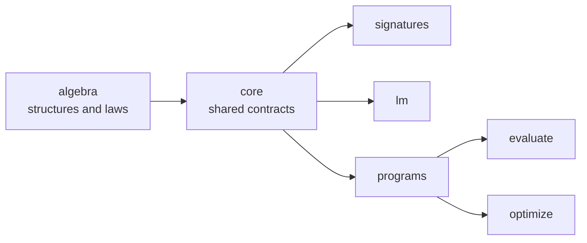
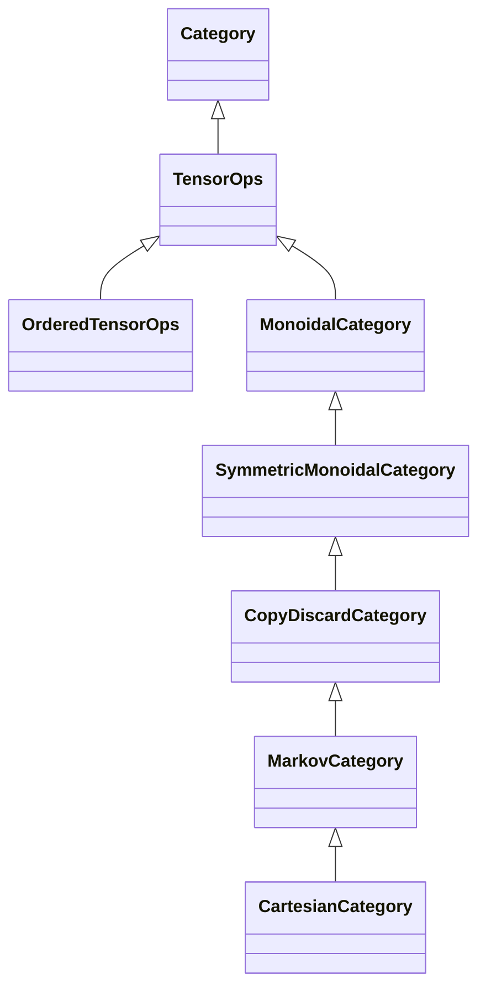

# dspy4s `algebra`

This module defines the small algebraic structures that dspy4s uses to describe composition. It gives names and laws
to operations such as:

- combine two values;
- run one operation after another;
- map one form of composition into another;
- read and replace one part of a value;
- track a static resource count during composition.

The module contains no model, adapter, schema, or runtime code. Its production code has no external library
dependencies. This keeps the law vocabulary available to every higher dspy4s module.



Most users do not need to use this module directly. Use it when you add a new composition rule, a reusable type-class
instance, or a law suite. To build and run a program, start with the
[`programs`](../programs/README.md) module.

## The core idea

An algebraic structure has two parts:

1. **Operations** say what code can do. For example, a `Category` provides an identity operation and composition.
2. **Laws** say which results must be equal. For example, category composition must be associative.

The laws are part of each trait. A concrete instance supplies the operations and inherits the law statements. A test
suite then checks the statements with an equality that is valid for that instance.

```scala
import dspy4s.algebra.*

val functions = summon[Category[AnyObject, Function1]]

val normalize: String => String = _.trim.toLowerCase
val length: String => Int       = _.length
val positive: Int => Boolean    = _ > 0

val normalizedLength: String => Int = functions.>>>(normalize)(length)

val law = functions.associativity(normalize, length, positive)
assert(law.lhs("  Hello  ") == law.rhs("  Hello  "))
```

The `>>>` notation uses diagram order: `f >>> g` means “run `f`, then run `g`.”

## Laws are executable specifications

`IsEq[A]` stores the left and right sides of an equation. The `<->` operator constructs this value. `@Law` marks a
method as a law statement.

```scala
@Law("associativity")
def associativity(a: M, b: M, c: M): IsEq[M] =
  a.combine(b).combine(c) <-> a.combine(b.combine(c))
```

These types state laws, but they do not prove them. The test suite chooses how to compare both sides:

- use structural equality for ordinary values;
- run both sides on sample inputs for functions;
- compare visible output, parameters, or decoded values for effectful carriers.

This rule prevents the library from using Scala object identity as a false test for functions or program modules.

## Main structures

### Values and optics

| Type | Purpose |
|---|---|
| `Monoid[M]` | Combines values with an associative operation and an identity value. |
| `MonoidAction[M, A]` | Applies monoid values to values of `A` and states how combined actions behave. |
| `Lens[S, A]` | Reads and replaces one exact part `A` of a larger value `S`. It carries Get-Put, Put-Get, and Put-Put laws. |
| `IsEq[A]` / `@Law` | Stores and labels a law statement for a test suite. |

### Categories and mappings

| Type | Purpose |
|---|---|
| `Category[P, Hom]` | Defines identity and sequential composition for morphisms `Hom[A, B]`. `P[A]` can restrict valid objects. |
| `Isomorphism[P, Hom, A, B]` | Pairs a forward morphism with its inverse. |
| `Functor` | Maps objects and morphisms from one category to another. It preserves identity and composition. |
| `NaturalTransformation` | Maps one functor to another with one component for each source object. |
| `Profunctor` | Maps both boundaries of a two-parameter structure. Its first boundary is contravariant and its second boundary is covariant. |
| `Opposite` | Reverses all morphisms in a category. |
| `Monad` | Defines a categorical monad from an endofunctor, a unit, and multiplication. |
| `ScalaMonad` | Specializes `Monad` to Scala functions and provides `pure`, `map`, `flatten`, and `flatMap`. |
| `Kleisli` | Represents an effectful morphism `A => F[B]`; `kleisliCategory` composes these morphisms with a `ScalaMonad`. |

The module supplies a category for Scala functions and a `ScalaMonad` for `Either[E, *]`. It also supplies constructors
for identity and composed functors, opposite categories, monoid deloopings, and Kleisli categories.

### Graded and ordered execution

Some dspy4s operations have visible order and can fail. The module gives these operations precise, weak contracts. It
does not assign laws that effects can break.

| Type | Purpose |
|---|---|
| `NatGradedCategory[P, Hom]` | Adds a natural-number grade to each morphism. Identity has grade `0`; composition adds grades. |
| `AnyGrade` | Hides a grade but keeps the original morphism. This permits ordinary category law statements. |
| `GradedFunctor` | Maps a graded category to an ordinary category and hides or interprets the grade. |
| `GradePreservingFunctor` | Maps between graded categories and keeps the exact grade. |
| `OrderedFanout` | Runs two graded morphisms on one shared input, from left to right, and pairs their outputs. |
| `TensorOps` | Pairs two morphisms that have independent inputs. It makes no coherence claim. |
| `OrderedTensorOps` | Adds ordered `tensor`, `swap`, `copy`, and `discard` operations without false symmetry or naturality laws. |

The grade in the program algebra is parameter arity. If one program has `N` optimizable parameter groups and another
has `M`, their composition has grade `N + M`. Scala keeps this sum in the result type.

## Weak and strong composition structures

The module keeps effectful execution separate from stronger mathematical structures.



`OrderedTensorOps` is for runtime operations whose order is visible. For example, the first program can fail before the
second program runs. Such a carrier does not necessarily satisfy tensor interchange, symmetry, or discard naturality.

Use the stronger branch only when the carrier satisfies its additional laws:

| Type | Additional guarantee |
|---|---|
| `MonoidalCategory` | Tensor is a bifunctor; associators and unitors satisfy coherence laws. |
| `SymmetricMonoidalCategory` | A natural symmetric braiding can exchange both sides. |
| `CopyDiscardCategory` | Every object has coherent copy and discard operations. |
| `MarkovCategory` | Every morphism preserves discard. |
| `CartesianCategory` | Every morphism also preserves copy. |

Do not select the strongest name only because it has more operations. Select the weakest structure that states all true
laws for the carrier. This makes invalid rewrites unavailable.

## How dspy4s uses this module

| Consumer | Algebraic model |
|---|---|
| `LmUsage`, `RawPrediction`, and `RuntimeOutput` | `Monoid` instances define lawful accumulation. |
| `RuntimeOutput` and `Prediction` | `ScalaMonad` instances define sequencing and short-circuit behavior. |
| `ProgramCall` and `SizedVector` | `Endofunctor` instances map values without changing their structural context. |
| `OptimizableLeaf` and `OptimizableStructure` | `Lens` laws specify safe parameter reads and replacements. |
| `Mode` | A `Monoid` and `MonoidAction` specify how execution modes combine and apply. |
| `Program` | A `NatGradedCategory` tracks parameter arity during composition. |
| Program parameterization | A `GradePreservingFunctor` maps programs to their parameter structure. |
| Module composition | `OrderedTensorOps` and `OrderedFanout` describe ordered `split` and shared-input `fanout`. |

For the program-specific instances, see
[`programs/algebra`](../programs/src/main/scala/dspy4s/programs/algebra/) and the
[`Program` guide](../programs/src/main/scala/dspy4s/programs/algebra/Program.md).

## Source layout

| File | Contents |
|---|---|
| `Laws.scala` | `IsEq`, `<->`, and `@Law` |
| `Monoid.scala`, `MonoidAction.scala` | value combination and monoid actions |
| `Lens.scala` | lawful read and replace optics |
| `Category.scala`, `Opposite.scala`, `Isomorphism.scala` | category base types and constructors |
| `Functor.scala`, `NaturalTransformation.scala`, `Profunctor.scala` | mappings between categorical structures |
| `Monad.scala`, `Kleisli.scala` | categorical and Scala monads, plus effectful composition |
| `NatGradedCategory.scala` | graded categories and graded functors |
| `OrderedFanout.scala`, `OrderedTensorOps.scala` | weak contracts for ordered effectful execution |
| `CopyDiscardCategory.scala` | monoidal, symmetric, copy-discard, Markov, and cartesian category hierarchy |

## Tests

Run this module's tests from the repository root:

```shell
sbt algebra/test
```

`AlgebraConstructionSuite` checks `Either` as a `ScalaMonad` and checks the Kleisli category laws.
`CopyDiscardCategorySuite` checks all structural, monoidal, symmetric, copy-discard, and cartesian laws for Scala
functions.
