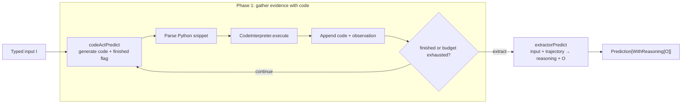
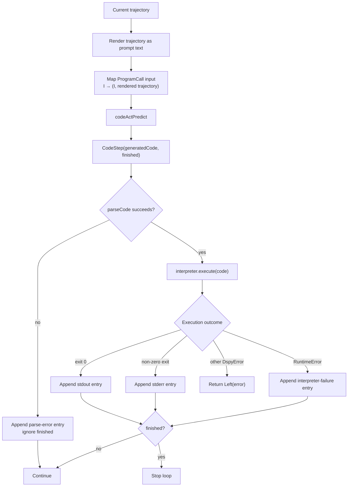
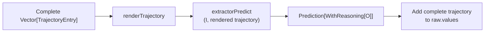
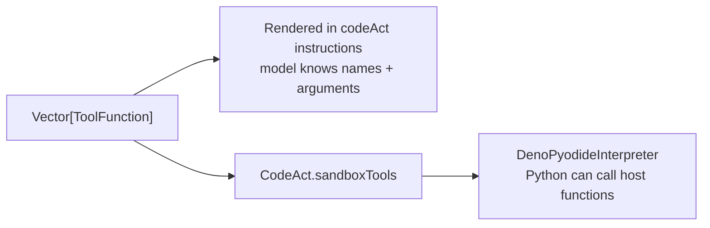
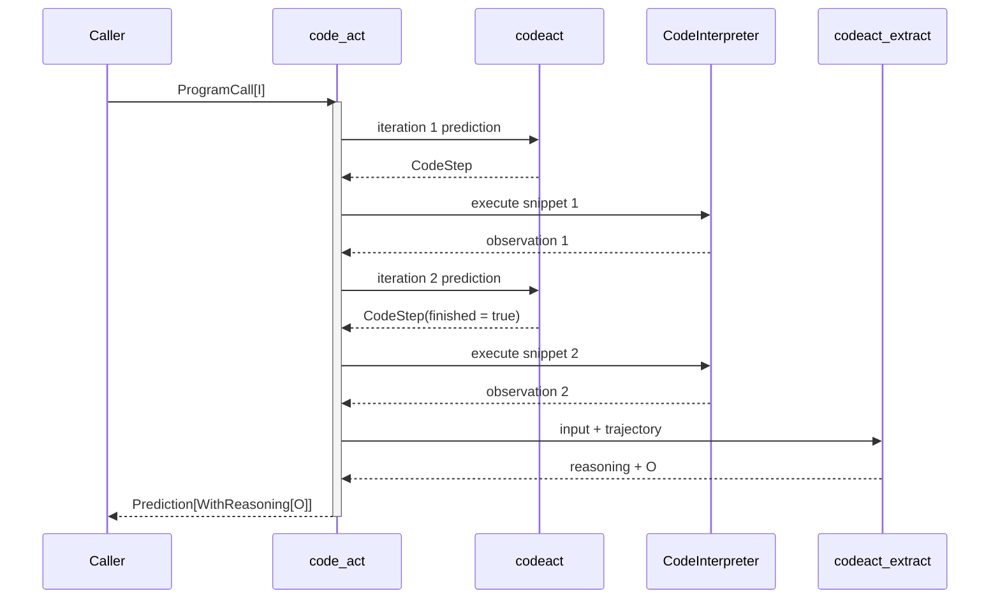
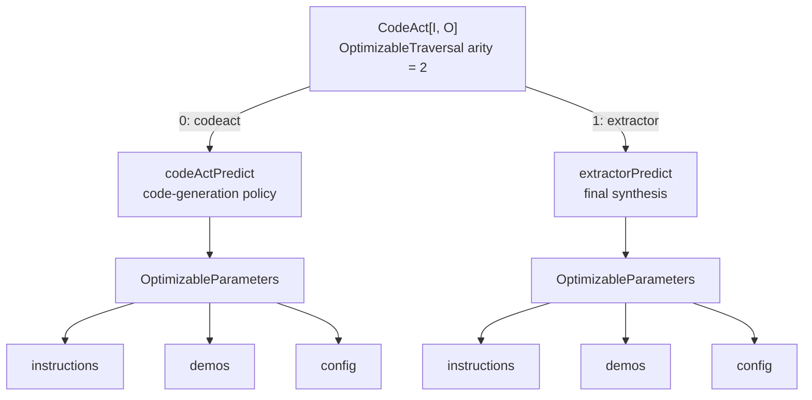

# How CodeAct works in dspy4s

`CodeAct[I, O]` is an iterative code-generation agent. It asks a language model to write Python, executes that code,
feeds the observation back to the model, and repeats until the model says it has gathered enough information or the
iteration budget is exhausted. A final predictor then turns the accumulated trajectory into the requested typed output.

The most useful mental model is **a code-and-observation loop followed by typed extraction**:



There are therefore three actors with different jobs:

- `codeActPredict` decides what Python to run next;
- `CodeInterpreter` runs that Python and returns stdout or an error;
- `extractorPredict` reads the completed trajectory once and produces the domain answer.

The loop gathers evidence; it does not directly construct `O`. The extractor is the only stage responsible for the
base output fields.

## The public type

Conceptually, the class has this shape:

```scala
final case class CodeAct[I, O](
    baseSignature: Signature[I, O],
    interpreter: CodeInterpreter,
    tools: Vector[ToolFunction] = Vector.empty,
    maxIterations: IterationLimit = IterationLimit(5),
    codeActProgramName: String = "codeact",
    extractorProgramName: String = "codeact_extract",
    codeActPredictOverride: Option[Predict[(I, String), CodeStep]] = None,
    extractorPredictOverride: Option[Predict[(I, String), WithReasoning[O]]] = None
) extends Module[I, CodeAct.WithReasoning[O]]
```

Its fields have distinct responsibilities:

| Field | Meaning |
|---|---|
| `baseSignature` | The original typed task, `I → O` |
| `interpreter` | Executes each generated Python snippet |
| `tools` | Functions described to the model and optionally bridged into a sandbox |
| `maxIterations` | Strictly positive upper bound on generator/execution steps |
| `codeActProgramName` | Module name of the per-iteration predictor |
| `extractorProgramName` | Module name of the final predictor |
| `codeActPredictOverride` | Optional immutable replacement for the generated default policy predictor |
| `extractorPredictOverride` | Optional immutable replacement for the generated default extractor |

The outer module name is always `code_act`. The two configurable names identify the inner executable predictors for
callbacks, traces, streaming, and optimizer diagnostics.

`CodeAct.WithReasoning[O]` is the same output augmentation used by `ChainOfThought`: a `reasoning: String` field is
prepended to the named-tuple view of `O`, idempotently. See [`ChainOfThought.md`](ChainOfThought.md) for the full type
transformation.

## Three related signatures

Given a base signature:

```text
question -> answer
```

CodeAct derives two internal signatures:

| Stage | Effective signature | Purpose |
|---|---|---|
| Public boundary | `question -> reasoning, answer` | What the caller ultimately receives |
| Code step | `question, trajectory -> generated_code, finished` | Choose and terminate loop actions |
| Extractor | `question, trajectory -> reasoning, answer` | Synthesize the final typed result |

In types, the inner predictors are:

```scala
codeActPredict:
  Predict[(I, String), CodeAct.CodeStep]

extractorPredict:
  Predict[(I, String), CodeAct.WithReasoning[O]]
```

`InputAugmentation.appendedStringInput` makes `(I, String)` line up with the runtime layout: it encodes `I` through the
base input shape, then appends the rendered trajectory under the field name `trajectory`.

The generator signature discards the base output fields and replaces them with:

```scala
final case class CodeStep(
    generatedCode: String,
    finished: Boolean
)
```

Its hand-written output shape is intentionally lenient. A missing `generated_code` becomes an empty string, any
present value is rendered as text, and `finished` accepts either a Boolean or the case-insensitive string `"true"`.
Missing or unrecognized `finished` values become `false`. Decoding a `CodeStep` therefore never fails; malformed code
is handled as an observation by the loop instead.

The extractor starts with the base outputs, appends `trajectory` to the inputs, then uses the same reasoning
augmentation as `ChainOfThought`.

## One iteration

Each iteration receives the current `Vector[TrajectoryEntry]` and its zero-based iteration number:



Two details are deliberate:

1. A code parse failure consumes the iteration but ignores `finished=true`. Unparseable code cannot be a valid final
   action, so the loop continues if budget remains.
2. A successfully parsed snippet may stop the loop even when its execution failed. The failure is evidence in the
   trajectory, and the extractor may still be able to produce a useful answer from it.

The bounded recursion itself lives in `AgentLoop`, and `TrajectoryAgent` owns the final extraction. The intermediate
transition is the same typed template used by ReAct: `InterpretedTrajectoryAgent` generates a `CodeStep`, lowers it to a
code-string action (or a rejected parse), invokes `ActionInterpreter[String, String]`, and records one
`TrajectoryEntry`. Its post-outcome decision then reads `CodeStep.finished`. CodeAct supplies those typed operations;
the shared final transition owns their ordering through explicit phase states. Rejected preparation and interpreted
outcomes have different recording states, so the rejected branch cannot contain an action or reach `decide`.

This gives the branches explicit behavioral laws. Rejected code records one failed observation without calling the
interpreter; ready code is interpreted, recorded, and decided exactly once; `finished` is checked only after recording;
and a fatal interpreter `Left` neither appends nor decides. `InterpretedTrajectoryAgentLawSuite` tests these guarantees
independently of CodeAct's Python parsing and execution details.

## How generated code is parsed

`CodeAct.parseCode` normalizes the model's `generated_code` before execution:

- content after `---` or the first triple newline is discarded;
- fenced blocks tagged `python`, tagged `py`, or untagged are accepted;
- empty code is rejected;
- a single line containing multiple `=` characters is rejected as malformed;
- when a multiline snippet ends in a plain assignment, the assigned variable is appended as a final expression so a
  REPL-style interpreter can echo its value.

For example:

```text
y = 2
x = y + 1
```

becomes:

```text
y = 2
x = y + 1
x
```

A parse error becomes a trajectory observation such as `Failed to parse the generated code: Empty code after
parsing.`; it is not immediately returned as a program-level `Left`.

## The trajectory

Each loop step contributes:

```scala
final case class TrajectoryEntry(
    iteration: Int,
    code: String,
    observation: String,
    isError: Boolean
)
```

The rendered form is both prompt context for the next step and evidence for the final extractor:

````text
## Iteration 1
```python
print(sum(range(10)))
```
code_output_0: 45

## Iteration 2
```python
print(undefined_name)
```
observation_1: Failed to execute the generated code: NameError: ...
````

An empty trajectory renders as `(empty)`. Successful entries use `code_output_N`; parse and execution failures use
`observation_N`. Iteration headings are one-based for readers, while those field suffixes retain the internal
zero-based index.

The trajectory is prompt memory, not necessarily interpreter memory. Whether Python variables persist depends on the
chosen `CodeInterpreter`.

## Finishing and extraction

The loop ends in either of two ways:

- `CodeStep.finished` is true after a parsed snippet; or
- `maxIterations` steps have been consumed.

In both cases CodeAct runs `extractorPredict` over the original input and the rendered trajectory. The extractor
returns `reasoning` plus the base output fields using the same typed decoding rules as `ChainOfThought`.



If extraction exceeds the model's context window, CodeAct retries up to three total attempts, dropping the oldest
trajectory entry before each retry. This truncation affects only the extractor's prompt. On success, the final
`prediction.raw.values("trajectory")` still contains the complete, untruncated trajectory produced by the loop.

The final raw completions and LM usage come from the extractor prediction. Generator calls remain observable through
their own callbacks, traces, and history rather than being merged into the final `RawPrediction`.

## Example: calculate with generated Python

```scala
import dspy4s.core.contracts.{DspyError, RuntimeContext}
import dspy4s.core.runtime.SubprocessPythonInterpreter
import dspy4s.programs.CodeAct
import dspy4s.typed.Signature

def factorial(n: Int)(using RuntimeContext): Either[DspyError, String] =
  val interpreter = new SubprocessPythonInterpreter(timeoutMillis = 10_000)
  val program = CodeAct(
    baseSignature = Signature.fromString("n: int -> factorial"),
    interpreter = interpreter
  )

  try
    program((n = n)).map { prediction =>
      println(prediction.output.reasoning)
      prediction.output.factorial
    }
  finally interpreter.close()
```

`CodeAct` does not close its interpreter. The caller owns that resource and should close it in `finally`, through a
resource abstraction, or when the surrounding application shuts down.

> **Security:** `SubprocessPythonInterpreter` is not sandboxed. LM-generated code runs with the host user's filesystem,
> network, and environment access. Use it only for trusted code or inside an already isolated environment. Prefer
> `DenoPyodideInterpreter` or another sandbox for untrusted model output.

## Interpreter choices and state

| Interpreter | Isolation | State across iterations | Host-tool bridge |
|---|---|---|---|
| `SubprocessPythonInterpreter` | None; runs as the host user | No; each snippet is a fresh `python3 -c` process | No automatic bridge |
| `DenoPyodideInterpreter` | Pyodide/WASM under Deno allowlists | Yes; globals persist in its long-lived REPL | Yes, through `SandboxTool` |
| Custom `CodeInterpreter` | Implementation-defined | Implementation-defined | Implementation-defined |

With a stateless interpreter, the next model call can still see all earlier code and outputs in the trajectory. It must
regenerate any definitions or values needed by the next independent snippet. With the stateful Deno/Pyodide
interpreter, definitions genuinely remain available to later executions.

## Tools inside generated code

CodeAct tools have two separate paths that must agree:



Passing `tools` to `CodeAct` only documents them in the generator prompt. To make those names callable inside
`DenoPyodideInterpreter`, bridge the same vector into the sandbox:

```scala
val tools: Vector[ToolFunction] = Vector(getWeather)

val interpreter = new DenoPyodideInterpreter(
  tools = CodeAct.sandboxTools(tools)
)

val program = CodeAct(
  baseSignature = signature,
  interpreter = interpreter,
  tools = tools
)
```

`sandboxTools` maps wire types to Python parameter hints and captures the current `RuntimeContext`, because a tool call
arriving from the sandbox occurs outside the ordinary dspy4s call stack.

`SubprocessPythonInterpreter` has no host-function bridge. With that interpreter, generated code can use only its
Python environment unless the caller supplies some other integration.

## Output and raw evidence

The returned prediction has this shape:

```text
Prediction[CodeAct.WithReasoning[O]]
├── output
│   ├── reasoning: String
│   └── base output fields from O
└── raw
    ├── values: extractor values + trajectory
    ├── completions: extractor completions
    └── lmUsage: extractor LM usage
```

As with `ChainOfThought`, a case-class base output is normalized to a named tuple when `reasoning` is added. The full
trajectory is stored as a rendered string in `prediction.raw.values`, not as part of the typed domain output:

```scala
val trajectory: Either[DspyError, String] =
  prediction.raw.asString("trajectory")
```

## Lifecycle and observability

One successful two-step run has the following observable nesting:



The outer `code_act` module wraps every inner call. Each generator iteration is its own `codeact` `Predict` boundary;
the final extraction is one `codeact_extract` boundary. Adapter and LM callbacks nest inside each predictor. Direct
`CodeInterpreter.execute` calls are not module boundaries.

With tracing enabled, a successful two-step call records two generator entries, one extractor entry, then the outer
CodeAct entry. If a later stage fails, already completed inner calls remain valid trace/history evidence even though the
outer module has no successful entry. Setting `traceEnabled = false` suppresses trace/history for the outer module and
all mapped inner calls while leaving callbacks active.

`ProgramCall.mapInput` preserves per-call config, `traceEnabled`, and `rolloutId`, so every generator and extractor call
receives the same execution controls while seeing its stage-specific typed input.

## Failure policy

CodeAct distinguishes recoverable evidence from failures of the prediction machinery:

| Situation | Behavior |
|---|---|
| Empty or malformed generated code | Append a parse-error observation, ignore `finished`, and continue if budget remains |
| Python exits non-zero | Append stderr as an execution-error observation; honor `finished` |
| Interpreter returns `RuntimeError` | Append an interpreter-failure observation; honor `finished` |
| Interpreter returns another `DspyError` | Return `Left(error)` immediately |
| Generator prediction fails | Return `Left(error)` immediately |
| `maxIterations` is reached | Extract from the trajectory gathered so far |
| Extractor context overflow | Drop oldest entries and retry, up to three attempts |
| Persistent extractor overflow | Return the final `Left(ContextWindowExceededError)` |
| Extractor output fails typed decoding | Return `Left(DspyError)` |

This split lets the model learn from ordinary code mistakes without disguising failures that prevent the framework
itself from continuing safely.

## Per-call controls and immutable overrides

The original `ProgramCall` config is forwarded to every internal prediction, so provider options apply throughout the
run:

```scala
program(
  input,
  config = DynamicValues.record("temperature" := 0.4),
  traceEnabled = false
)
```

`maxIterations` is architecture configuration rather than an LM option. Change it with an immutable copy and validate
runtime values through `IterationLimit`:

```scala
val shorter = program.copy(maxIterations = IterationLimit(3))
```

The two override fields allow different predictor settings without rebuilding CodeAct internals manually. For example,
models can be pinned independently:

```scala
val specialized = program.copy(
  codeActPredictOverride = Some(program.codeActPredict.withLm(codeModel)),
  extractorPredictOverride = Some(program.extractorPredict.withLm(answerModel))
)
```

Overrides are also the mechanism used by optimizer replacement. They preserve the expected typed signatures, module
names, runtimes, bound models, and other execution metadata.

## Optimization

Optimizers see two independently tunable leaves in stable order:



The generator's default instructions include the CodeAct protocol and tool descriptions. The extractor's instructions
originate from the base signature. Each leaf can be replaced independently through the two override fields.

The base signature structure and shapes, interpreter, tool vector, iteration limit, predictor names, runtimes, and
bound models remain outside `OptimizableParameters`; optimizer writes cannot change them.

## Streaming

`Streamable[CodeAct[I, O]]` reports the two executable predictors:

```text
(codeActProgramName, codeActSignature)
(extractorProgramName, reasoning-augmented extractor layout)
```

Listeners can observe `generated_code` and `finished` on each loop call, or `reasoning` and the base output fields on
the final extractor. The outer `code_act` module and interpreter do not directly emit LM tokens.

## CodeAct compared with nearby programs

| Program | Iterative action | Observation source | Final output |
|---|---|---|---|
| `ChainOfThought` | None | One LM completion | Same prediction's reasoning + base fields |
| `ReAct` | Select a named `ToolFunction` and arguments | Tool result | Separate extractor over the tool trajectory |
| `CodeAct` | Generate and execute Python | stdout or execution error | Separate extractor over the code trajectory |
| `ProgramOfThought` | Generate/regenerate a program | Program execution | Answerer after a successful program |

CodeAct is most appropriate when computation and exploratory code are the natural action language. ReAct is usually
clearer when the available actions should remain a small, explicitly named tool vocabulary.

## Reading the implementation

A useful reading order is:

1. [`CodeAct.scala`](CodeAct.scala): derived signatures, loop step, parsing, tools, and result assembly.
2. [`runtime/InterpretedTrajectoryAgent.scala`](runtime/InterpretedTrajectoryAgent.scala): generate, prepare, interpret,
   record, and stop.
3. [`contracts/ActionInterpreter.scala`](contracts/ActionInterpreter.scala): success, recoverable failure, and fatal
   action outcomes.
4. [`runtime/TrajectoryAgent.scala`](runtime/TrajectoryAgent.scala): gather a trajectory, then extract exactly once.
5. [`runtime/AgentLoop.scala`](runtime/AgentLoop.scala): bounded continue/done recursion.
6. [`runtime/TrajectoryTruncation.scala`](runtime/TrajectoryTruncation.scala): oldest-first extractor retries.
7. [`InputAugmentation.scala`](../../../../../../typed/src/main/scala/dspy4s/typed/InputAugmentation.scala): typed
   `(I, trajectory)` encoding.
8. [`OutputAugmentation.scala`](../../../../../../typed/src/main/scala/dspy4s/typed/OutputAugmentation.scala): final
   reasoning augmentation.
9. [`CodeInterpreter.scala`](../../../../../../core/src/main/scala/dspy4s/core/contracts/CodeInterpreter.scala): execution
   result and sandbox-tool contracts.
10. [`CompositeOptimizableTraversalInstances.scala`](optimization/CompositeOptimizableTraversalInstances.scala): the
   two-leaf optimizer traversal.
11. [`Streamable.scala`](../../../../../../streaming/src/main/scala/dspy4s/streaming/Streamable.scala): streaming targets.
12. [`CodeActSuite.scala`](../../../../test/scala/dspy4s/programs/CodeActSuite.scala): executable examples of stopping,
    parsing, interpreter failures, tools, subprocess execution, and truncation.
13. [`InterpretedTrajectoryAgentLawSuite.scala`](../../../../test/scala/dspy4s/programs/runtime/InterpretedTrajectoryAgentLawSuite.scala)
    and [`TrajectoryAgentLawSuite.scala`](../../../../test/scala/dspy4s/programs/runtime/TrajectoryAgentLawSuite.scala):
    the shared transition and extraction contracts.
14. [`Cheatsheet.scala`](../../../../../../examples/src/main/scala/dspy4s/examples/Cheatsheet.scala): a concise runnable
    example.

## Scope and assumptions

This guide describes the current dspy4s implementation. It assumes the runtime can resolve a language model and
adapter, the base output has statically known fields, and the caller supplies an interpreter appropriate to the trust
boundary. Exact prompts and model parsing remain adapter-specific; the loop state, execution/error policy, extraction,
lifecycle nesting, and optimizer structure are defined by `CodeAct` itself.
