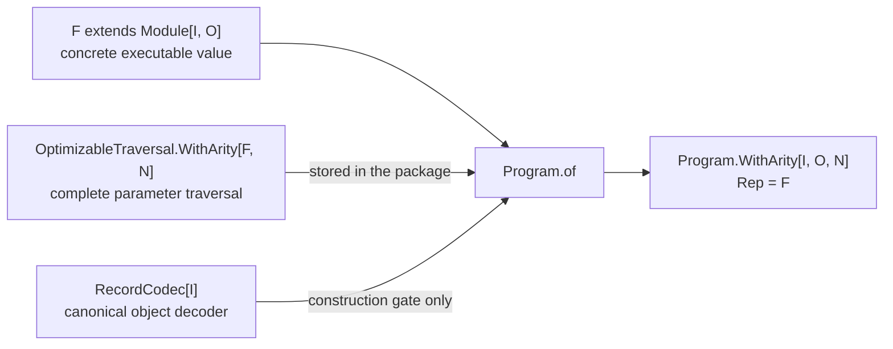
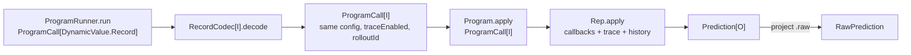
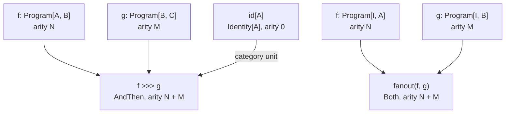

# A module packaged for composition and optimization

A [`Module`](../contracts/Module.md) knows how to run: give it an input and it produces either an error or a prediction.
An optimizer needs more information. It must also be able to find every tunable `Predict` inside the module, read those
predicts' instructions and demonstrations, and rebuild the module with updated values.

Composition makes this harder. Combining two modules produces a precise but increasingly large Scala type describing
the whole structure. For example, a two-stage pipeline may have a type resembling:

```scala
AndThen[Question, Draft, Answer, Predict[Question, Draft], ChainOfThought[Draft, Answer]]
```

That precision is useful to the compiler, but it is cumbersome for APIs that simply want “a program from `Question` to
`Answer` that can be optimized.”

[`Program`](Program.scala) solves this by putting two things in one value:

1. The executable module.
2. A traversal that can find and replace all of that module's tunable parameters.

It then hides the module's large concrete type behind the simpler `Program[I, O]`, where `I` is the input type and `O`
is the output type. For example, `Program[Question, Answer]` means “an optimizable program that accepts a `Question` and
produces an `Answer`,” regardless of how many modules are inside it.

The source expresses that package as:

```scala
sealed trait Program[I, O]:
  type Rep <: Module[I, O]
  type ParameterArity <: Int

  val program: Rep
  val optimizableParameters: OptimizableTraversal.WithArity[Rep, ParameterArity]
```

`Program` does **not** extend `Module`. It contains a module and delegates execution to it. `Rep` is the hidden concrete
module type, while `ParameterArity` records how many independently tunable parts the module contains.

The shortest mental model is:

```text
Program[I, O]
  = some Rep <: Module[I, O]
  + that exact Rep value
  + its fixed-arity OptimizableTraversal
```

The later algebraic terminology describes ordinary operations over this package: identity, sequential composition,
fan-out, reading parameters, and replacing parameters. You do not need category theory to understand or use the type;
the laws simply state that these operations behave predictably when programs are combined.

## Construction and evidence

To turn an existing module into a `Program`, call `Program.of`. The call compiles only when Scala can find two supporting
typeclass values—often called *evidence* in Scala documentation:



The two requirements reject different invalid packages:

| Evidence | What it establishes | If absent |
|---|---|---|
| `OptimizableTraversal[F]` | Every learnable leaf in the representation is addressable in stable order | `Program.of(f)` does not compile |
| `RecordCodec[I]` | A raw input record can be decoded into `I` in one agreed way | The module cannot be packaged with input type `I` |

`RecordCodec[I]` is not stored as a field. It guards construction, identity, and record-boundary execution; a
[`ProgramRunner`](../ProgramRunner.scala) resolves the object's codec again when it needs to decode a record.

The package itself is built privately by `packageWith`. This keeps every `Program` value honest: application code
cannot construct one with traversal evidence for a different representation or claim the wrong arity.

## The two associated types

An associated type is a type named inside another type instead of supplied in its square brackets. Each `Program[I, O]`
value therefore carries its own answers to “what exact module is inside?” and “how many tunable parts does it have?”

### `Rep`

`Rep` is the hidden concrete module type. The value and its traversal retain the same path-dependent type:

```scala
type Rep <: Module[I, O]
val program: Rep
val optimizableParameters: OptimizableTraversal[Rep]
```

This alignment is the package's key safety property. The public API need not know whether `Rep` is a
`Predict`, `AndThen`, `Both`, `ReAct`, or a user-defined composite, but the stored traversal still does.

### `ParameterArity`

`ParameterArity` is the number of independently writable optimizer leaves. It is a singleton `Int` type: a literal such
as `2` that the compiler knows, not merely a number discovered at runtime. `Program.WithArity` makes that associated
type visible in an ordinary refinement:

```scala
type WithArity[I, O, N <: Int] =
  Program[I, O] { type ParameterArity = N }
```

For example:

```text
Predict                         N = 1
parameter-free Identity         N = 0
f >>> g                         N = f.N + g.N
fanout(f, g)                    N = f.N + g.N
```

The runtime traversal still reports its count. `OptimizableTraversal.arityAgreement` states that the runtime count and
the statically tracked arity agree.

## Packaging versus erasing arity

`Program.of` returns a refined value whose arity is available to inference:

```scala
val precise: Program.WithArity[I, O, 1] =
  Program.of(predict)
```

Scala also lets the precise type be assigned to the more general `Program[I, O]` type. This is called *widening* (or
an *upcast*):

```scala
val erased: Program[I, O] = precise
```

The widened value is still executable, still has its packaged traversal internally, and still supports the compatibility
`params` operation. What is lost is the compile-time name `N` for its parameter count, which is needed to build
`OptimizableTraversal.Of[Program.WithArity[I, O, N], N]`. Consequently:

| Static type | Typed execution | `ProgramRunner` | `params` | Optimizer typeclass |
|---|---:|---:|---:|---:|
| `Program.WithArity[I, O, N]` | yes | yes | yes | yes |
| `Program[I, O]` | yes | yes | yes | intentionally unavailable |

This distinction prevents an optimizer from accepting a program after its parameter shape has been erased while still
allowing non-optimizing consumers to use the simpler two-parameter `Program[I, O]` type.

## Execution has two entry paths

`Program.apply` is the typed path. It delegates to the packaged module's public `apply`, so the module lifecycle remains
in force:

```scala
def apply(call: ProgramCall[I])(using RuntimeContext)
    : Either[DspyError, Prediction[O]] =
  program(call)
```

Optimizers and evaluators start from `DynamicValue.Record`, so `ProgramRunner` supplies a second path:



`ProgramCall.mapInput` changes only the decoded input carrier, preserving every execution control. The runner returns
`RawPrediction` because `Example`-based optimization and evaluation operate on dynamic records, even when the packaged
program's internal boundary is statically typed.

Decoding belongs to the input object `I`, not to `Rep`. Two different programs with the same input type therefore
cannot quietly disagree about how raw records should be decoded. Identity and composition can therefore reuse the same
decoder without having to choose between program-specific alternatives.

## Category operations

Here, a *category* can be read as a system of typed pipes: there is a pipe that does nothing (`id`), and compatible pipes
can be connected in sequence (`>>>`). The companion supplies a
[`ParameterizedCategory[RecordCodec, Program]`](ParameterizedCategory.scala) instance. Its object constraint is
`RecordCodec`; its morphisms are packaged programs.



The operations reuse the ordinary executable combinators:

- `id[A]` packages `Compose.id[A]` with an empty, arity-zero traversal.
- `f >>> g` builds `AndThen(f.program, g.program)` and concatenates their traversals in execution order.
- `fanout(f, g)` builds ordered `Both(f.program, g.program)` and concatenates their traversals left-to-right.
- `parallel` is a compatibility name for `fanout`; neither operation claims concurrent execution.

There is no independent-input `tensor` operation on this parameterized-category instance. A packaged program has one
canonical record decoder for its domain object; a general pair `(I, J)` has no automatically chosen combined record
boundary. Ordered tensor operations remain available at the raw `Module` algebra where no such packaging claim is
needed.

## Parameters form a lawful lens

The complete writable parameter vector is exactly the lawful focus of a fixed-arity package:

```text
Program.WithArity[I, O, N]
          │
          ├── sizedParams / Lens.get ──> SizedVector[OptimizableParameters, N]
          │
          └── reparamSized / Lens.set <── SizedVector[OptimizableParameters, N]
```

`SizedVector` validates a runtime vector's size once and retains its length in the type. The resulting lens satisfies:

| Lens law | Meaning for a packaged program |
|---|---|
| Get-Put | Replacing a program with the parameters just read changes nothing observable |
| Put-Get | Reading after replacement returns exactly the supplied parameters |
| Put-Put | A second replacement completely supersedes the first |

The older `params: Vector[OptimizableParameters]` and `reparam(Vector[...])` methods remain as compatibility APIs.
`sizedParams` and `reparamSized` are preferable when a fixed program shape is already available because a wrong-sized
replacement is then unrepresentable at the call site.

The `OptimizableTraversal` instance for `Program.WithArity` delegates inspection, replacement, and structural naming to
the packaged traversal. Optimizers therefore see the same leaves in the same order before and after packaging.

## Parameter projection is a functor

The practical rule is simple: an identity program has no tunable parameters, and a pipeline contains the first stage's
parameters followed by the second stage's parameters.

Algebra gives names to these familiar structures. A `Vector` with an empty value and concatenation is a *monoid*:

```text
empty   = Vector.empty
p ⊕ q   = p ++ q
```

`ReadFunctor` is the operation that reads parameters from a program. Calling it a *functor* says that reading respects
the two ways programs are combined:

```text
ReadFunctor(id[A])  = Vector.empty
ReadFunctor(f >>> g) = ReadFunctor(f) ++ ReadFunctor(g)
```

In other words, reading parameters does not scramble or invent them when programs are composed. The law names for these
rules are `paramsId`, `paramsCompose`, and `paramsFanout`. `ParameterizedCategory` also checks that replacing parameters
and then reading them back behaves as expected.

## A typed example

The following pipeline contains two independently tunable predicts:

```scala
import dspy4s.programs.*
import dspy4s.programs.algebra.*
import dspy4s.programs.contracts.ProgramCall
import dspy4s.programs.optimization.OptimizableParameters
import dspy4s.core.collections.SizedVector
import dspy4s.typed.Signature
import zio.blocks.schema.Schema

final case class Question(question: String) derives Schema
final case class Draft(answer: String) derives Schema
final case class Answer(summary: String) derives Schema

val draft: Program.WithArity[Question, Draft, 1] =
  Program.of(Predict(Signature.derived[Question, Draft]("Draft")))

val summarize: Program.WithArity[Draft, Answer, 1] =
  Program.of(Predict(Signature.derived[Draft, Answer]("Summarize")))

val pipeline: Program.WithArity[Question, Answer, 2] =
  draft >>> summarize
```

Typed execution uses the semantic input directly:

```scala
pipeline(ProgramCall(Question("Why is the sky blue?")))
```

The static arity makes a sized update possible:

```scala
val current: SizedVector[OptimizableParameters, 2] = pipeline.sizedParams
val revised = current.mapSized(parameters =>
  parameters.copy(instructions = Some("Be concise and precise."))
)
val updated: Program.WithArity[Question, Answer, 2] =
  pipeline.reparamSized(revised)
```

An optimizer may consume `pipeline` because both required capabilities are available:

```text
OptimizableTraversal[Program.WithArity[Question, Answer, 2]]
ProgramRunner[Program.WithArity[Question, Answer, 2]]
```

## Runtime-string signatures

A raw `DynamicValue.Record` cannot use one global `RecordCodec`: signatures created from strings may expect different
fields, so the record type alone does not tell the program which validation and decoding rules to use.

[`DynamicSignature`](../DynamicSignature.scala) solves this by minting fresh path-dependent `In` and `Out` types for
each parse, together with their canonical codecs. Its `packaged()` method returns an ordinary
`Program.WithArity[In, Out, 1]`. Two parses of the same string still produce distinct object types; crossing between
them requires an explicit, validating `DynamicSignature.bridge`.

This lets runtime-built signatures use the same composition and optimization machinery while keeping their different
decoding rules separate.

## What `Program` does not contain

- It is not an AST and does not interpret module nodes; `Rep` remains the actual executable module value.
- It is not a subtype of `Module`; execution is explicit delegation through `program`.
- It does not store `RecordCodec[I]`; decoding remains an object capability resolved at construction or run time.
- It does not store `RuntimeContext`; execution services remain ambient at the call boundary.
- It does not define structural equality. Category laws use the documented observation of results, parameters, decoding,
  callbacks, trace, and history.
- It does not make effectful fan-out into lawful copying. Sharing `h` in `h >>> fanout(f, g)` runs `h` once, while
  `fanout(h >>> f, h >>> g)` runs it twice; copy naturality is deliberately a non-law.

## Laws and executable checks

The primary executable specification is
[`ParameterizedCategoryLawSuite`](../../../../../test/scala/dspy4s/programs/algebra/ParameterizedCategoryLawSuite.scala).
It checks:

1. Category left identity, right identity, and associativity under complete program observation.
2. Preservation of the complete prediction envelope through identity and `ProgramRunner`.
3. Parameter identity, composition, fan-out, round-trip, and write-back laws.
4. The three sized parameter lens laws and static/runtime arity agreement.
5. The parameter monoid, its delooped category, and both `ReadFunctor` laws.
6. Canonical object-side decoding and the compile-time rejection of incoherent decoders or missing evidence.
7. Fresh runtime-signature objects and rejection of accidental cross-bundle composition.
8. The effectful copy non-law.

[`ProgramRunnerSuite`](../../../../../test/scala/dspy4s/programs/ProgramRunnerSuite.scala) separately checks that typed
record decoding preserves the complete `ProgramCall` control envelope.

The optimizer integration is exercised by
[`ParaCompileSuite`](../../../../../../../optimize/src/test/scala/dspy4s/optimize/para/ParaCompileSuite.scala), including
optimization of composed, fixed-arity packages and the deliberate loss of optimizer evidence after an arity-erasing
upcast.

Run them with:

```bash
sbt --error \
  'programs/testOnly dspy4s.programs.algebra.ParameterizedCategoryLawSuite' \
  'programs/testOnly dspy4s.programs.ProgramRunnerSuite' \
  'optimize/testOnly dspy4s.optimize.para.ParaCompileSuite'
```

## Suggested reading order

1. Read `Program`'s four abstract members to see what each packaged value carries.
2. Read `Program.of` and then `packageWith` to see how a module and its parameter traversal are packaged safely.
3. Read `WithArity`, `sizedParams`, and `reparamSized` to see parameter shape retained in types.
4. Read the lens and `OptimizableTraversal` instances to see why fixed arity matters to optimizers.
5. Read both `ProgramRunner` instances to see how raw records become typed inputs.
6. Read `parameterizedCategoryProgram` to see identity, composition, fan-out, and arity addition.
7. Read `ReadFunctor` and `ParameterAlgebra.scala` last; they give algebraic names to the parameter-reading rules already
   introduced above.

For the executable boundary inside the package, continue with [`Module.md`](../contracts/Module.md).
