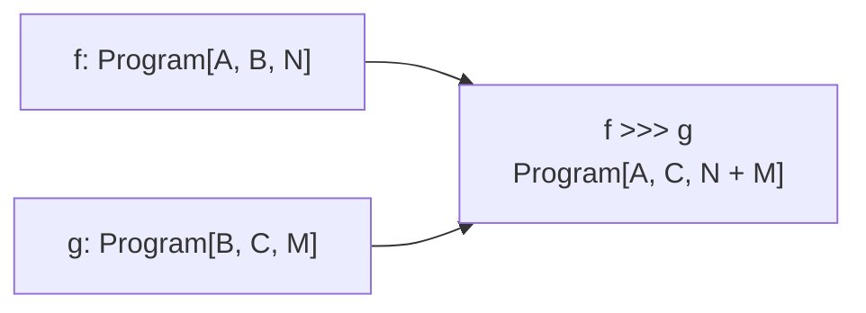

# `Program`: an optimizable module with a known parameter count

A [`Module`](../contracts/Module.scala) knows how to run a computation. An optimizer needs more: it must be able to find
every tunable leaf, read those leaves in a stable order, and rebuild the same computation with updated values.

`Program` packages those two capabilities together:

1. A runnable `Module[I, O]`.
2. The exact traversal that reads and replaces all of that module's optimizer parameters.

It also records the number of tunable leaves in its type:

```scala
sealed trait Program[I, O, N <: Int]:
  type Rep <: Module[I, O]

  val program: Rep
  val optimizableParameters: OptimizableTraversal.WithArity[Rep, N]
```

The three type arguments mean:

| Argument | Meaning |
|---|---|
| `I` | Input type accepted by the program |
| `O` | Output type produced by the program |
| `N` | Number of independently writable optimizer leaves |

For example, `Program[Question, Answer, 2]` accepts a `Question`, produces an `Answer`, and contains exactly two tunable
leaves.

`Program` does **not** extend `Module`. It contains a module and delegates execution to it. This keeps ordinary modules
usable without claiming that every module is optimizer-addressable.

## Why `Rep` is hidden but `N` is visible

Composition produces large concrete Scala types. A two-stage pipeline may have a representation resembling:

```scala
AndThen[Question, Draft, Answer, Predict[Question, Draft], ChainOfThought[Draft, Answer]]
```

Most callers do not need that structural type. They only need to know the input, output, and number of parameters. `Rep`
therefore remains an associated type hidden inside the package, while `N` is a public type argument:

```text
Program[I, O, N]
  = some hidden Rep <: Module[I, O]
  + that exact Rep value
  + OptimizableTraversal.WithArity[Rep, N]
```

Keeping `N` visible makes invalid parameter updates unrepresentable and lets composition calculate its new arity.

## Construction and evidence

`Program.of(module)` packages an existing module. It compiles only when Scala can find:

- `OptimizableTraversal[module.Type]`, proving that every optimizer leaf is addressable;
- `RecordCodec[I]`, giving the input object one canonical record decoder.

```mermaid
flowchart LR
    moduleValue["F extends Module[I, O]"]
    traversal["OptimizableTraversal.WithArity[F, N]"]
    codec["RecordCodec[I]"]
    constructor["Program.of"]
    packaged["Program[I, O, N]<br/>Rep = F"]

    moduleValue --> constructor
    traversal -->|"stored"| constructor
    codec -->|"construction gate"| constructor
    constructor --> packaged
```

The private `packageWith` constructor ties `Rep`, its value, its traversal, and `N` together. Application code cannot
package a module with traversal evidence for a different representation or claim the wrong parameter count.

## Parameter arity is a grade

A *grade* is information attached to a composable operation that combines predictably. Program arity behaves this way:

```text
grade(id)      = 0
grade(f >>> g) = grade(f) + grade(g)
```

The abstraction expressing this is:

```scala
NatGradedCategory[RecordCodec, Program]
```

Its important operations have these types:

```scala
id[A]: Program[A, A, 0]

compose(
  f: Program[A, B, N],
  g: Program[B, C, M]
): Program[A, C, N + M]
```

The familiar `f >>> g` syntax delegates to `compose`.



The ordinary category laws still apply: identity changes nothing and composition is associative. The law statements
compare programs after forgetting only the grade. `AnyGrade` is a sealed existential package containing the unchanged
morphism and its hidden grade; `forgetGrade` is final, so an instance cannot discard behavioral information to make a
law pass. This package is necessary because Scala does not normalize symbolic types such as `(N + M) + K` and
`N + (M + K)` to the same spelling, even though natural-number addition is associative.

## Parameters form a lawful lens

`Parameterization` is separate from the category. It focuses a fixed-grade program onto its complete parameter vector:

```text
Program[I, O, N]
       │
       ├── sizedParams ──────> SizedVector[OptimizableParameters, N]
       │
       └── reparamSized <───── SizedVector[OptimizableParameters, N]
```

This is a lawful [`Lens`](../../../../../../../core/src/main/scala/dspy4s/core/algebra/Lens.scala). It satisfies:

| Lens law | Program meaning |
|---|---|
| Get-Put | Writing back the parameters just read changes nothing observable |
| Put-Get | Reading after a write returns exactly the supplied parameters |
| Put-Put | The most recent replacement completely supersedes the earlier one |

The parameterization also states two compositional laws:

```text
params(id[A])  = empty
params(f >>> g) = params(f) ++ params(g)
```

`params` and `reparam(Vector)` remain convenient runtime-boundary operations. Prefer `sizedParams` and `reparamSized`
inside typed code because their lengths are checked statically.

## Ordered fan-out is deliberately separate

Running two programs on the same input is useful, but it is not part of parameterization and it is not a categorical
product for effectful programs. `OrderedFanout` owns only this operation:

```scala
fanout(
  f: Program[I, A, N],
  g: Program[I, B, M]
): Program[I, (A, B), N + M]
```

The left program runs before the right program. Its parameter law is simple concatenation, but no concurrency, symmetry,
or copying-naturality law is asserted.

The distinction matters for an effectful `h`:

```text
h >>> fanout(f, g)          runs h once, then shares its result
fanout(h >>> f, h >>> g)    runs h twice
```

Those expressions can make different language-model calls, emit different callbacks, or fail differently. Treating
fan-out as ordinary cartesian copying would equate programs that the runtime can distinguish.

## Intentionally forgetting the grade

Some APIs only execute or inspect a program and do not care how many parameters it contains. They can use:

```scala
type SomeProgram[I, O] = Program[I, O, ?]
```

For example:

```scala
val precise: Program[Question, Answer, 1] = Program.of(predict)
val erased: SomeProgram[Question, Answer] = precise
```

| Static type | Typed execution | `ProgramRunner` | Unsized `params` | Optimizer traversal |
|---|---:|---:|---:|---:|
| `Program[I, O, N]` | yes | yes | yes | yes |
| `SomeProgram[I, O]` | yes | yes | yes | intentionally unavailable |

The optimizer traversal is unavailable after erasure because its result must name the same `N` as the program. Execution
does not need that information, so `ProgramRunner[SomeProgram[I, O]]` remains available.

`Program.erasedCategory` supplies ordinary category operations for code that intentionally works at this boundary. It is
an explicit value rather than a `given`; exact programs therefore select graded composition and retain `N + M` by
default.

## Parameter reading is functorial

`Vector[OptimizableParameters]` forms a monoid:

```text
identity = Vector.empty
combine  = ++
```

`ParamsHom` turns that monoid into a one-object category. `ReadFunctor` maps an arity-erased program into it:

```text
SomeProgram[I, O]
      │ ReadFunctor
      ▼
Vector[OptimizableParameters]
      │ length
      ▼
Natural-number grade N
```

Calling this projection a functor says that it preserves identity and composition. It cannot reorder, invent, or discard
parameters when programs are combined. The visible grade is therefore not unrelated metadata: it is the length of the
ordered parameter vector produced by this semantics.

## Execution paths

Typed execution delegates to the packaged module's public `apply`, preserving callbacks, trace, history, and the complete
prediction envelope:

```scala
program(ProgramCall(input)): Either[DspyError, Prediction[O]]
```

Optimizers start from a dynamic record. `ProgramRunner` resolves the canonical `RecordCodec[I]`, decodes the input while
preserving the rest of the `ProgramCall`, executes the typed program, and projects its `RawPrediction`:


Decoding belongs to the input object `I`, not to the concrete representation. Two programs with the same input type
cannot quietly disagree about how raw records are decoded.

## A typed example

```scala
import dspy4s.programs.*
import dspy4s.programs.algebra.*
import dspy4s.typed.Signature
import zio.blocks.schema.Schema

final case class Question(question: String) derives Schema
final case class Draft(answer: String) derives Schema
final case class Answer(summary: String) derives Schema

val draft: Program[Question, Draft, 1] =
  Program.of(Predict(Signature.derived[Question, Draft]("Draft")))

val summarize: Program[Draft, Answer, 1] =
  Program.of(Predict(Signature.derived[Draft, Answer]("Summarize")))

val pipeline: Program[Question, Answer, 2] =
  draft >>> summarize
```

The result is known statically to contain two writable leaves:

```scala
val current: SizedVector[OptimizableParameters, 2] = pipeline.sizedParams
val updated: Program[Question, Answer, 2] = pipeline.reparamSized(current)
```

## Runtime-created signatures

[`DynamicSignature`](../DynamicSignature.scala) mints fresh path-dependent input and output types for each parsed
signature, together with their canonical codecs. Its `packaged()` method returns `Program[In, Out, 1]`. Explicit bridges
have grade zero, so a pipeline across two runtime signatures retains only the grades of the actual predictors.

## What `Program` does not claim

- It is not a subtype of `Module`; it packages one.
- It is not a free syntax tree or interpreter; `Rep` is the executable module value.
- It does not make every `Module` optimizable.
- It does not store `RuntimeContext` or `RecordCodec[I]`.
- It does not claim that effectful fan-out is copying in a cartesian category.
- It does not claim that ordered independent execution is a symmetric monoidal tensor.

## Laws and executable checks

[`ProgramAlgebraLawSuite`](../../../../../test/scala/dspy4s/programs/algebra/ProgramAlgebraLawSuite.scala) checks:

1. Graded identity and associative composition under complete program observation.
2. Zero identity grade and additive composition/fan-out grades.
3. The sized parameter lens laws.
4. Parameter identity, composition, and fan-out laws.
5. The parameter monoid, its delooping, and both `ReadFunctor` laws.
6. Canonical object-side decoding and construction gates.
7. The effectful copying non-law.

Optimizer integration is checked by
[`ParaCompileSuite`](../../../../../../../optimize/src/test/scala/dspy4s/optimize/para/ParaCompileSuite.scala).

Run the focused checks with:

```bash
sbt --error \
  'programs/testOnly dspy4s.programs.algebra.ProgramAlgebraLawSuite' \
  'programs/testOnly dspy4s.programs.DynamicSignatureSuite' \
  'programs/testOnly dspy4s.programs.algebra.OrderedTensorOpsSuite' \
  'optimize/testOnly dspy4s.optimize.para.ParaCompileSuite'
```

## Suggested reading order

1. Read `Program` and `Program.of` to understand the package.
2. Read `NatGradedCategory` to see why identity has grade zero and composition adds grades.
3. Read `Parameterization` and `Lens` to see how parameters are read and replaced lawfully.
4. Read `OrderedFanout` to see which useful effectful operation is intentionally not a category law.
5. Read `ParameterAlgebra` and `ReadFunctor` to see parameter extraction as a separate interpretation.
6. Read `ProgramAlgebraLawSuite` for executable examples and counterexamples.
