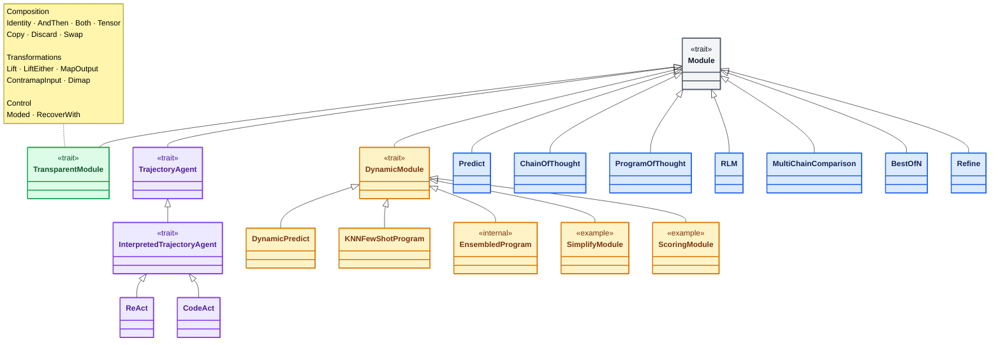
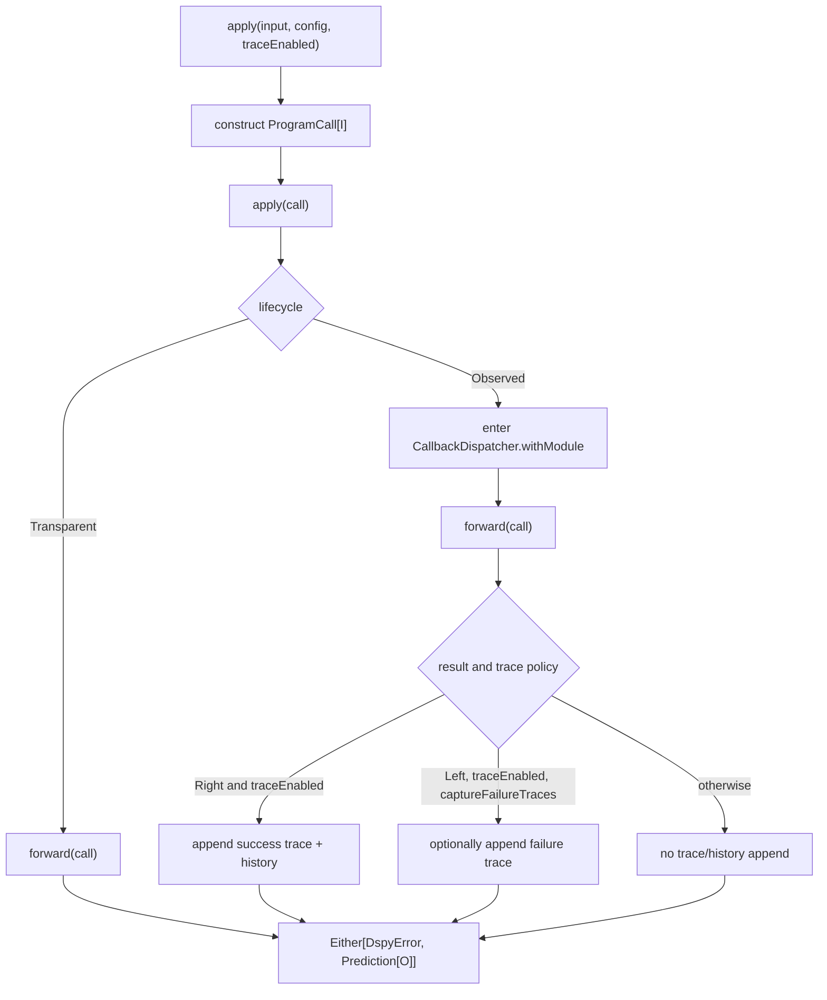

# The uniform program boundary

[`Module`](Module.scala) is the base type of every executable program in dspy4s. It gives a program a semantic input
type `I`, a semantic output type `O`, and one uniform runtime boundary:

```scala
trait Module[I, O]:
  def moduleName: String
  protected val lifecycle: ModuleLifecycle[I, O]
  protected def forward(
      call: ProgramCall[I]
  )(using RuntimeContext): Either[DspyError, Prediction[O]]
```

Read the type from the inside out:

```text
ProgramCall[I]  ── Module ──>  Either[DspyError, Prediction[O]]
     │                                      │
     ├─ semantic input I                    ├─ decoded output O
     └─ execution controls                  └─ preserved raw evidence
```

`I` and `O` describe the program's domain-level function. [`ProgramCall`](ProgramCall.scala) and
[`Prediction`](../../../../../../../typed/src/main/scala/dspy4s/typed/Prediction.scala) add the operational context that
every program boundary needs.

## Class hierarchy

The hollow-triangle arrows mean “extends” and point toward the supertype. This diagram names every **named** `src/main`
descendant in the repository. To keep the large transparent branch legible, its descendants are grouped by
responsibility in an attached note instead of fourteen individual class nodes and arrows. Test fixtures are excluded.
The streaming tutorial also creates one anonymous `new DynamicModule`; because that expression declares no reusable
class name, it is noted here but is not a class node.
Colors match the four semantic branches in the table below: blue is direct executable, green is transparent structural,
amber is dynamic-record, and violet is trajectory-based. The `Module` root remains neutral gray.



The descendants fall into four semantic branches:

| Branch | Purpose | Descendants |
|---|---|---|
| Direct executable programs | Implement a complete typed strategy directly | `Predict`, `ChainOfThought`, `ProgramOfThought`, `RLM`, `MultiChainComparison`, `BestOfN`, `Refine` |
| `TransparentModule` | Structural syntax whose own node must not appear in callbacks, trace, or history | `Identity`, `AndThen`, `Both`, `Tensor`, `Copy`, `Discard`, `Swap`, `Lift`, `LiftEither`, `MapOutput`, `ContramapInput`, `Dimap`, `Moded`, `RecoverWith` |
| `DynamicModule` | Execute over runtime `DynamicValue.Record` inputs and outputs | `DynamicPredict`, `KNNFewShotProgram`, internal `EnsembledProgram`, example `SimplifyModule`, example `ScoringModule` |
| `TrajectoryAgent` | Gather a typed trajectory and then extract the result | `InterpretedTrajectoryAgent`, with concrete programs `ReAct` and `CodeAct` |

This is an inheritance diagram, not a catalog of every type that mentions `Module`. In particular:

- `Program[I, O]` packages a representation through `type Rep <: Module[I, O]`; it does not extend `Module`.
- `ModuleHom[I, O]` is an alias for `Module[I, O]`, not a new type.
- `Parallel`, `Compose`, and `DynamicSignature` are factories or APIs that construct modules, not subclasses.
- A program containing `Predict` fields has a composition relationship to those predicts, not an inheritance edge.

## What crosses the boundary

### Input: `ProgramCall[I]`

A call bundles the semantic input with controls that must survive composition:

```scala
final case class ProgramCall[I](
    input: I,
    config: DynamicValue.Record = DynamicValue.Record.empty,
    traceEnabled: Boolean = true,
    rolloutId: Option[Int] = None
)
```

`mapInput` changes only `I`. It preserves `config`, `traceEnabled`, and `rolloutId`, which is why `AndThen`, input
adapters, typed encoding, and trajectory extractors can move between input carriers without silently discarding call
controls.

### Output: `Prediction[O]`

A successful module returns both the decoded value and its raw execution evidence:

```scala
final case class Prediction[O](
    output: O,
    raw: RawPrediction
)
```

`output` is the domain result used by downstream typed modules. `raw` retains parsed field values, completions, LM usage,
and adapter metadata. Composition therefore threads `prediction.output` while preserving or combining
`prediction.raw`.

### Failure: `Either[DspyError, ...]`

Expected failures are values. A module does not encode failure by returning an empty prediction, and callers do not
need exceptions for ordinary adapter, decoding, model, tool, or interpreter failures. Structural transforms guard
user-supplied functions and translate thrown exceptions into the same error channel.

## The execution template

Callers invoke `apply`; subclasses implement `forward`. `apply` is `final`, so an ordinary subclass cannot bypass the
shared lifecycle.



The observed branch always establishes the callback scope; `traceEnabled` controls trace and history recording, not the
existence of module start/end callbacks. A successful observed call appends one trace entry and one history entry. A
failure normally appends neither; when `captureFailureTraces` is enabled, it appends a failure trace and preserves a
parser's raw response when available.

## `ModuleLifecycle` is an observation policy

[`ModuleLifecycle`](ModuleLifecycle.scala) is a value-level strategy:

```scala
sealed trait ModuleLifecycle[I, O]

object ModuleLifecycle:
  final case class Transparent[I, O]() extends ModuleLifecycle[I, O]
  final case class Observed[I, O](
      observation: CallObservation[ProgramCall[I], O]
  ) extends ModuleLifecycle[I, O]
```

`CallObservation` answers three questions for an observed boundary:

1. How is the typed input projected into a runtime record?
2. Does this call permit trace/history recording?
3. How is the prediction projected into an output record?

It is a field rather than a typeclass because observation is not unique for a given `I` and `O`. A signature-backed
`Predict[I, O]` can encode its input through its `Shape[I]`; a generic wrapper such as `BestOfN[I, O]` has the same type
shape but may not possess an authoritative input encoder.

## Why transparent modules exist

Consider:

```scala
(a >>> b) >>> c
a >>> (b >>> c)
```

Both syntax trees execute the same semantic leaves: `a`, `b`, and `c`. If each `AndThen` node were observed, the two
associations would produce different callback and trace trees merely because parentheses changed.

`TransparentModule` fixes its lifecycle to `ModuleLifecycle.Transparent`. Its own `forward` delegates through each
child's public `apply`, so the wrapper is invisible while its children remain fully observed:

```text
AndThen (transparent)
├── a (observed)
└── AndThen (transparent)
    ├── b (observed)
    └── c (observed)
```

Transparency is therefore an operational distinction, not an optimization or a claim that the wrapper performs no
work. `RecoverWith` can choose a fallback, `Moded` can rewrite controls, and `AndThen` can combine raw envelopes; they
simply do not claim independent runtime identity.

## Typed and dynamic modules are siblings

`Predict[I, O]` extends `Module[I, O]` directly. `DynamicPredict` extends `DynamicModule`, whose fixed carrier is:

```scala
Module[DynamicValue.Record, DynamicValue.Record]
```

`DynamicModule` asks subclasses for:

```scala
protected def forwardDynamic(
    call: ProgramCall[DynamicValue.Record]
): Either[DspyError, RawPrediction]
```

It then lifts a successful `RawPrediction` exactly once with `Prediction.dynamic`. This makes dynamic modules obey the
same public result boundary as typed modules without pretending that a runtime record has a statically known domain
shape.

`Predict` and `DynamicPredict` are consequently siblings over the shared `PredictEngine`; neither invokes the other.
This avoids an extra lifecycle boundary and keeps one model prediction equal to one module event.

## A minimal custom module

This module has a typed semantic function, an explicit observation projection, and no raw model evidence:

```scala
final case class LengthModule() extends Module[String, Int]:
  override val moduleName: String = "length"

  override protected val lifecycle: ModuleLifecycle[String, Int] =
    ModuleLifecycle.typed(call => DynamicValues.record("text" := call.input))

  override protected def forward(
      call: ProgramCall[String]
  )(using RuntimeContext): Either[DspyError, Prediction[Int]] =
    Right(Prediction(call.input.length, RawPrediction.empty))
```

Callers may use the convenience boundary:

```scala
LengthModule()("hello")
// Right(Prediction(output = 5, raw = RawPrediction.empty))
```

or provide the envelope explicitly when they need controls:

```scala
LengthModule()(ProgramCall(
  input = "hello",
  traceEnabled = false,
  rolloutId = Some(2)
))
```

If the type is merely structural syntax around child modules, it should normally extend `TransparentModule` instead.
If its semantic carrier is a runtime record and its computation naturally returns `RawPrediction`, it should normally
extend `DynamicModule`.

## Synchronous and asynchronous entry points

| Entry point | Purpose |
|---|---|
| `apply(input, config, traceEnabled)` | Convenience constructor for a `ProgramCall`, followed by ordinary execution |
| `apply(call)` | Canonical synchronous, lifecycle-wrapped boundary |
| `applyAsync(call)` | Runs asynchronously and returns only the value; the worker's trace/history remains isolated |
| `applyAsyncExecuted(call)` | Runs asynchronously and returns `Executed[value]`, including the worker-produced runtime delta |

Both asynchronous methods propagate the runtime services, configuration, scope, and registered context carriers into
the worker. Use `applyAsyncExecuted` when the caller must explicitly join the child's observable runtime output.

## Boundary invariants

The implementation establishes these invariants:

1. Every successful public call returns `Prediction[O]`; typed and dynamic modules share the same outer result shape.
2. Every ordinary module call passes through exactly one `final apply` lifecycle boundary before its `forward`.
3. A transparent module contributes no callbacks, trace, or history of its own.
4. An observed successful call records trace/history only when `traceEnabled` is true.
5. A failed call records failure evidence only when tracing and `captureFailureTraces` are both enabled.
6. `ProgramCall.mapInput` preserves all execution controls.
7. `DynamicModule` lifts `RawPrediction` into `Prediction[DynamicValue.Record]` exactly once.
8. Structural composition invokes children through `apply`, so transparency never suppresses child lifecycles.

The executable checks are split by responsibility:

- [`ModuleLifecycleSuite`](../../../../../test/scala/dspy4s/programs/ModuleLifecycleSuite.scala) checks value-level
  observation and transparent lifecycle behavior.
- [`ProgramRuntimeSuite`](../../../../../test/scala/dspy4s/programs/ProgramRuntimeSuite.scala) checks callbacks,
  trace/history, and `traceEnabled` on a dynamic module.
- [`ComposeLawSuite`](../../../../../test/scala/dspy4s/programs/ComposeLawSuite.scala) checks that transparent structural
  composition exposes only semantic leaf lifecycles and preserves category observations under reassociation.
- [`FailureTraceSuite`](../../../../../test/scala/dspy4s/programs/FailureTraceSuite.scala) checks captured failure traces
  and raw parser responses.

Run the boundary-focused suites with:

```bash
sbt --error \
  'programs/testOnly dspy4s.programs.ModuleLifecycleSuite' \
  'programs/testOnly dspy4s.programs.ProgramRuntimeSuite' \
  'programs/testOnly dspy4s.programs.ComposeLawSuite' \
  'programs/testOnly dspy4s.programs.FailureTraceSuite'
```

## Suggested reading order

1. Read `Module.apply(call)` to see the lifecycle template.
2. Read `ModuleLifecycle` and `CallObservation` to see how typed values become runtime records.
3. Read `ProgramCall.mapInput` and `Prediction` to understand what composition changes and preserves.
4. Read `TransparentModule` and then `AndThen` to see structural composition without structural trace noise.
5. Read `DynamicModule`, `Predict`, and `DynamicPredict` to compare the typed and dynamic carriers.
6. Read `TrajectoryAgent` and `InterpretedTrajectoryAgent` for the deepest template-method branch.

For the typed state machine beneath `ReAct` and `CodeAct`, continue with
[`InterpretedTrajectoryAgent.md`](../runtime/InterpretedTrajectoryAgent.md).
