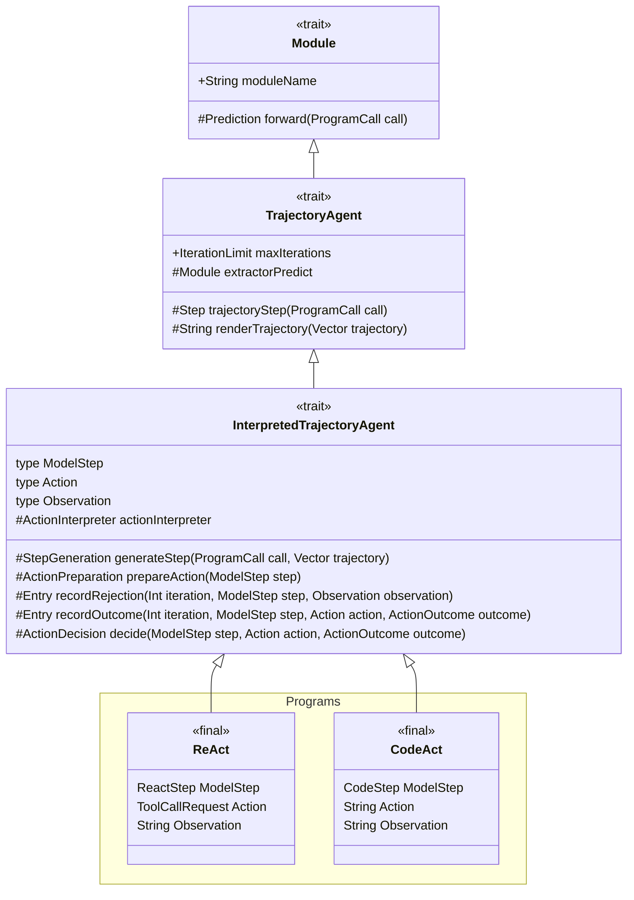
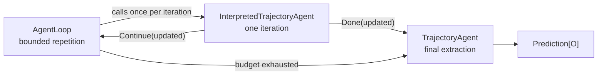
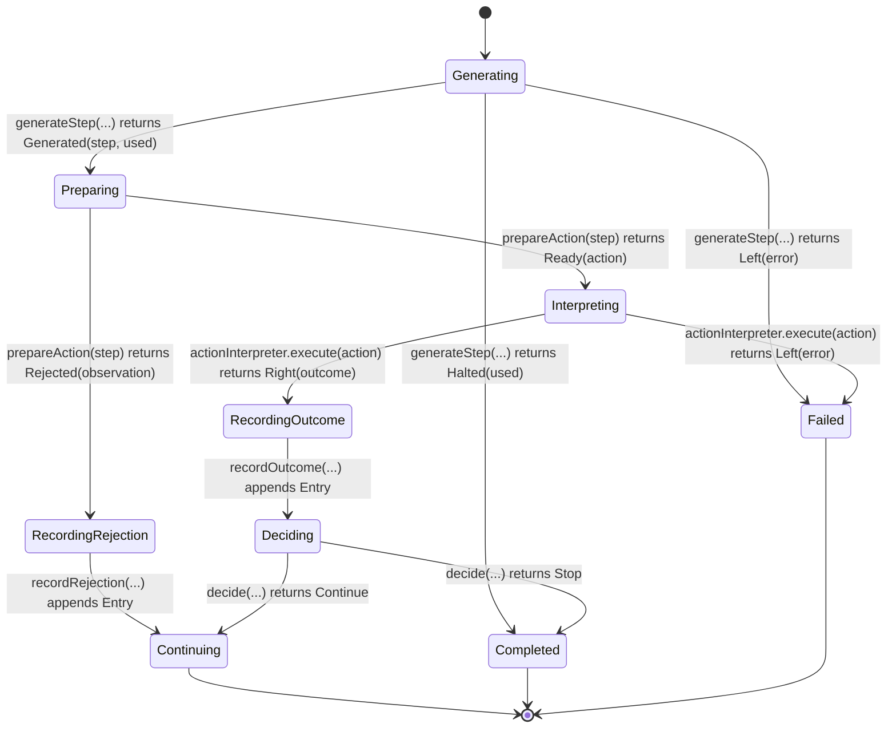

# The interpreted trajectory state machine

[`InterpretedTrajectoryAgent`](InterpretedTrajectoryAgent.scala) is the shared one-iteration machine behind
[`ReAct`](../ReAct.scala) and [`CodeAct`](../CodeAct.scala). It describes agents whose model output is lowered into an
action, interpreted by an environment, recorded in a trajectory, and then classified as either continuing or complete.

The central idea is:

```text
generate → prepare → interpret → record → decide
```

Those words are not merely comments over sequential code. Each phase has its own state type. Private transition ADTs
enumerate branching successor sets, while a transition with only one legal successor returns that state directly. Every
state carries the values required by its outgoing transition.

## Class hierarchy

The hollow-triangle arrows below mean “extends” and point toward the supertype. `ReAct` and `CodeAct` are the two
production programs that specialize the shared state machine.



In full, the specializations are:

- `ReAct[I, O] extends InterpretedTrajectoryAgent[I, ReAct.WithReasoning[O], ReAct.TrajectoryEntry]`.
- `CodeAct[I, O] extends InterpretedTrajectoryAgent[I, CodeAct.WithReasoning[O], CodeAct.TrajectoryEntry]`.

`TrajectoryAgent` supplies the final `Module.forward` implementation. `InterpretedTrajectoryAgent` supplies its final
`trajectoryStep` implementation, leaving the concrete programs to define their action language through `ModelStep`,
`Action`, and `Observation` and to implement the phase hooks.

## Where it fits

There are three nested abstractions:



- [`AgentLoop`](AgentLoop.scala) owns iteration numbers, the maximum-iteration budget, and repetition.
- `InterpretedTrajectoryAgent` owns one generate/prepare/interpret/record/decide transition.
- [`TrajectoryAgent`](TrajectoryAgent.scala) owns the final extractor and attaches the complete rendered trajectory to
  the resulting prediction.

This separation matters when reading the state diagram: `Continuing` ends one invocation of this machine. `AgentLoop`
may then invoke it again with the updated trajectory. Budget exhaustion and final extraction are outside this machine.

## State diagram

Every node below has exactly the name of its `InterpretedTrajectoryAgent.State` type. Every arrow is a transition,
labeled with the operation and the result or effect that selects that successor. The table after the diagram explains
what each code-level state means.



There is deliberately no transition from `RecordingRejection` to `Deciding`. A rejected action was never interpreted,
so there is no executable action or interpreted outcome on which to base the normal post-execution decision.

Algebraically, the machine uses product types for state payloads and sum types for choices between successors. It does
not use one broad enum whose cases all carry unrelated optional fields. The terminal states alone share the sealed
`State.Terminal[Entry]` sum type; each nonterminal phase remains a distinct input type for its transition function.

## The three type dimensions

The public trait fixes the user-facing input, output, and trajectory entry:

```scala
trait InterpretedTrajectoryAgent[I, O, Entry]
```

Each concrete action language then chooses three associated types:

```scala
type ModelStep
type Action
type Observation
```

They answer three different questions:

| Type | Question |
|---|---|
| `ModelStep` | What value did the model produce for this turn? |
| `Action` | What executable value is obtained by lowering that model output? |
| `Observation` | What value does the action environment return to the agent? |
| `Entry` | What durable domain record is appended to the trajectory? |

The distinction prevents a universal action envelope with optional, protocol-specific fields. ReAct and CodeAct share the machine while
retaining different languages:

| Agent | `ModelStep` | `Action` | `Observation` | Stop rule |
|---|---|---|---|---|
| ReAct | `ReactStep` | `ToolCallRequest` | `String` | Prepared tool name is `finish` or empty |
| CodeAct | `CodeStep` | Python source as `String` | `String` | `CodeStep.finished` is true |

For the full concrete protocols, see [`ReAct.md`](../ReAct.md) and [`CodeAct.md`](../CodeAct.md).

## What each state knows

The state records live under `InterpretedTrajectoryAgent.State`. Their names indicate the transition enabled next:

| Diagram node and Scala type | Meaning | Data carried |
|---|---|---|
| `Generating[Entry]` | The iteration is ready to generate a model step | trajectory, iteration |
| `Preparing[ModelStep, Entry]` | A model step is available to lower into an action | step, trajectory, iteration |
| `Interpreting[ModelStep, Action, Entry]` | An executable action is available | step, action, trajectory, iteration |
| `RecordingRejection[ModelStep, Observation, Entry]` | Preparation was rejected and its observation awaits recording | step, rejection observation, trajectory, iteration |
| `RecordingOutcome[ModelStep, Action, Observation, Entry]` | An interpreted outcome is available and awaits recording | step, action, outcome, trajectory, iteration |
| `Deciding[ModelStep, Action, Observation, Entry]` | The outcome is recorded and control flow awaits a decision | step, action, outcome, updated trajectory |
| `Continuing[Entry]` | This iteration requests another iteration | updated trajectory |
| `Completed[Entry]` | This iteration requests final extraction | updated trajectory |
| `Failed` | The machine terminated with a fatal error | fatal `DspyError` |

Notice that `Deciding` carries the **updated** trajectory. Its only constructor path runs through
`transitionOutcomeRecording`, so the machine cannot decide before appending the action outcome.

## Domain outcomes versus machine states

Three small public enums let a concrete agent describe its domain-specific branch results:

```scala
enum StepGeneration[+ModelStep, +Entry]:
  case Generated(step: ModelStep, trajectory: Vector[Entry])
  case Halted(trajectory: Vector[Entry])

enum ActionPreparation[+Action, +Observation]:
  case Ready(action: Action)
  case Rejected(observation: Observation)

enum ActionDecision:
  case Continue
  case Stop
```

[`ActionOutcome`](../contracts/ActionInterpreter.scala) separately describes the observable result of executing a ready
action:

```scala
enum ActionOutcome[+Observation]:
  case Succeeded(value: Observation)
  case Failed(value: Observation)
```

These values are domain results, not control states. The private `GenerationTransition`, `PreparationTransition`,
`InterpretationTransition`, and `DecisionTransition` ADTs translate branching results into legal next states. Recording
transitions have exactly one successor, so their return types are directly `State.Continuing` and `State.Deciding`.

## Recoverable failure versus fatal failure

The machine distinguishes failures the agent can observe from failures that abort the program:

```text
Right(ActionOutcome.Failed(observation))
```

is recoverable. It enters `RecordingOutcome`, appends an entry, and then reaches `Deciding`. The concrete agent may
continue or stop after seeing that failure.

```text
Left(DspyError)
```

is fatal. It enters `Failed` immediately. No entry is appended and `decide` is not called.

A rejected preparation is a third case. It means no executable action was produced, so the interpreter is skipped. Its
observation is recorded through `RecordingRejection`, and the iteration always returns `Continuing`.

## Why recording has two states

A single method of this shape would admit invalid combinations:

```scala
recordStep(
  action: Option[Action],
  outcome: ActionOutcome[Observation]
)
```

For example, `None` together with `Succeeded` would claim an action succeeded even though no action existed.

The state machine instead exposes two phase-specific hooks:

```scala
protected def recordRejection(
    iteration: Int,
    step: ModelStep,
    observation: Observation
): Entry

protected def recordOutcome(
    iteration: Int,
    step: ModelStep,
    action: Action,
    outcome: ActionOutcome[Observation]
): Entry
```

`recordRejection` cannot receive an action. `recordOutcome` cannot omit one. The distinction in the domain is therefore
represented by different product types rather than an optional field.

## Why `decide` runs after recording

The decision hook receives the generated step, prepared action, and interpreted outcome:

```scala
protected def decide(
    step: ModelStep,
    action: Action,
    outcome: ActionOutcome[Observation]
): ActionDecision
```

This supports terminal signals from different parts of an action protocol:

- ReAct decides from the prepared tool-call name.
- CodeAct decides from the model's `finished` field.
- Another language could decide from whether interpretation succeeded or from the returned observation.

Recording first preserves the final evidence. A ReAct `finish` call, a CodeAct snippet marked `finished`, and even a
recoverably failed terminal action all remain visible to the final extractor.

## Implementing a concrete language

A concrete agent supplies meanings for the phase operations. The following is an abbreviated shape, not a
standalone module:

```scala
type ModelStep   = MyStep
type Action      = MyAction
type Observation = MyObservation

override protected def generateStep(
    call: ProgramCall[I],
    trajectory: Vector[Entry]
)(using RuntimeContext): Either[DspyError, StepGeneration[MyStep, Entry]] =
  policy(call, trajectory)

override protected def prepareAction(
    step: MyStep
): ActionPreparation[MyAction, MyObservation] =
  lower(step)

override protected val actionInterpreter: ActionInterpreter[MyAction, MyObservation] =
  environment

override protected def recordRejection(
    iteration: Int,
    step: MyStep,
    observation: MyObservation
): Entry =
  rejectedEntry(iteration, step, observation)

override protected def recordOutcome(
    iteration: Int,
    step: MyStep,
    action: MyAction,
    outcome: ActionOutcome[MyObservation]
): Entry =
  interpretedEntry(iteration, step, action, outcome)

override protected def decide(
    step: MyStep,
    action: MyAction,
    outcome: ActionOutcome[MyObservation]
): ActionDecision =
  if terminal(step, action, outcome) then ActionDecision.Stop
  else ActionDecision.Continue
```

The concrete agent cannot replace `trajectoryStep`: it is `final`. It can choose domain meanings, but not reorder,
duplicate, or omit the machine's phases.

## Behavioral laws

For one invocation of `trajectoryStep`:

1. A generation `Left` reaches `Failed` without preparing, interpreting, recording, or deciding.
2. `Halted` reaches `Completed` without preparing, interpreting, recording, or deciding.
3. `Rejected` invokes only `recordRejection`, appends exactly one entry, and reaches `Continuing`.
4. `Ready` interprets exactly once.
5. An interpreter `Left` reaches `Failed` without recording or deciding.
6. An interpreter `Right(outcome)` invokes `recordOutcome` exactly once before `decide` exactly once.
7. `ActionDecision.Continue` preserves the recorded entry and reaches `Continuing`.
8. `ActionDecision.Stop` preserves the recorded entry and reaches `Completed`.

The executable specification is
[`InterpretedTrajectoryAgentLawSuite`](../../../../../test/scala/dspy4s/programs/runtime/InterpretedTrajectoryAgentLawSuite.scala):

```bash
sbt --error \
  'programs/testOnly dspy4s.programs.runtime.InterpretedTrajectoryAgentLawSuite'
```

The outer-loop and extraction laws are tested separately by `AgentLoopLawSuite` and `TrajectoryAgentLawSuite`.

## Suggested reading order

1. Read the `State` definitions to see what information exists at each phase.
2. Read the four private transition ADTs to see the legal successor relation.
3. Read the `transition*` methods to see how hooks are translated into state changes.
4. Read `runStateMachine` to see the complete one-iteration interpreter.
5. Read `trajectoryStep` to see terminal states adapted back to `Either[DspyError, AgentLoop.Step]`.
6. Compare the concrete mappings in [`ReAct.scala`](../ReAct.scala) and [`CodeAct.scala`](../CodeAct.scala).
