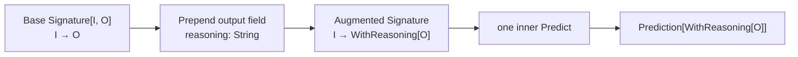
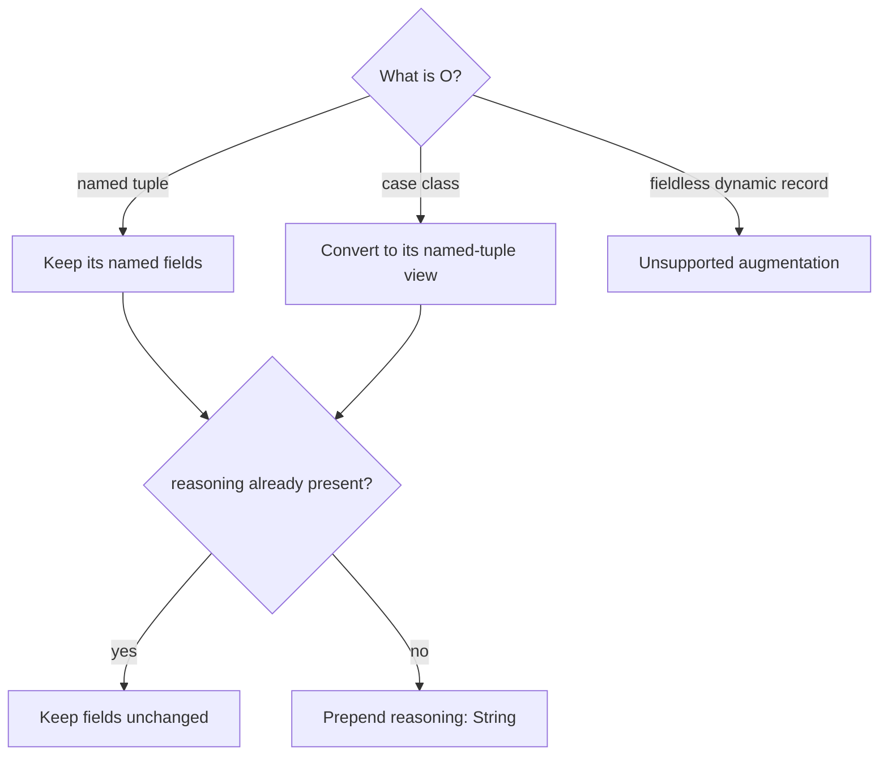
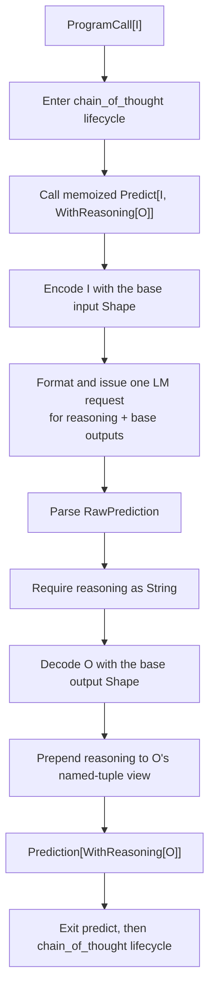
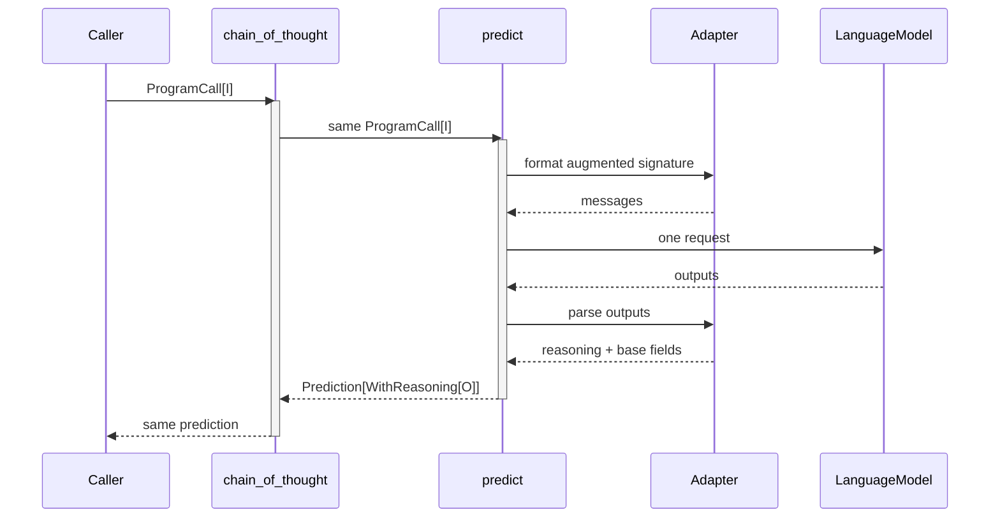
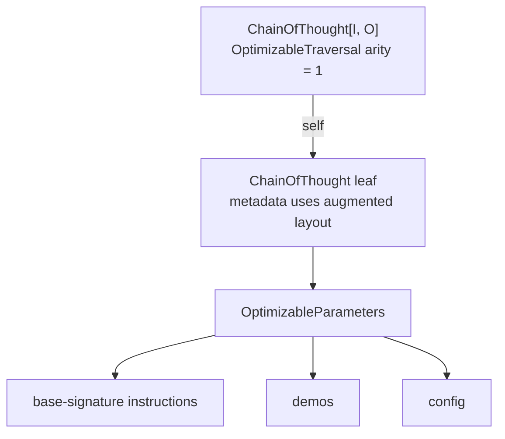

# How ChainOfThought works in `dspy4s.programs.strategies`

`ChainOfThought[I, O]` is a small transformation on top of `Predict`. It takes a base `Signature[I, O]`, prepends a
`reasoning: String` field to its outputs, and runs the augmented signature through one inner predictor.

The most useful mental model is **signature augmentation followed by an ordinary prediction**:



Despite its name, this module is not an iterative reasoning loop and does not make one LM call per reasoning step. It
makes a single LM call that asks for `reasoning` followed by the base output fields. For a loop that repeatedly selects
and executes tools, see [`ReAct`](ReAct.md).

The returned reasoning is an ordinary model-produced string. It can be useful evidence for debugging, evaluation, or
later program stages, but dspy4s does not treat it as a verified explanation of how the model reached its answer.

## The public type

Conceptually, the class has this shape:

```scala
final case class ChainOfThought[I, O](
    baseSignature: Signature[I, O],
    demos: Vector[Example] = Vector.empty,
    runtime: ProgramRuntime = new SettingsProgramRuntime {},
    name: Option[String] = None,
    config: DynamicValue.Record = DynamicValue.Record.empty
)(using PrependField["reasoning", String, O])
    extends Module[I, ChainOfThought.WithReasoning[O]]
```

Its fields have narrow responsibilities:

| Field | Meaning |
|---|---|
| `baseSignature` | The original task contract before `reasoning` is added |
| `demos` | Few-shot examples passed to the inner `Predict` |
| `runtime` | Resolves the model and adapter used by the inner prediction |
| `name` | Outer module identity; defaults to `chain_of_thought` |
| `config` | Default LM request options; per-call options may override them |

`PrependField` is compile-time evidence that dspy4s knows how to construct the augmented output type from `String` and
`O`. Callers normally do not summon or pass it; Scala derives the appropriate instance from the concrete output type.

The class also defines a convenient local alias:

```scala
type Out = ChainOfThought.WithReasoning[O]
```

## The output type transformation

`WithReasoning[O]` normalizes `O` to its named-tuple view and prepends `reasoning: String` unless that field already
exists:

```scala
type WithReasoning[O] =
  OutputAugmentation.WithField[O, "reasoning", String]
```

This produces the following shapes:

| Base output `O` | `WithReasoning[O]` |
|---|---|
| `(answer: String)` | `(reasoning: String, answer: String)` |
| `(answer: String, score: Double)` | `(reasoning: String, answer: String, score: Double)` |
| `case class Answer(answer: String)` | `(reasoning: String, answer: String)` |
| `(reasoning: String, answer: String)` | unchanged; `reasoning` is not duplicated |
| `DynamicValue.Record` | unsupported because it has no static field structure |

The result is therefore always a named tuple—even when the base output is a case class. Scala can derive the field
names and types of a case class, but it cannot synthesize a new nominal case class with one extra field.



This transformation is idempotent at all three representations used by the program:

- the match type does not add a second `reasoning` label;
- `SignatureLayout.prependOutput` does not add a second runtime field;
- the augmented output `Shape` does not add a second field specification.

## How the signature changes

For a base signature such as:

```text
question -> answer, confidence
```

`ChainOfThought` constructs:

```text
question -> reasoning, answer, confidence
```

Only the output boundary changes:

| Signature component | Augmented value |
|---|---|
| Name | Same as the base signature |
| Instructions | Same as the base signature |
| Input fields | Unchanged |
| Output fields | `reasoning` followed by the base fields, idempotently |
| Input shape | The base input shape |
| Output shape | A new shape that decodes `reasoning` plus the base output |
| Output JSON Schema | The base schema is preserved for structured base fields |

The normalized reasoning field has type `String`, description `${reasoning}`, and the inferred prompt marker
`Reasoning:`. The base JSON Schema is intentionally passed through: nested base outputs still need their detailed
schema, while the plain string reasoning field is already described by the augmented field layout.

## Example: reasoning plus a case-class answer

```scala
import dspy4s.core.contracts.{DspyError, RuntimeContext}
import dspy4s.programs.strategies.ChainOfThought
import dspy4s.signatures.Signature
import zio.blocks.schema.Schema

final case class Question(question: String) derives Schema
final case class Answer(answer: String, confidence: Double) derives Schema

val signature =
  Signature.derived[Question, Answer](
    name = "QuestionAnswering",
    instructions = "Answer accurately and explain the evidence used."
  )

val answerQuestion = ChainOfThought(signature)

def ask(question: String)(using RuntimeContext): Either[DspyError, (String, String, Double)] =
  answerQuestion(Question(question)).map { prediction =>
    val reasoning:  String = prediction.output.reasoning
    val answer:     String = prediction.output.answer
    val confidence: Double = prediction.output.confidence
    (reasoning, answer, confidence)
  }
```

Notice that `prediction.output` is not an `Answer`. It is the named tuple
`(reasoning: String, answer: String, confidence: Double)`, with direct dot access for all three fields.

The lightweight string DSL works the same way:

```scala
val answerQuestion =
  ChainOfThought(Signature.fromString("question -> answer"))

answerQuestion((question = "What is the capital of France?")).map { prediction =>
  println(prediction.output.reasoning)
  prediction.output.answer
}
```

## One call, step by step

`ChainOfThought.forward` contains only `predict(call)`. The important work happens while constructing the augmented
signature and inside that stable, memoized inner `Predict`.



In order:

1. The outer `chain_of_thought` module lifecycle observes the original input.
2. The same `ProgramCall[I]` is passed unchanged to the inner `Predict`, preserving config, `traceEnabled`, and
   `rolloutId`.
3. The inner predictor encodes the input with `baseSignature.inputShape` and runs the standard adapter/LM pipeline.
4. The adapter parses a record containing `reasoning` and the base output fields.
5. The augmented shape requires `reasoning` to exist as a string.
6. That same record is decoded through `baseSignature.outputShape` to recover `O`.
7. `PrependField` combines the reasoning string with `O`'s named-tuple view.
8. The inner `Predict` returns the output together with its complete `RawPrediction`; the outer module returns it
   unchanged.

The inner `Predict` is a `lazy val`, so a `ChainOfThought` instance builds it once and reuses the same predictor across
calls. It is left unnamed, giving the executable prediction boundary the stable module name `predict`.

## Output and raw evidence

The returned value retains both the augmented semantic output and the engine record:

```text
Prediction[WithReasoning[O]]
├── output
│   ├── reasoning: String
│   └── base output fields from O
└── raw
    ├── values: parsed reasoning + base fields + synthetic tool_calls
    ├── completions: every parsed completion
    └── lmUsage: token accounting
```

`prediction.output.reasoning` and `prediction.raw.asString("reasoning")` refer to the same parsed field at different
abstraction levels. The first is a validated domain value; the second accesses the runtime record.

Only the first raw completion is decoded into the output. Additional candidates remain available through
`prediction.raw.completions`.

## Lifecycle and observability

Unlike `Predict`, `ChainOfThought` has two observable module boundaries: the outer semantic program and its inner
executable predictor.



On an ordinary successful call with tracing enabled, trace and history each receive two entries: inner `predict`
first, then outer `chain_of_thought`. Callback scopes are nested in the opposite visual sense: the outer start surrounds
the inner start/end pair.

Setting `traceEnabled = false` suppresses trace and history for both boundaries, but callbacks still run. An ordinary
failure records no successful trace or history at either boundary. When explicit failure-trace capture is enabled, each
failing observable boundary may record its failure.

## Configuration

`demos`, `runtime`, and module-level `config` are copied into the inner `Predict`. Per-call controls are preserved
because `forward` passes the original `ProgramCall` through unchanged.

Request option precedence is therefore the same as for `Predict`:

```text
per-call ProgramCall.config
    overrides ChainOfThought.config
        overrides adapter-contributed request options
```

The default runtime resolves both the language model and adapter from `RuntimeContext`. Unlike the public `Predict`
constructor, `ChainOfThought` currently has no separate bound-LM or native-tool-schema field.

## What happens when decoding fails?

The augmented output shape performs all validation before a successful `Prediction` is returned:

| Situation | Result |
|---|---|
| Required base input is missing | `Left(NotFoundError)` before the LM call |
| `reasoning` field is absent | `Left(NotFoundError)` |
| `reasoning` is not decodable as a string | `Left(ValidationError)` |
| A base output field is absent or malformed | `Left(DspyError)` from the base output shape |
| Base output is a fieldless `DynamicValue.Record` | `Left(ValidationError)` because augmentation is unsupported |
| Model, adapter, formatting, or parsing fails | The inner `Predict` error is returned unchanged |

Because augmentation decoding happens inside the inner `Predict` lifecycle, a malformed reasoning or base field does
not produce a misleading successful inner trace. The outer lifecycle sees the same `Left` and also remains failed.

## Optimization

Although execution contains an inner `Predict`, optimizers see `ChainOfThought` itself as one leaf:



The optimizer may replace exactly the base signature's instructions, demos, and module-level config. Metadata exposes
the augmented layout—including `reasoning`—so an optimizer sees the signature the model actually runs.

Base field structure and shapes, the runtime, and module name remain read-only execution metadata. The
`OptimizableLeaf[ChainOfThought[I, O]]` instance is a lawful lens: writing parameters preserves that metadata, and
reading after a write returns the written parameters.

When `ChainOfThought` is a field of a composite program, its traversal name becomes that field path rather than
`self`.

## Streaming

Streaming targets the executable inner predictor, so `Streamable[ChainOfThought[I, O]]` reports one known signature:

```text
("predict", augmented layout containing reasoning + base outputs)
```

Listeners can therefore target `reasoning` or any base output field under the predict name. The outer
`chain_of_thought` boundary remains useful for callbacks and trace/history, but it does not directly call the language
model or emit tokens.

## ChainOfThought compared with nearby modules

| Module | LM calls in its basic execution | Added behavior |
|---|---:|---|
| `Predict[I, O]` | 1 | Decode the declared base outputs |
| `ChainOfThought[I, O]` | 1 | Prepend and decode a model-produced `reasoning` field |
| `ReAct[I, O]` | Multiple possible | Repeatedly choose and execute tools, then extract a final answer |

`ChainOfThought` is therefore best understood as a specialized `Predict` architecture, not as a small agent runtime.

## Reading the implementation

A useful reading order is:

1. [`ChainOfThought.scala`](ChainOfThought.scala): outer module, augmented signature, and inner predictor.
2. [`OutputAugmentation.scala`](../../../../../../../signatures/src/main/scala/dspy4s/signatures/OutputAugmentation.scala): the match
   type, `PrependField` evidence, and augmented output shape.
3. [`SignatureOps.scala`](../../../../../../../core/src/main/scala/dspy4s/core/contracts/SignatureOps.scala): idempotent
   runtime-layout augmentation.
4. [`Predict.scala`](Predict.scala) and [`Predict.md`](Predict.md): the inner prediction pipeline.
5. [`optimization/OptimizableLeaf.scala`](../optimization/OptimizableLeaf.scala): the lawful optimizer lens.
6. [`Streamable.scala`](../../../../../../../streaming/src/main/scala/dspy4s/streaming/Streamable.scala): the inner prediction
   signature exposed for streaming.
7. [`ChainOfThoughtSuite.scala`](../../../../../test/scala/dspy4s/programs/ChainOfThoughtSuite.scala): executable examples
   of augmentation, case classes, idempotence, raw preservation, and failures.
8. [`Modules.scala`](../../../../../../../examples/src/main/scala/dspy4s/examples/learn/programming/Modules.scala): a concise
   runnable usage example.

## Scope and assumptions

This guide describes the current dspy4s implementation. It assumes a signature whose output has statically known
fields and a runtime that can resolve a language model and adapter. The adapter determines the exact prompt format, but
the augmented field order, output type, decoding behavior, lifecycle nesting, and optimization surface are defined by
`ChainOfThought` itself.
