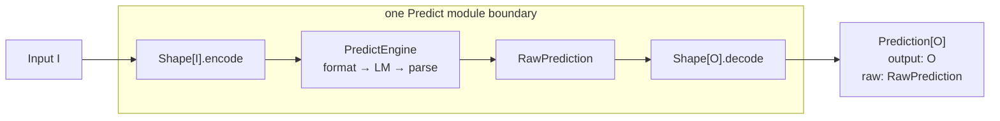
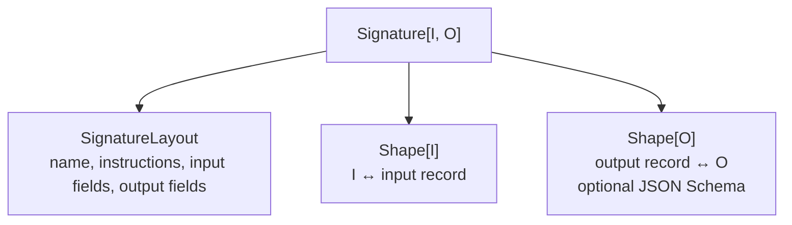
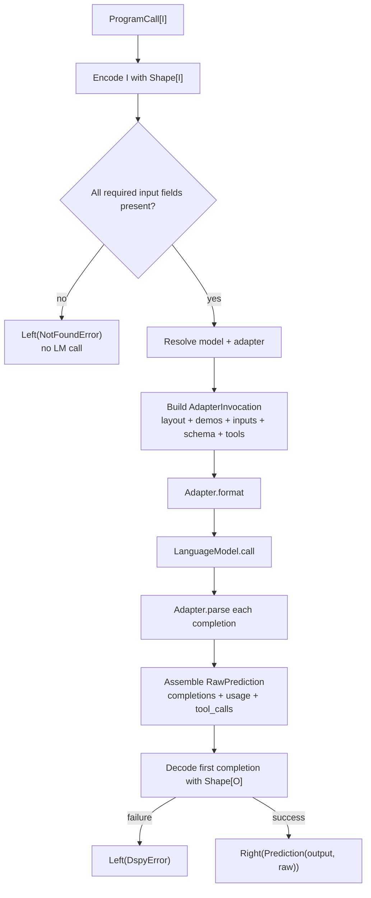
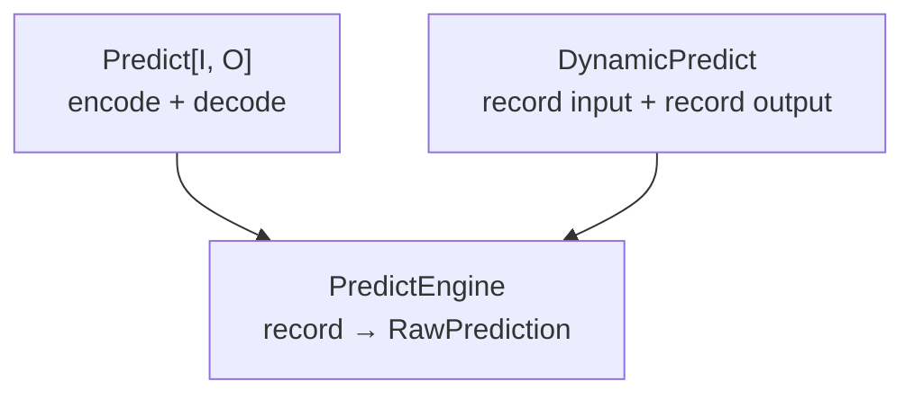
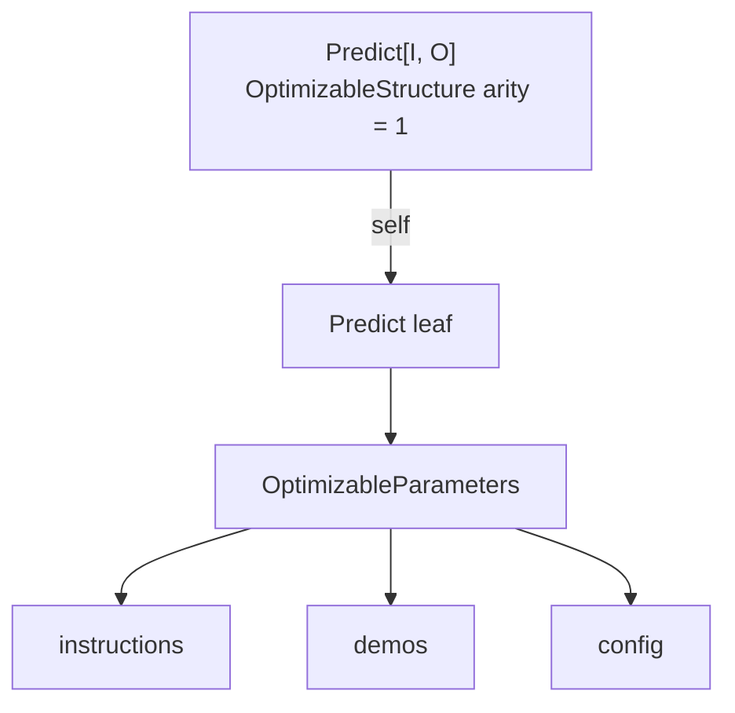

# How Predict works in `dspy4s.programs.strategies`

`Predict[I, O]` is the smallest language-model program in dspy4s. It turns an input value of type `I` into a
`Prediction[O]` according to a `Signature[I, O]`.

The most useful mental model is a **domain boundary around a record-based prediction engine**:



The engine speaks in `DynamicValue.Record`s because adapters and language models operate on runtime data. The two
`Shape`s supplied by the signature translate between those records and the program's Scala types.

## The public type

Conceptually, `Predict` has this shape:

```scala
final case class Predict[I, O](
    signature: Signature[I, O],
    demos: Vector[Example] = Vector.empty,
    name: Option[String] = None,
    runtime: ProgramRuntime = new SettingsProgramRuntime {},
    config: DynamicValue.Record = DynamicValue.Record.empty,
    lm: Option[LanguageModel] = None,
    tools: Vector[ToolSpec] = Vector.empty
) extends Module[I, O]
```

Its fields have distinct responsibilities:

| Field | Meaning |
|---|---|
| `signature` | Instructions, input/output field layout, and the shapes for encoding `I` and decoding `O` |
| `demos` | Few-shot examples included when the adapter builds the prompt |
| `name` | Optional module identity; defaults to `predict` |
| `runtime` | Resolves the ambient model and adapter |
| `config` | Default LM request options for this predictor |
| `lm` | Optional model pinned specifically to this predictor |
| `tools` | Provider-native tool schemas exposed to the adapter |

The type parameters name the semantic boundary, not the engine's wire format:

```text
Predict[I, O] is a Module[I, O]
Module[I, O] receives ProgramCall[I]
Module[I, O] returns Either[DspyError, Prediction[O]]
```

`ProgramCall` and `Prediction` are uniform execution envelopes added by `Module`; callers still think in terms of `I`
and `O`.

## What a Signature contributes

A `Signature[I, O]` bundles three related descriptions of the task:



`SignatureLayout` tells the adapter what the prompt means. The shapes tell `Predict` how Scala values cross that
layout. Keeping all three together prevents a predictor's declared fields from drifting away from its codecs.

## Example: a question-answer predictor

Case classes give the boundary concrete domain types:

```scala
import dspy4s.core.contracts.{DspyError, RuntimeContext}
import dspy4s.programs.strategies.Predict
import dspy4s.signatures.Signature
import zio.blocks.schema.Schema

final case class Question(question: String) derives Schema
final case class Answer(answer: String, confidence: Double) derives Schema

val signature =
  Signature.derived[Question, Answer](
    name = "QuestionAnswering",
    instructions = "Answer the question and estimate confidence from 0 to 1."
  )

val answerQuestion = Predict(signature)

def ask(question: String)(using RuntimeContext): Either[DspyError, Answer] =
  answerQuestion(Question(question)).map(_.output)
```

The generated prompt is adapter-specific, but the application-facing contract is not: the input is always a
`Question`, and successful output decoding always produces an `Answer`.

For lightweight signatures, `Signature.fromString` produces named-tuple inputs and outputs:

```scala
val predict = Predict(Signature.fromString("question -> answer"))

predict((question = "What is the capital of France?")).map { prediction =>
  prediction.output.answer
}
```

## One call, step by step

Calling `answerQuestion(Question("..."))` first creates a `ProgramCall` and enters the final lifecycle wrapper defined
by `Module.apply`. Everything below—including output decoding—happens inside that one observable boundary.



The stages are:

1. `Shape[I]` encodes the input into a record. The encoding is memoized on that `ProgramCall` because lifecycle
   observation and `forward` both need it.
2. `Predict` rejects missing required fields before spending an LM call. Derived case-class shapes always encode every
   field; this check mainly protects more dynamic map-backed shapes.
3. `PredictEngine` resolves the model and adapter, then builds an invocation from the signature, demos, inputs, output
   JSON Schema, tools, and request controls.
4. The adapter formats the invocation into model messages.
5. The model returns one or more outputs.
6. The adapter parses every model output into an output record.
7. The engine preserves all parsed rows as completions and chooses the first row as `raw.values`.
8. `Shape[O]` decodes those first values into `O`. `Prediction.from` returns both that value and the unabridged raw
   prediction.

## Output and raw evidence

`Prediction[O]` deliberately retains both views of a result:

```text
Prediction[O]
├── output: O
└── raw: RawPrediction
    ├── values: first parsed completion + synthetic tool_calls
    ├── completions: all parsed completions
    └── lmUsage: token usage reported by the model
```

Use `prediction.output` for normal program composition. Reach into `prediction.raw` when evaluation, selection,
debugging, or accounting needs information that is not part of the domain output.

If the model returns several candidates, only the first becomes `output: O`; the remaining candidates are not lost.
They remain in `raw.completions` for evaluation or custom selection logic. (`BestOfN` performs a related kind of
selection by making several distinct program calls rather than consuming these candidates directly.)

The engine also adds a synthetic `tool_calls` value to every raw prediction. It is empty for ordinary calls and
contains provider-native calls when the adapter and model produce them. `Predict` exposes tool schemas but does not
execute tools itself; execution belongs to a caller or a higher-level program.

## Per-call controls and precedence

The convenience call accepts the controls used most often:

```scala
answerQuestion(
  Question("What is the capital of France?"),
  config = DynamicValues.record("temperature" := 0.2),
  traceEnabled = false
)
```

Construct `ProgramCall` directly when a sampling `rolloutId` is also needed:

```scala
answerQuestion(ProgramCall(
  input = Question("What is the capital of France?"),
  config = DynamicValues.record("temperature" := 0.8),
  traceEnabled = true,
  rolloutId = Some(3)
))
```

Resolution and option merging follow explicit precedence rules:

| Concern | Highest precedence → lowest precedence |
|---|---|
| Language model | `predict.withLm(model)` / `lm = Some(model)` → ambient `RuntimeContext` model |
| Request option | per-call `ProgramCall.config` → module `Predict.config` → adapter-contributed option |
| Adapter | resolved by `ProgramRuntime`, normally from the ambient `RuntimeContext` |

Both `withLm` and request configuration are immutable. `withLm` returns a copy; a per-call config changes only that
invocation.

## Failure and observability semantics

The module lifecycle surrounds encoding, engine execution, and output decoding as one unit. That keeps the returned result
and runtime observations consistent.

| Situation | Result and observable behavior |
|---|---|
| Required input is missing | `Left(NotFoundError)` before the model is called |
| Model or adapter cannot be resolved | `Left(ConfigurationError)` |
| Adapter formatting or parsing fails | `Left(DspyError)` from that stage |
| Model call fails | `Left(DspyError)` from the model |
| Parsed values do not satisfy `Shape[O]` | `Left(DspyError)` during output decoding |
| Successful call with `traceEnabled = true` | One `predict` module scope plus one trace and history entry |
| Successful call with `traceEnabled = false` | Module callbacks still run; trace and history recording is suppressed |
| Ordinary failed call | Module callbacks report the failure; no success trace or history entry is recorded |

Because decoding occurs before the lifecycle sees success, a decoding failure cannot leave behind a misleading
successful trace. Failure traces are only recorded when the runtime explicitly enables failure-trace capture.

Adapter formatting, the LM call, and parsing each completion also have their own nested callback scopes. These are
details inside the single `Predict` module boundary, not extra modules.

## Predict and DynamicPredict

`Predict` and `DynamicPredict` are sibling front ends over the same `PredictEngine`:



`Predict.erase` creates an immutable `DynamicPredict` snapshot with the same layout, demos, runtime, output JSON
schema, config, bound model, and tools:

```scala
val dynamic: DynamicPredict = answerQuestion.erase
```

Erasure removes the static `I` and `O` boundary; it does not add another runtime wrapper. For valid encoded inputs and
decodable model outputs, the `Predict` call's `.raw` value equals the erased call's `.raw` value.

## Optimization

A standalone `Predict` is one independently tunable leaf named `self`:



This is the optimizer-visible tree, not the full case-class structure. Optimizers may replace exactly:

- signature instructions;
- demonstrations;
- module-level config.

Signature fields and shapes, the module name, runtime, bound model, and tools are read-only execution metadata. The
`OptimizableLeaf[Predict[I, O]]` instance is a lawful lens: reading after a write returns the written parameters, and
writing cannot change that metadata.

When a `Predict` is a field of a composite program, structural derivation replaces `self` with the field path. For
example, ReAct exposes its two internal predictors as `react` and `extractor`.

## Streaming

`Predict` reports one known streamable signature: its `moduleName` paired with `signature.layout`. While the engine is
active, it also installs that identity in `ActivePredictContext`, allowing stream listeners to route tokens to the
correct predictor even when predictors are nested inside a larger program.

Streaming changes how partial model output is observed; it does not bypass parsing or output decoding for the
final return value.

## Reading the implementation

A useful reading order is:

1. [`Predict.scala`](Predict.scala): the domain boundary, required-input check, engine construction, and erasure.
2. [`runtime/PredictEngine.scala`](../runtime/PredictEngine.scala): model/adapter resolution and the raw format-call-parse
   pipeline.
3. [`contracts/Module.scala`](../contracts/Module.scala): the uniform `ProgramCall`/`Prediction` boundary and lifecycle.
4. [`contracts/ProgramCall.scala`](../contracts/ProgramCall.scala): per-call controls and memoized input encoding.
5. [`Signature.scala`](../../../../../../../signatures/src/main/scala/dspy4s/signatures/Signature.scala): the relationship among layout,
   input shape, and output shape.
6. [`optimization/OptimizableLeaf.scala`](../optimization/OptimizableLeaf.scala): the lawful optimizer lens for `Predict`.
7. [`PredictSuite.scala`](../../../../../test/scala/dspy4s/programs/PredictSuite.scala): executable examples for
   execution, raw preservation, erasure, controls, and failure semantics.

## Scope and assumptions

This guide describes the current dspy4s implementation. It assumes the default runtime can resolve an adapter and,
unless the predictor has a bound model, an ambient language model from `RuntimeContext`. Prompt text and output parsing
remain adapter-specific; the input/output contract and module lifecycle are not.
