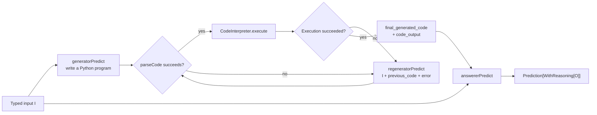
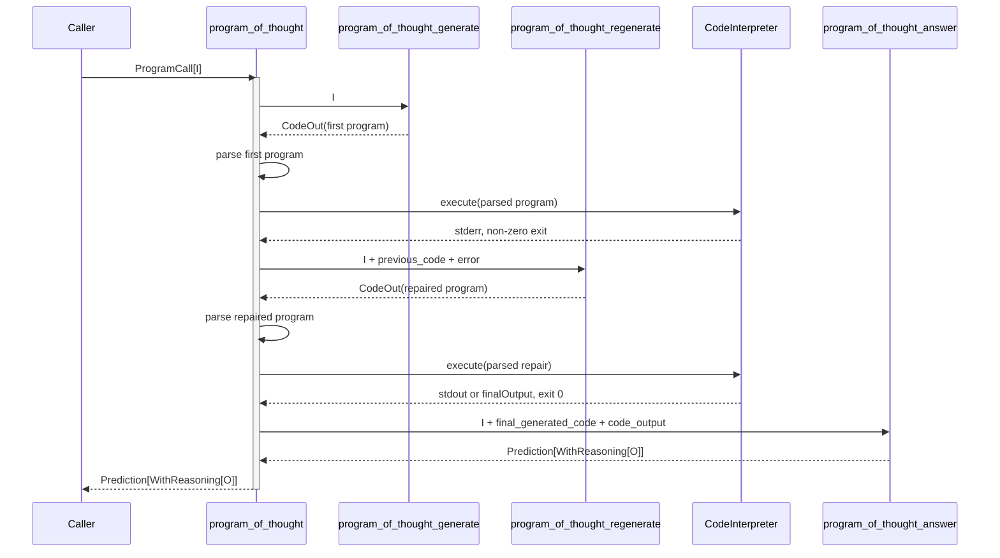
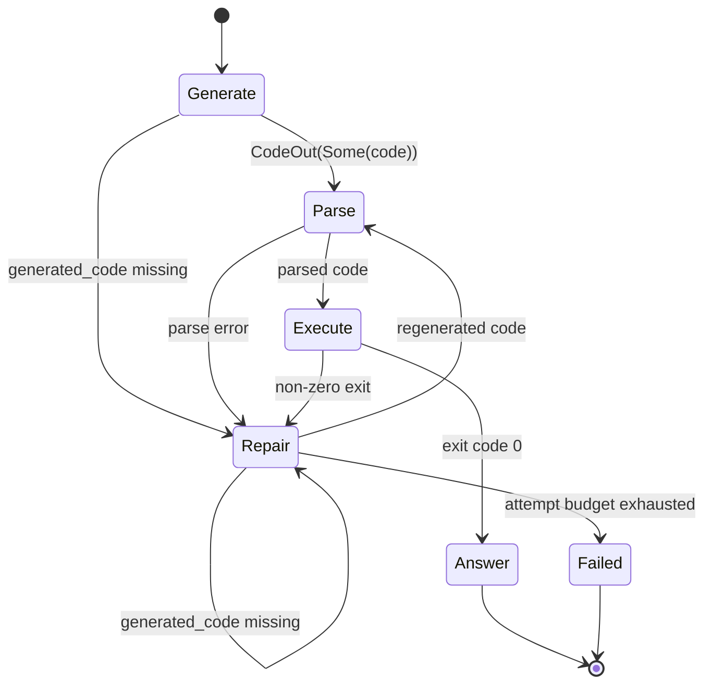
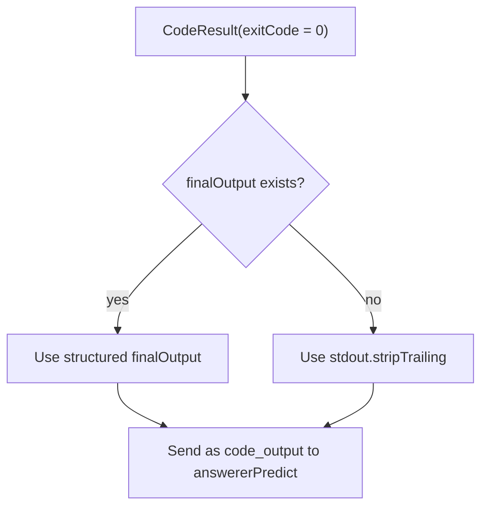
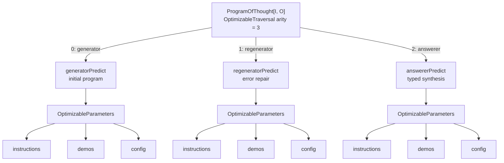

# How ProgramOfThought works in `dspy4s.programs.strategies`

`ProgramOfThought[I, O]` asks a language model to solve a task by writing a complete Python program. It executes that
program, gives failures back to the model for repair, and—once execution succeeds—uses a final predictor to turn the
code and its output into the requested typed answer.

The most useful mental model is **generate, repair until executable, then answer**:



There are three predictors with different responsibilities:

- `generatorPredict` writes the first candidate program;
- `regeneratorPredict` repairs a candidate after a parse or Python execution error;
- `answererPredict` interprets the first successful program and its output as the final typed response.

The successful program does not construct `O` directly. Even a structured `SUBMIT(...)` result becomes evidence for
`answererPredict`; the answerer remains the only stage that produces the public output.

## The public type

Conceptually, the class has this shape:

```scala
final case class ProgramOfThought[I, O](
    baseSignature: Signature[I, O],
    interpreter: CodeInterpreter,
    maxIterations: IterationLimit = IterationLimit(3),
    generatorPredictOverride: Option[Predict[I, ProgramOfThought.CodeOut]] = None,
    regeneratorPredictOverride:
      Option[Predict[((I, String), String), ProgramOfThought.CodeOut]] = None,
    answererPredictOverride:
      Option[Predict[((I, String), String), ProgramOfThought.WithReasoning[O]]] = None
)(using PrependField.Of[ChainOfThought.ReasoningName, String, O])
    extends Module[I, ProgramOfThought.WithReasoning[O]]
```

Its fields have distinct responsibilities:

| Field | Meaning |
|---|---|
| `baseSignature` | The original typed task, `I → O` |
| `interpreter` | Executes generated Python and returns stdout, stderr, and optional `finalOutput` |
| `maxIterations` | Maximum total code attempts, including the initial generation |
| `generatorPredictOverride` | Immutable replacement for the initial program generator |
| `regeneratorPredictOverride` | Immutable replacement for the repair predictor |
| `answererPredictOverride` | Immutable replacement for final answer synthesis |

The outer module name is `program_of_thought`. The three inner module names are fixed:

```text
program_of_thought_generate
program_of_thought_regenerate
program_of_thought_answer
```

`maxIterations` counts attempts, not retries after the first attempt. With the default value of three, a run can make
one generator call and at most two regenerator calls before failing.

## The public output

ProgramOfThought returns the same reasoning augmentation used by `ChainOfThought`:

```scala
type ProgramOfThought.WithReasoning[O] =
  ChainOfThought.WithReasoning[O]
```

Conceptually, `reasoning: String` is prepended to the fields of `O`. The result is always represented as a named tuple,
and the transformation is idempotent if `O` already begins with the same reasoning field. See
[`ChainOfThought.md`](ChainOfThought.md) for the complete output-type transformation.

For a base signature:

```text
question -> answer
```

the public result is:

```text
question -> reasoning, answer
```

The public `reasoning` comes from `answererPredict`. Reasoning emitted by the generator or regenerator belongs to
those inner calls and is not copied into the final output.

## Four typed boundaries

ProgramOfThought derives three internal signatures from the base task:

| Boundary | Effective signature | Purpose |
|---|---|---|
| Public module | `I -> reasoning, O` | Return the typed answer |
| Generator | `I -> reasoning, generated_code` | Write the first complete Python program |
| Regenerator | `I, previous_code, error -> reasoning, generated_code` | Repair the last failed program |
| Answerer | `I, final_generated_code, code_output -> reasoning, O` | Interpret successful execution evidence |

The corresponding predictor types are:

```scala
generatorPredict:
  Predict[I, ProgramOfThought.CodeOut]

regeneratorPredict:
  Predict[((I, String), String), ProgramOfThought.CodeOut]

answererPredict:
  Predict[((I, String), String), ProgramOfThought.WithReasoning[O]]
```

The nested tuples are the static representation of appending two string fields to `I`:

```text
((I, previous_code), error)
((I, final_generated_code), code_output)
```

`InputAugmentation.appendedStringInput` makes these types line up with their `SignatureLayout` fields while preserving
the base input shape.

All three internal layouts are ChainOfThought-augmented, so each asks the LM for `reasoning`. The generator and
regenerator expose only the semantic value needed by the execution loop:

```scala
final case class CodeOut(
    generatedCode: Option[String]
)
```

The hand-written `Shape[CodeOut]` gives missing code an honest representation: `None`. A present non-string
`generated_code` is a decoding error rather than being coerced into source text.

## One call, step by step

A call to `ProgramOfThought[I, O]` proceeds as follows:

1. `Module` validates the typed input through `baseSignature.inputShape`.
2. `AgentLoop` starts with no previous attempt.
3. `generatorPredict` receives `I` and produces optional `generated_code`.
4. The shared runtime helper `GeneratedPython.parse` normalizes the generated program and optional Markdown fence.
5. The configured `CodeInterpreter` executes the parsed program.
6. Missing code, parse errors, and non-zero Python exits become repair state.
7. `regeneratorPredict` receives `I`, the failed code, and its error, then produces another complete program.
8. The first exit-code-zero result ends the repair loop.
9. `answererPredict` receives `I`, the successful parsed code, and its execution output.
10. The answerer returns `reasoning` plus the base output fields as a typed prediction.

An execution-error path with one successful repair looks like this:



If the generator prediction fails, no interpreter call occurs. If every code attempt fails, the answerer is never
called.

## The retry state

The loop state is deliberately small:

```scala
private final case class Attempt(
    code: String,
    error: String,
    exhaustionMessage: String
)
```

`AgentLoop` carries an `Option[Attempt]`:

- `None` means no candidate has been tried, so use `generatorPredict`;
- `Some(attempt)` means the previous candidate failed, so use `regeneratorPredict`.



The exact code stored in `Attempt` depends on where failure occurred:

| Failure | `previous_code` sent to regenerator | `error` sent to regenerator |
|---|---|---|
| Missing `generated_code` | Empty string | Missing-field explanation |
| Parse failure | Raw model output | Parser explanation |
| Python exits non-zero | Parsed code that ran | Stripped stderr |

The model gets both the original task input and this failure pair. It is expected to return a corrected, self-contained
program—not a patch or diff.

## How generated code is parsed

ProgramOfThought and CodeAct intentionally use the same runtime parser, `GeneratedPython.parse`, because both programs
accept the same model-produced Python format. Parsing:

- ignores content after `---` or the first triple newline;
- accepts `python`, `py`, or untagged fences, as well as unfenced code;
- rejects empty code;
- rejects a single-line snippet containing multiple `=` characters;
- appends the assigned variable name when a multiline program ends in a simple assignment.

For example:

```text
values = [1, 2, 3]
total = sum(values)
```

becomes:

```text
values = [1, 2, 3]
total = sum(values)
total
```

The final expression is useful for REPL-style interpreters. ProgramOfThought's own generator instructions still ask
the program to print a JSON object explicitly, because stdout is the portable result channel supported by every
`CodeInterpreter`.

## Example: solve an arithmetic problem with Python

```scala
import dspy4s.core.contracts.{DspyError, RuntimeContext}
import dspy4s.core.runtime.SubprocessPythonInterpreter
import dspy4s.programs.IterationLimit
import dspy4s.programs.strategies.ProgramOfThought
import dspy4s.typed.Signature

def solve(question: String)(using RuntimeContext): Either[DspyError, String] =
  val interpreter = new SubprocessPythonInterpreter(timeoutMillis = 10_000)
  val program = ProgramOfThought(
    baseSignature = Signature.fromString(
      "question -> answer",
      "Use Python to calculate the answer exactly."
    ),
    interpreter = interpreter,
    maxIterations = IterationLimit(3)
  )

  try
    program((question = question)).map { prediction =>
      println(s"reasoning: ${prediction.output.reasoning}")
      prediction.output.answer
    }
  finally interpreter.close()
```

For `"What is the sum of the integers from 1 through 100?"`, the generator might produce:

```python
import json

answer = sum(range(1, 101))
print(json.dumps({"answer": answer}))
```

The interpreter returns:

```json
{"answer": 5050}
```

The answerer then sees the original question, the successful Python, and this output. It produces the public
`reasoning` and decodes `answer` according to the base signature's output shape.

## Printed output and `SUBMIT`

ProgramOfThought supports two interpreter result conventions:



The generator instructions ask for:

```python
print(json.dumps({"answer": value}))
```

This works with a basic interpreter such as `SubprocessPythonInterpreter`. A SUBMIT-capable interpreter may instead
return a structured `CodeResult.finalOutput`:

```python
SUBMIT(answer=value)
```

When both `finalOutput` and stdout are present, `finalOutput` wins. Unlike RLM, ProgramOfThought does not decode that
record directly into `O`; it sends the selected string to `answererPredict` as `code_output`. The answerer always runs
after successful execution.

## Answer synthesis and raw evidence

The answerer receives:

```text
original fields from I
final_generated_code
code_output
```

and produces:

```text
Prediction[ProgramOfThought.WithReasoning[O]]
├── output
│   ├── reasoning: String
│   └── base output fields from O
└── raw
    ├── values: answerer fields
    ├── completions: answerer completions
    └── lmUsage: answerer LM usage
```

ProgramOfThought returns the answerer's `RawPrediction` unchanged. It does not add the generated program, failed
attempts, stderr, or successful `code_output` to the final raw values. Those inner calls remain observable through
callbacks, tracing, and history, but they are not assembled into a public trajectory.

This differs from CodeAct and RLM, which attach a rendered trajectory to the final raw prediction.

## Failure policy

ProgramOfThought distinguishes failures the LM can repair from failures of the prediction or interpreter machinery:

| Situation | Behavior |
|---|---|
| `generated_code` is missing | Send an empty previous program and a missing-field error to the regenerator |
| `generated_code` has a non-string wire value | Return `Left(ValidationError)` |
| Generated code cannot be parsed | Send the raw code and parser error to the regenerator |
| Python exits non-zero | Send the parsed code and stripped stderr to the regenerator |
| `CodeInterpreter.execute` returns `Left` | Return that error immediately; do not regenerate |
| Generator or regenerator prediction fails | Return `Left(error)` immediately |
| All attempts fail | Return `RuntimeError("program_of_thought", last failure)` |
| Successful code has empty stdout | Still run the answerer with an empty `code_output` |
| Answerer prediction or typed decoding fails | Return `Left(error)` |

An interpreter timeout, process-start failure, or I/O failure is not presumed repairable by changing Python source,
so it bypasses the regenerator. A normal Python exception is represented by a `CodeResult` with a non-zero exit code
and can be repaired.

## Interpreter choice, lifecycle, and security

ProgramOfThought accepts a `CodeInterpreter`; it does not create or close one. The caller owns the complete lifecycle:

```scala
val interpreter = new SubprocessPythonInterpreter()
val program = ProgramOfThought(signature, interpreter)

try program(input)
finally interpreter.close()
```

Common interpreter properties are:

| Interpreter | Isolation | State across attempts | Result channel |
|---|---|---|---|
| `SubprocessPythonInterpreter` | None; host `python3` process | None; fresh process per attempt | stdout |
| `DenoPyodideInterpreter` | Pyodide/WASM under Deno | Persistent REPL state | stdout or `SUBMIT` |
| Custom `CodeInterpreter` | Implementation-defined | Implementation-defined | `CodeResult` contract |

> **Security:** `SubprocessPythonInterpreter` is not sandboxed. Generated code runs with the host user's filesystem,
> network, and environment access. Use it only for trusted code or inside an already isolated environment. Prefer an
> appropriately configured sandbox for untrusted model output.

ProgramOfThought generates complete programs and does not rely on interpreter state surviving between attempts. A
stateful interpreter may nevertheless retain definitions or side effects, so a custom integration should decide
whether that persistence is desirable.

## Per-call controls and immutable overrides

`ProgramCall.mapInput` preserves call config, `traceEnabled`, and rollout identity while appending retry or answer
fields. Provider options therefore reach every inner predictor that runs:

```scala
program(
  input,
  config = DynamicValues.record("temperature" := 0.2),
  traceEnabled = false
)
```

`maxIterations` and the interpreter are architecture settings rather than LM config:

```scala
val moreRepairs = program.copy(maxIterations = IterationLimit(5))
```

The three overrides allow independent predictor specialization:

```scala
val specialized = program.copy(
  generatorPredictOverride = Some(program.generatorPredict.withLm(codeLm)),
  regeneratorPredictOverride = Some(program.regeneratorPredict.withLm(repairLm)),
  answererPredictOverride = Some(program.answererPredict.withLm(answerLm))
)
```

Changing optimizer parameters through these overrides preserves the interpreter, typed shapes, predictor runtimes,
module names, and other execution metadata.

## Optimization

Optimizers see three independently tunable leaves in stable order:



The traversal names are `generator`, `regenerator`, and `answerer`. The interpreter and retry budget are architectural
state, not optimizable parameters. A no-op replacement preserves the original ProgramOfThought value and leaves all
override fields empty.

## Streaming and observability

`Streamable[ProgramOfThought[I, O]]` reports the three stable inner predictors:

```text
(program_of_thought_generate, generator layout)
(program_of_thought_regenerate, regenerator layout)
(program_of_thought_answer, answerer layout)
```

All three layouts include the ChainOfThought `reasoning` field. A successful first attempt emits generator and answerer
LM activity. Each nonterminal failed attempt causes a regenerator call, while a run that exhausts its budget never
reaches the answerer.

The outer `program_of_thought` module wraps the inner calls for callbacks and runtime tracing. Direct
`CodeInterpreter.execute` calls are not module boundaries. Completed inner predictions remain trace evidence if a
later stage fails.

## ProgramOfThought compared with nearby programs

| Program | Generated action | Feedback and stopping | Final typed output |
|---|---|---|---|
| `ChainOfThought` | No executable action | One LM completion | Same predictor returns reasoning + `O` |
| `CodeAct` | One Python snippet per iteration | Every observation returns to the policy; `finished` stops | Extractor always returns reasoning + `O` |
| `ProgramOfThought` | A complete Python program | Only failures trigger repair; first successful execution stops | Answerer always returns reasoning + `O` |
| `RLM` | Python over injected variables | REPL observations continue; valid `SUBMIT` stops | `SUBMIT` returns `O`; extractor only on exhaustion |

ProgramOfThought is a good fit when a task can be expressed as a self-contained computation and execution errors can
be repaired mechanically. CodeAct is better when the model should explore incrementally and learn from successful
observations between snippets. RLM is intended for selective exploration of inputs held as REPL variables.

## Reading the implementation

A useful reading order is:

1. [`ProgramOfThought.scala`](ProgramOfThought.scala): derived signatures, retry state, execution, and answer assembly.
2. [`CodeAct.scala`](CodeAct.scala): the shared `parseCode` normalization.
3. [`runtime/AgentLoop.scala`](../runtime/AgentLoop.scala): bounded continue/done recursion and exhaustion behavior.
4. [`InputAugmentation.scala`](../../../../../../../typed/src/main/scala/dspy4s/typed/InputAugmentation.scala): typed
   appending of retry and answer evidence.
5. [`OutputAugmentation.scala`](../../../../../../../typed/src/main/scala/dspy4s/typed/OutputAugmentation.scala): public
   reasoning augmentation.
6. [`CodeInterpreter.scala`](../../../../../../../core/src/main/scala/dspy4s/core/contracts/CodeInterpreter.scala):
   `CodeResult`, interpreter failures, and lifecycle.
7. [`CompositeOptimizableTraversalInstances.scala`](../optimization/CompositeOptimizableTraversalInstances.scala): the
   three-leaf optimizer traversal.
8. [`Streamable.scala`](../../../../../../../streaming/src/main/scala/dspy4s/streaming/Streamable.scala): streaming targets.
9. [`ProgramOfThoughtSuite.scala`](../../../../../test/scala/dspy4s/programs/ProgramOfThoughtSuite.scala): executable cases
   for first-attempt success, regeneration, exhaustion, lifecycle, subprocess execution, and `SUBMIT` precedence.
10. [`ProgramOfThoughtOptimizableTraversalSuite.scala`](../../../../../test/scala/dspy4s/programs/ProgramOfThoughtOptimizableTraversalSuite.scala):
    optimizer order and replacement laws.
11. [`Cheatsheet.scala`](../../../../../../../examples/src/main/scala/dspy4s/examples/Cheatsheet.scala): a concise usage
    example.

## Scope and assumptions

This guide describes the current dspy4s implementation. It assumes the ambient `RuntimeContext` supplies an LM and
adapter, the base output has statically known fields, and the caller supplies an interpreter appropriate to the trust
boundary. Exact generated Python and adapter parsing remain model-specific; the typed stages, retry conditions,
attempt budget, answer synthesis, lifecycle ownership, and optimizer structure are defined by ProgramOfThought itself.
