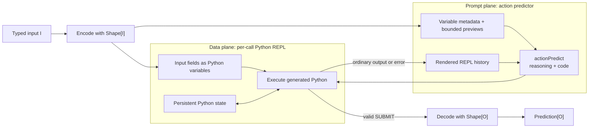
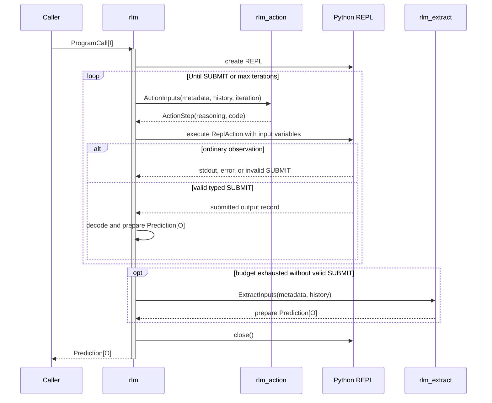
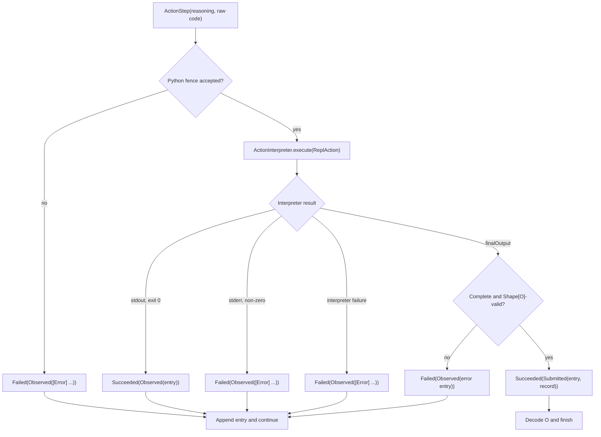
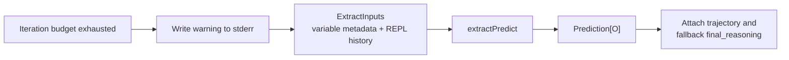
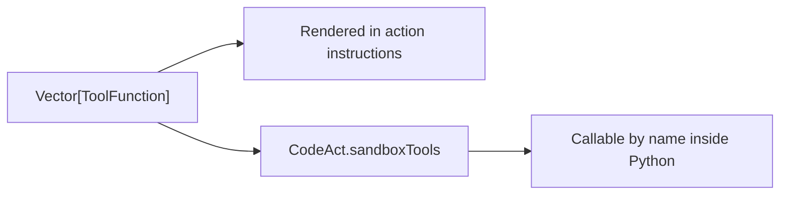
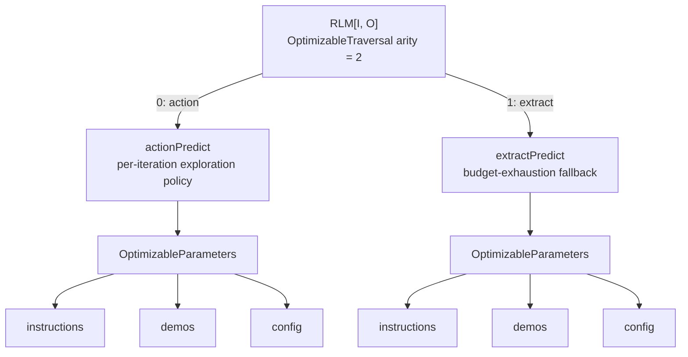

# How RLM works in `dspy4s.programs.strategies`

`RLM` means **Recursive Language Model**. It is designed for tasks where the input may be too large to place directly
in every language-model prompt. Instead, RLM gives the model a stateful Python REPL:

1. encode the typed input and inject its fields as Python variables;
2. show the model metadata and bounded previews of those variables;
3. ask the model for a small Python action;
4. execute the action and add its output to a history;
5. repeat until the code calls `SUBMIT(...)` with a valid typed answer;
6. if the iteration budget runs out, ask a second predictor to extract an answer from the history.

The most useful mental model is that RLM separates the **data plane** from the **prompt plane**. The full input lives
in the REPL. The action model sees variable descriptions and the results of deliberate exploration.



This does not mean that the prompt contains no input content at all. Each variable description includes a bounded
head-and-tail preview. The important property is that large values are not copied into the predictor as ordinary
input fields or reproduced in full on every iteration.

## The public type

Conceptually, the class has this shape:

```scala
final case class RLM[I, O](
    baseSignature: Signature[I, O],
    maxIterations: IterationLimit = IterationLimit(20),
    maxLlmCalls: LlmCallLimit = LlmCallLimit(50),
    maxOutputChars: OutputCharLimit = OutputCharLimit(10_000),
    verbose: Boolean = false,
    tools: Vector[ToolFunction] = Vector.empty,
    subLm: Option[LanguageModel] = None,
    interpreterFactory: RLM.InterpreterFactory = RLM.defaultInterpreterFactory,
    actionProgramName: String = "rlm_action",
    extractProgramName: String = "rlm_extract",
    actionPredictOverride: Option[Predict[RLM.ActionInputs, RLM.ActionStep]] = None,
    extractPredictOverride: Option[Predict[RLM.ExtractInputs, O]] = None
) extends Module[I, O]
```

Its fields have distinct responsibilities:

| Field | Meaning |
|---|---|
| `baseSignature` | The typed task, including the input and output shapes |
| `maxIterations` | Maximum number of action-predict/REPL steps before fallback extraction |
| `maxLlmCalls` | Per-forward budget shared by `llm_query` and `llm_query_batched` |
| `maxOutputChars` | Head-and-tail limit for each REPL output rendered into history |
| `verbose` | Logs each action and ordinary step output to stderr |
| `tools` | Extra `ToolFunction` values callable from generated Python |
| `subLm` | Optional LM used by the in-REPL `llm_query` tools |
| `interpreterFactory` | Creates the stateful REPL owned by one forward call |
| `actionProgramName` | Module name of the per-iteration predictor |
| `extractProgramName` | Module name of the fallback predictor |
| `actionPredictOverride` | Immutable replacement for the default action predictor |
| `extractPredictOverride` | Immutable replacement for the default fallback predictor |

The outer module name is always `rlm`. Unlike `ChainOfThought`, `ReAct`, and `CodeAct`, RLM does not add a reasoning
field to `O`. It returns the base output type directly. The final action reasoning and rendered trajectory are kept in
`Prediction.raw` instead.

## Three typed boundaries

Given this base signature:

```text
context, question -> answer
```

RLM creates two internal signatures:

| Boundary | Effective signature | Purpose |
|---|---|---|
| Public module | `I -> O` | Accept typed input and return the typed task output |
| Action predictor | `variables_info, repl_history, iteration -> reasoning, code` | Choose the next Python action |
| Fallback predictor | `variables_info, repl_history -> O` | Produce `O` if no valid `SUBMIT` arrives in time |

The inner predictor types are explicit:

```scala
actionPredict:
  Predict[RLM.ActionInputs, RLM.ActionStep]

extractPredict:
  Predict[RLM.ExtractInputs, O]
```

Their carrier types are:

```scala
final case class ActionInputs(
    variables_info: String,
    repl_history: String,
    iteration: String
)

final case class ActionStep(
    reasoning: String,
    code: String
)

final case class ExtractInputs(
    variables_info: String,
    repl_history: String
)
```

The action output shape is deliberately lenient. Missing `reasoning` or `code` fields decode as empty strings, and
present values are rendered as text. This keeps imperfect action formatting inside the agent loop; failures that make
the prediction machinery itself unusable still return `Left(DspyError)`.

Notice what is absent from `ActionInputs` and `ExtractInputs`: neither contains `I`. The original values cross the
interpreter boundary, while the predictors receive only the declared meta inputs.

## One call, step by step

A call to `RLM[I, O]` proceeds as follows:

1. `Module` validates and encodes `I` through `baseSignature.inputShape`.
2. RLM maps every declared input field to a `DynamicValue` and builds a `ReplVariable` description for it.
3. RLM creates the built-in sub-LM tools, bridges user tools, and creates a fresh `ReplCodeInterpreter`.
4. `AgentLoop` starts with an empty `Vector[ReplEntry]`.
5. `actionPredict` receives the variable metadata, rendered history, and an iteration label such as `1/20`.
6. RLM strips an optional Python Markdown fence and interprets the resulting `ReplAction`.
7. An ordinary observation is appended to history and the next iteration begins.
8. A valid `SUBMIT` is decoded to `O` and returns immediately.
9. If all iterations are consumed, `extractPredict` creates `O` from the metadata and history.
10. The interpreter is closed in a `finally` block on success or failure.



## One iteration and its algebra

The model first produces an `ActionStep`. After fence handling, RLM turns it into a smaller execution command:

```scala
final case class ReplAction(
    reasoning: String,
    code: String
)
```

The per-call interpreter has this abstract interface:

```scala
ActionInterpreter[RLM.ReplAction, RLM.ReplExecution]
```

Execution yields two independent pieces of information:

- `ActionOutcome.Succeeded` or `ActionOutcome.Failed` records whether the action itself worked;
- `ReplExecution.Observed` or `ReplExecution.Submitted` tells the loop whether to continue or finish.

```scala
enum ReplExecution:
  case Observed(entry: ReplEntry)
  case Submitted(entry: ReplEntry, outputs: DynamicValue.Record)
```

That separation is useful. A failed Python action can still produce an observation that helps the next action, so
`Right(ActionOutcome.Failed(Observed(...)))` continues. A `Left(DspyError)` is reserved for a failure outside this
recoverable action protocol.



## What the action model sees

For an input field named `context`, the metadata resembles:

````text
Variable: `context` (access it in your code)
Type: str
Description: the source material to analyze
Total length: 125,430 characters
Preview:
```
<the beginning of context>...<the end of context>
```
````

`ReplVariable.fromValue` uses a 1,000-character head-and-tail preview by default. Structured values are rendered as
JSON for the purpose of computing their type, total length, and preview.

After one action, `repl_history` resembles:

````text
=== Step 1 ===
Reasoning: I should inspect the structure before searching semantically.
Code:
```python
print(type(context), len(context))
print(context[:200])
```
Output (238 chars):
<class 'str'> 125430
...
````

Each later action receives the whole rendered history, subject to `maxOutputChars` for each output. Truncation changes
what is shown in the prompt and stored in the final rendered trajectory; it does not delete Python variables or other
state already present in the REPL.

## Example: explore a long context

The default interpreter is a Deno/Pyodide REPL, so the host needs `deno` available:

```scala
import dspy4s.core.contracts.{DspyError, RuntimeContext}
import dspy4s.programs.{IterationLimit, LlmCallLimit}
import dspy4s.programs.strategies.RLM
import dspy4s.signatures.Signature

val agent = RLM(
  baseSignature = Signature.fromString(
    "context, question -> answer",
    "Inspect the context in Python and answer the question from evidence."
  ),
  maxIterations = IterationLimit(8),
  maxLlmCalls = LlmCallLimit(12)
)

def ask(context: String, question: String)(using RuntimeContext): Either[DspyError, String] =
  agent((context = context, question = question)).map(_.output.answer)
```

An idealized three-step run might generate:

```python
# Step 1: inspect without copying the complete value into the prompt
sections = context.split("\n\n")
print(len(sections), [len(section) for section in sections[:5]])
```

```python
# Step 2: ask a sub-LM about only the relevant slice
candidate = max(sections, key=lambda section: section.count("retention"))
finding = llm_query(prompt="Extract the retention policy from:\n" + candidate)
print(finding)
```

```python
# Step 3: terminate with the declared output field
SUBMIT(answer=finding)
```

The important point is not that every RLM run must use `llm_query`. Python can search, filter, aggregate, or compute
deterministically first, then use a sub-LM only for the slices that require semantic interpretation.

For a real sandboxed three-step example that proves variable injection, persistent state, `llm_query`, and `SUBMIT`,
see [`RLMLiveSuite.scala`](../../../../../test/scala/dspy4s/programs/RLMLiveSuite.scala).

## `SUBMIT` is typed termination

`SUBMIT(...)` is different from `print(...)`:

- `print` creates an observation and the loop continues;
- `SUBMIT` asks the interpreter to return a structured `finalOutput` and end the loop.

RLM accepts a submission only after two checks:

1. the payload is a record containing every output field declared by `baseSignature`;
2. `baseSignature.outputShape` can decode the whole record as `O`.

For a signature with `answer` and `confidence`, this is structurally valid:

```python
SUBMIT(answer="The policy is 30 days.", confidence=0.92)
```

These attempts are recoverable observations rather than terminal program failures:

```python
SUBMIT(answer="The policy is 30 days.")  # missing confidence
SUBMIT(answer=42, confidence="very")     # wrong output types
```

The next model turn sees an `[Error] Missing output fields: ...` or `[Type Error] ...` entry and can correct the call.
A successful submission is decoded to `O` and returned directly; the fallback predictor does not run.

## Fallback extraction

If no accepted `SUBMIT` appears within `maxIterations`, RLM calls `extractPredict` once:



The extractor receives neither the full typed input nor direct access to the REPL. It must synthesize `O` from the
metadata and evidence the action loop printed. This is why the action instructions tell the model to print useful
intermediate results.

Fallback is an iteration-budget policy, not a general error handler. If `actionPredict` or `extractPredict` itself
returns `Left`, RLM returns that error. Reaching the fallback always writes a warning to stderr, even when `verbose` is
false.

## Built-in tools and sub-LM calls

Generated Python has four reserved built-in names:

| Name | Purpose |
|---|---|
| `print(...)` | Put selected evidence into the next action prompt |
| `SUBMIT(...)` | Return the declared typed output fields |
| `llm_query(prompt=...)` | Ask a sub-LM to analyze one prompt |
| `llm_query_batched(prompts=...)` | Analyze several prompts concurrently |

Both query functions share one counter for the current forward call. A batched call consumes one unit per prompt.
`llm_query_batched` uses up to eight worker threads and turns an individual sub-call failure into an `[ERROR] ...`
item in the returned Python list. Exceeding the shared budget rejects the tool call.

The sub-LM is selected as follows:

1. use `RLM.subLm` when supplied;
2. otherwise use the ambient `RuntimeContext` language model;
3. fail the tool call if neither exists.

This allows the action policy and semantic helper to use different models. For example, the action predictor can use a
strong code-generating model while `subLm` uses a cheaper model for many targeted classifications.

User `ToolFunction` values take two paths:



Construction rejects a user tool named `llm_query`, `llm_query_batched`, `SUBMIT`, or `print`, because shadowing a
built-in would make the action protocol ambiguous.

## Output and raw evidence

The returned value has this shape:

```text
Prediction[O]
├── output: O
└── raw
    └── values
        ├── base output fields
        ├── trajectory: String
        └── final_reasoning: String
```

On direct submission, `final_reasoning` is the `reasoning` emitted with the successful action. On fallback, it is the
fixed marker `Extract forced final output`. The trajectory includes every accepted action attempt, including
recoverable failures and the final `FINAL: ...` entry for a successful submission.

On the fallback path, the rest of `RawPrediction` originates from `extractPredict`. On the direct path there is no
final LM prediction to borrow completions or usage from, so RLM constructs the raw value from the submitted output and
the trajectory. Earlier action and sub-LM calls remain observable through their own callbacks and runtime traces.

## Interpreter state, ownership, and security

`RLM.defaultInterpreterFactory` creates a fresh `DenoPyodideInterpreter` for every forward call. It supports the
features RLM depends on:

- typed `DynamicValue` variables injected into Python;
- state that persists across action iterations;
- host tools callable from sandboxed code;
- structured `SUBMIT` output.

RLM owns the interpreter returned by `interpreterFactory` and always closes it. A custom factory should therefore
create a fresh interpreter or otherwise transfer ownership to the call; it should not return a shared interpreter that
must remain alive afterward.

The default interpreter runs Python through Pyodide under Deno rather than as an unrestricted host `python3` process.
If a custom `ReplCodeInterpreter` is supplied, its isolation, persistence, timeout, and tool-bridge guarantees become
part of that implementation's trust boundary.

## Failure policy

RLM distinguishes mistakes the agent can learn from from failures that prevent the framework from continuing:

| Situation | Behavior |
|---|---|
| Explicit non-Python Markdown fence | Append an `[Error]` observation without invoking the REPL |
| Python exits non-zero | Append stderr as an `[Error]` observation and continue |
| REPL returns `Left(DspyError)` | Convert it to an `[Error]` observation and continue |
| `SUBMIT` payload is not a record | Append an `[Error]` observation and continue |
| `SUBMIT` omits a declared output | Append an `[Error]` observation and continue |
| `SUBMIT` fails `Shape[O]` decoding | Append a `[Type Error]` observation and continue |
| `actionPredict` fails | Return `Left(error)` immediately |
| `maxIterations` is reached | Warn and run `extractPredict` |
| `extractPredict` fails or cannot decode `O` | Return `Left(error)` |
| `llm_query` fails inside Python | Surface through the generated-code execution path |
| One item in `llm_query_batched` fails | Return an `[ERROR] ...` string at that list position |

With `verbose = true`, each iteration's reasoning and code and each ordinary step output are written to stderr. This is
particularly useful if a later predictor failure prevents RLM from returning a `Prediction` containing the trajectory.

## Per-call controls and immutable overrides

`ProgramCall.mapInput` carries the original call's config, `traceEnabled`, and rollout identity into both inner
predictors. Provider options therefore apply to action and fallback calls:

```scala
agent(
  input,
  config = DynamicValues.record("temperature" := 0.3),
  traceEnabled = false
)
```

Budgets and interpreter choice are architecture settings rather than provider config. Change them through immutable
copies:

```scala
val shorter = agent.copy(maxIterations = IterationLimit(4))
```

The override fields allow the two predictors to be specialized independently while preserving their typed
signatures:

```scala
val specialized = agent.copy(
  actionPredictOverride = Some(agent.actionPredict.withLm(actionLm)),
  extractPredictOverride = Some(agent.extractPredict.withLm(extractLm))
)
```

## Optimization

Optimizers see two independently tunable leaves in stable order:



The action instructions include the RLM protocol, output contract, sub-LM budget, and user-tool documentation. The
extract instructions combine the base task objective with the request to synthesize an answer from the trajectory.

This tree exposes learnable predictor parameters, not the whole object graph. Shapes, input values, interpreter
factory, tools, budgets, predictor names, runtimes, and bound models remain outside `OptimizableParameters`.

## Streaming and observability

The inner predictors are stable members, so callbacks and tracing can observe every `rlm_action` call and the optional
`rlm_extract` call. Direct REPL execution is not a module boundary, though its rendered result appears in later action
inputs and in the final trajectory.

The current [`Streamable.scala`](../../../../../../../streaming/src/main/scala/dspy4s/streaming/Streamable.scala) defines
dedicated instances for `Predict`, `ChainOfThought`, `ReAct`, `CodeAct`, and `ProgramOfThought`, but not for `RLM`.
Consequently, RLM does not yet have the same `Streamify` entry point and listener-signature validation as those
programs.

## RLM compared with nearby programs

| Program | What the action model receives | Action language | State/evidence | Final output |
|---|---|---|---|---|
| `ReAct` | Input + tool trajectory | Named tool call | Rendered trajectory | Extractor always: reasoning + `O` |
| `CodeAct` | Input + code trajectory | Python snippet | Trajectory + interpreter-specific state | Extractor always: reasoning + `O` |
| `RLM` | Metadata + REPL history | Python over injected variables | Stateful REPL + history | `SUBMIT` → `O`; extractor on exhaustion |
| `ProgramOfThought` | Task + program feedback | Complete program | Retry history | Answerer after successful code |

RLM is most useful when the data itself is the object being explored: a large document, dataset, collection, or nested
value that code can inspect selectively. ReAct is clearer when the domain is naturally a small vocabulary of explicit
actions. CodeAct is a better fit when code execution gathers evidence but the final typed answer should always be
synthesized by a separate predictor.

## Reading the implementation

A useful reading order is:

1. [`RLM.scala`](RLM.scala): configuration, derived signatures, addressable predictors, and the public `RLM.*` facade.
2. [`RLMModel.scala`](RLMModel.scala): action inputs/outputs, REPL commands, execution outcomes, variable metadata, and
   history entries.
3. [`RLMExecution.scala`](RLMExecution.scala): one invocation's interpreter lifecycle, loop transitions, validated
   `SUBMIT`, result assembly, and extraction fallback.
4. [`RLMReplProtocol.scala`](RLMReplProtocol.scala): prompt instructions, history rendering, code-fence handling, and
   `SUBMIT` decoding.
5. [`RLMSandboxTools.scala`](RLMSandboxTools.scala): bounded `llm_query` and `llm_query_batched` sandbox functions.
6. [`contracts/ActionInterpreter.scala`](../contracts/ActionInterpreter.scala): recoverable action outcomes versus fatal
   interpreter errors.
7. [`runtime/AgentLoop.scala`](../runtime/AgentLoop.scala): bounded continue/done recursion and exhaustion handling.
8. [`CodeInterpreter.scala`](../../../../../../../core/src/main/scala/dspy4s/core/contracts/CodeInterpreter.scala):
   `ReplCodeInterpreter`, `CodeResult`, and `SandboxTool` contracts.
9. [`DenoPyodideInterpreter.scala`](../../../../../../../core/src/main/scala/dspy4s/core/runtime/DenoPyodideInterpreter.scala):
   the default stateful sandbox and host-tool bridge.
10. [`CompositeOptimizableTraversalInstances.scala`](../optimization/CompositeOptimizableTraversalInstances.scala): the
   two-leaf optimizer traversal.
11. [`RLMSuite.scala`](../../../../../test/scala/dspy4s/programs/RLMSuite.scala): executable cases for iteration, invalid
   submissions, code errors, call limits, metadata, logging, and fallback.
12. [`RLMLiveSuite.scala`](../../../../../test/scala/dspy4s/programs/RLMLiveSuite.scala): end-to-end execution against the
   real Deno/Pyodide REPL.
13. [`talk_to_your_data/Agent.scala`](../../../../../../../examples/src/main/scala/dspy4s/examples/tutorials/talk_to_your_data/Agent.scala):
   RLM as the execution stage over a CSV that is too large for the prompt.
12. [`react_vs_rlm/ReactVsRlm.scala`](../../../../../../../examples/src/main/scala/dspy4s/examples/tutorials/react_vs_rlm/ReactVsRlm.scala):
    the same task and tools expressed with ReAct and RLM.

## Scope and assumptions

This guide describes the current dspy4s implementation. It assumes the ambient `RuntimeContext` supplies an adapter
and an action LM, the base signature has statically known output fields, and the selected interpreter supports
variable injection, persistent state, host tools, and `SUBMIT`. Exact generated Python and adapter parsing remain
model-specific; the typed boundaries, loop control, recovery policy, fallback, resource ownership, and optimizer
structure are defined by RLM itself.
