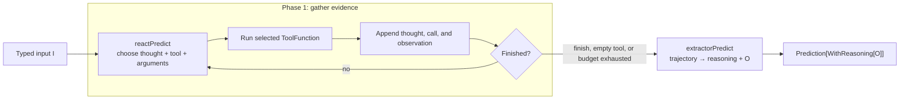
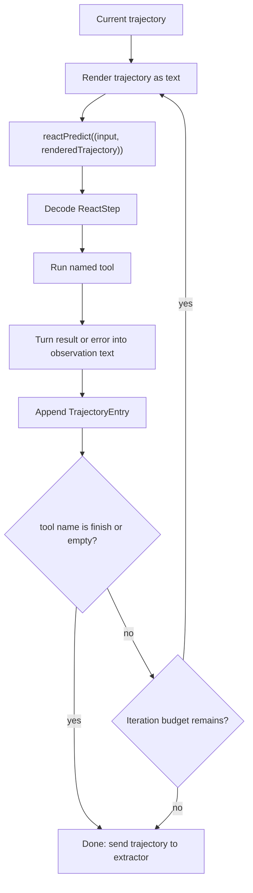
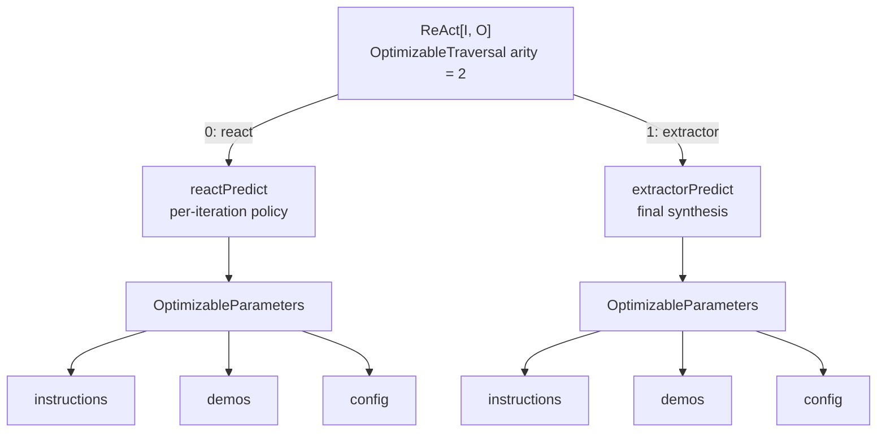

# How ReAct works in `dspy4s.programs.strategies`

`ReAct` means **Reasoning and Acting**. It gives a language model a small control loop:

1. decide what to do next;
2. call a tool;
3. observe the result;
4. repeat until enough information has been gathered;
5. turn the completed trajectory into the requested typed output.

The most useful mental model is that `ReAct` contains **two predictors with different jobs**:

- `reactPredict` chooses one action at a time and grows a trajectory;
- `extractorPredict` reads that trajectory once and produces the final answer.



This separation is important. The loop does not need to know how to construct every possible output type `O`; it only
needs to know the universal tool protocol. The extractor handles the task-specific output after the loop has collected
enough evidence.

## The public type

Conceptually, the class has this shape:

```scala
final case class ReAct[I, O](
    baseSignature: Signature[I, O],
    tools: Vector[ToolFunction],
    maxIterations: IterationLimit = IterationLimit(5)
) extends Module[I, ReAct.WithReasoning[O]]
```

A caller supplies an `I` and receives a `Prediction` whose output contains:

- `reasoning: String`, generated by the final extractor;
- all fields from the base output `O`.

The rendered tool trajectory is additionally stored in `prediction.raw.values` under the key `"trajectory"`.

There are therefore three related—but different—pieces of information:

| Value | Producer | Meaning |
|---|---|---|
| `next_thought` | `reactPredict`, once per iteration | Why the agent chose its next tool |
| `trajectory` | `ReAct` | Every thought, tool call, argument record, and observation |
| `output.reasoning` | `extractorPredict`, once at the end | The final reasoning used to synthesize the typed answer |

## How the signature changes

Suppose the base signature is:

```text
question -> answer
```

`ReAct` derives two internal signatures from it:

| Stage | Effective signature | Purpose |
|---|---|---|
| Public boundary | `question -> reasoning, answer` | What the caller sees |
| React step | `question, trajectory -> next_thought, next_tool_name, next_tool_args` | Select one action |
| Extractor | `question, trajectory -> reasoning, answer` | Produce the final typed result |

In types, the two internal predictors are:

```scala
reactPredict:
  Predict[(I, String), ReAct.ReactStep]

extractorPredict:
  Predict[(I, String), ReAct.WithReasoning[O]]
```

`ReactStep` is the stable protocol shared by every ReAct task:

```scala
final case class ReactStep(
    nextThought: String,
    nextToolName: String,
    nextToolArgs: DynamicValue.Record
)
```

The decoder for this step is deliberately lenient. Missing thought or tool-name fields become empty strings. Tool
arguments may arrive as a record or as JSON text; malformed, missing, or non-object arguments become an empty record.
This lets the control loop decide how to proceed instead of turning a slightly malformed action into a decoding failure.

## One loop iteration

The trajectory is a `Vector[TrajectoryEntry]`. Each iteration reads the current vector and either returns an updated
vector or declares the loop finished.



The bounded recursion lives in [`runtime/AgentLoop.scala`](../runtime/AgentLoop.scala), while
[`runtime/TrajectoryAgent.scala`](../runtime/TrajectoryAgent.scala) owns the loop-then-extract postlude. ReAct and CodeAct
also share [`runtime/InterpretedTrajectoryAgent.scala`](../runtime/InterpretedTrajectoryAgent.scala), whose final transition
is:

```text
generate model step → prepare action → interpret action → record outcome → decide → continue or stop
```

ReAct supplies the typed meanings: `ReactStep`, `ToolCallRequest`, a `ToolFunction`-backed `ActionInterpreter`, and
`TrajectoryEntry`. The shared trait represents every phase with a typed state and every legal successor set with a
transition ADT. In particular, rejected preparation and interpreted-outcome recording are different states. A halted
generation does not invoke or record an action, a ready action executes and records exactly once, and a fatal interpreter
error appends nothing. For a ready action, ReAct's decision runs after recording and stops when the prepared tool name is
`finish` or empty, regardless of whether that invocation succeeded. These branches are executable in
`InterpretedTrajectoryAgentLawSuite` rather than repeated in every concrete agent suite.

## Tools and the synthetic `finish` tool

The user supplies `ToolFunction` values. ReAct adds one more tool named `finish` and lists every available tool in the
react predictor's instructions, including each tool's description and typed argument schema when available.

The model does **not** use provider-native function calling here. It emits the ordinary signature fields
`next_tool_name` and `next_tool_args`. ReAct resolves that name and invokes the corresponding `ToolFunction` locally.

`finish` is a control signal, not the final answer. Selecting it appends a final trajectory entry with the observation
`Completed.`, stops the loop, and hands the trajectory to `extractorPredict`. The extractor—not the `finish` tool—creates
the requested output fields.

## Example: a weather agent

`ToolFunction.fromMethod` derives a tool name, description, argument schema, argument decoding, and result encoding from
a typed Scala method.

```scala
import dspy4s.core.contracts.{DspyError, DynamicValues, RuntimeContext}
import dspy4s.programs.IterationLimit
import dspy4s.programs.strategies.ReAct
import dspy4s.programs.contracts.{ToolFunction, description}
import dspy4s.typed.Signature

object WeatherAgent:
  @description("Get the current weather for a city.")
  def get_weather(city: String): String =
    s"The weather in $city is sunny and 25°C"

  val getWeather: ToolFunction = ToolFunction.fromMethod(get_weather)

  val agent = ReAct(
    baseSignature = Signature.fromString("question -> answer"),
    tools = Vector(getWeather),
    maxIterations = IterationLimit(5)
  )

  def ask(question: String)(using RuntimeContext): Either[DspyError, String] =
    agent((question = question)).map { prediction =>
      val trajectory =
        DynamicValues
          .recordGet(prediction.raw.values, "trajectory")
          .map(DynamicValues.renderText)
          .getOrElse("(missing)")

      println(s"reasoning:  ${prediction.output.reasoning}")
      println(s"trajectory: $trajectory")
      prediction.output.answer
    }
```

An idealized run for `"What's the weather in Tokyo?"` looks like this:

```text
## Step 1
thought: I need current weather data.
tool_name: get_weather
tool_args: {"city": Tokyo}
observation: The weather in Tokyo is sunny and 25°C

## Step 2
thought: I have enough information to answer.
tool_name: finish
tool_args: {}
observation: Completed.
```

The extractor then sees the original question and this trajectory and produces something like:

```text
reasoning: The weather tool returned the current conditions for Tokyo.
answer: The weather in Tokyo is sunny and 25°C.
```

For the runnable version of this pattern, see
[`WeatherAgentExample`](../../../../../../../examples/src/main/scala/dspy4s/examples/learn/programming/Tools.scala).

## What happens when things go wrong?

ReAct treats failures differently depending on whether they are part of the agent's environment or part of the
prediction machinery.

| Situation | Behavior |
|---|---|
| Unknown tool name | Append an `Execution error: tool ... does not exist` observation and continue |
| Tool returns an error | Append an error observation and continue |
| Empty tool name | Append `No tool was selected.` and run the extractor |
| Model selects `finish` | Append the finish entry and run the extractor |
| `maxIterations` reached | Run the extractor over the trajectory gathered so far |
| React-step context overflow | Drop the oldest trajectory entry and retry, up to three attempts |
| Persistent react-step overflow | End the loop and let the extractor make the best answer it can |
| Extractor context overflow | Retry with oldest entries omitted, up to three attempts |
| Other react/extractor LM error | Return `Left(error)` |
| Extractor decoding error | Return `Left(error)` |

React-step truncation is **durable**: if an old entry is dropped to make a later action fit, subsequent iterations and
the returned trajectory build on that shortened state. Extractor truncation is local to the extraction attempt: when a
retry succeeds, `prediction.raw.values("trajectory")` still contains the trajectory produced by the loop.

## Optimization, streaming, and observability

The two predictors are stable members rather than temporary values created inside `forward`. This has a few practical
consequences:

- optimizers see two independently tunable leaves named `react` and `extractor`;
- streaming can target the per-step react output or the final extractor output;
- callbacks and runtime tracing can observe the nested predictor and tool calls;
- immutable overrides can replace either predictor without changing the tools, schemas, runtime, or module names.

The optimization traversal is a two-branch tree. Traversal order is stable: `react` is index 0 and `extractor` is
index 1.



This is the optimizer-visible tree, not the complete object graph. The base signature, tools, input/output shapes,
runtime, bound LM, and module names remain outside `OptimizableParameters`, so replacing a leaf cannot alter them.

The final returned `RawPrediction` is based on the extractor's raw prediction with the rendered trajectory added to its
values. Detailed inner calls remain available through the runtime's callbacks, trace, and history.

## Reading the implementation

A useful reading order is:

1. [`ReAct.scala`](ReAct.scala): signatures, tools, one iteration, and result assembly.
2. [`runtime/InterpretedTrajectoryAgent.scala`](../runtime/InterpretedTrajectoryAgent.scala): generate, prepare, interpret,
   record, and stop.
3. [`contracts/ActionInterpreter.scala`](../contracts/ActionInterpreter.scala): success, recoverable failure, and fatal
   action outcomes.
4. [`runtime/TrajectoryAgent.scala`](../runtime/TrajectoryAgent.scala): gather a trajectory, then extract exactly once.
5. [`runtime/AgentLoop.scala`](../runtime/AgentLoop.scala): the bounded continue/done recursion.
6. [`runtime/TrajectoryTruncation.scala`](../runtime/TrajectoryTruncation.scala): context-window retry behavior.
7. [`contracts/ToolFunction.scala`](../contracts/ToolFunction.scala): the tool abstraction and typed-method derivation.
8. [`ReActSuite.scala`](../../../../../test/scala/dspy4s/programs/ReActSuite.scala): executable examples of finish, limits,
   tool errors, callbacks, and truncation.
9. [`InterpretedTrajectoryAgentLawSuite.scala`](../../../../../test/scala/dspy4s/programs/runtime/InterpretedTrajectoryAgentLawSuite.scala)
   and [`TrajectoryAgentLawSuite.scala`](../../../../../test/scala/dspy4s/programs/runtime/TrajectoryAgentLawSuite.scala):
   the shared transition and extraction contracts.

## Scope and assumptions

This guide describes the current dspy4s implementation. It assumes the ambient `RuntimeContext` supplies an LM and an
adapter. `ToolFunction` execution is synchronous, and ReAct's tool selection uses signature output fields rather than
provider-native function calling.
